2019 年之后，“Attention is not Explanation” 几乎成了 Transformer 可解释性讨论中的固定警句。它提醒我们：一张好看的 attention heatmap，不能自动升级为模型决策的因果解释。

但几年以后，另一个研究方向却在大量使用 attention score 删除 token。EViT 根据 CLS attention 保留图像 patch，H₂O 根据累计 attention 淘汰 KV cache，许多方法还报告了可观的吞吐提升和很小的精度损失。

这看起来像一个矛盾：

> 如果 attention 不能说明 token 是否重要，为什么它又能指导 token pruning？

问题出在“重要”这个词同时承担了两个不同任务。解释方法试图回答：**固定模型为什么做出当前预测？** 压缩方法试图回答：**改变计算图以后，哪些 token 值得继续花算力？** 前者要求忠实性，后者要求预算下的任务效用。二者相关，却不是同一个契约。

本文沿着这个分岔重新整理相关研究。核心结论可以先写在这里：

> Raw attention 是一个输入相关、计算廉价的路由信号。它遗漏了 value 内容、输出方向、残差路径、后续层敏感度与 token 间冗余，因此不足以单独承担因果解释；但当任务具有冗余、删除策略受到训练约束，或系统只需要一个便宜的 retention proxy 时，它仍然可以成为有效的压缩控制信号。

## 1. 先拆开两个契约：解释与压缩

设训练完成的模型为 $f_\theta$，输入 token 序列为 $X=(x_1,\ldots,x_N)$。

### 1.1 解释契约：固定模型中的行为归因

解释分数希望描述 token $x_i$ 对当前输出的影响。最直接的形式是比较某种干预前后的预测：

$$
I_i^{\mathrm{explain}}
=
d\!\left(
f_\theta(X),
f_\theta(\operatorname{do}(X,i))
\right),
$$

其中 $\operatorname{do}(X,i)$ 表示对 token $i$ 进行删除、替换、遮挡或内部通路切断，$d(\cdot,\cdot)$ 衡量输出变化。

这里有三个不能省略的限定：

1. 模型参数 $\theta$ 固定；
2. 干预的含义必须明确；
3. 解释要对应指定的输出，而不是笼统的“模型内部关注”。

即使写成这个形式，问题也没有完全解决。把单词换成 `[MASK]` 与删除它不是同一个干预；把图像 patch 涂黑可能制造分布外输入；切断 value 路径与同时删除 key、query 又会得到不同答案。所谓“真实贡献”总是相对于一个明确定义的反事实。

### 1.2 压缩契约：预算下的子集效用

Token reduction 关心的是另一个优化问题。给定计算预算 $K$，选择保留集合 $S$：

$$
\begin{aligned}
S^\star
&=
\arg\min_{S\subseteq\{1,\ldots,N\}}
\mathbb E_{(X,y)}
\left[
\mathcal L\!\left(f_{\theta,S}(X),y\right)
\right],\\
\text{s.t.}\quad
|S|&\le K.
\end{aligned}
$$

$f_{\theta,S}$ 已不再是原来的计算图：token 数量、softmax 归一化、残差流和后续层输入都发生了变化。如果方法还要微调，参数本身也会适应新的 token 分布。

因此，一个分数可以不是原模型的忠实解释，却仍能产生一个好用的保留策略。例如，猫的耳朵、眼睛和轮廓可能携带高度冗余的分类证据；删掉其中一个区域会改变解释，却未必损害压缩模型的准确率。

这给出了全文最重要的区分：

$$
\boxed{
\text{prediction attribution}
\;\neq\;
\text{retention utility}
}
$$

“哪个 token 导致了当前预测”和“有限预算下应该保留哪个 token”，不是同一个问题。

## 2. Attention weight 实际计算了什么

先忽略多头结构。对 query $q$，单头 attention 输出可以写为

$$
o
=
\sum_{i=1}^{N}\alpha_i u_i,
\qquad
\alpha_i
=
\frac{\exp(q^\top k_i/\sqrt d)}
{\sum_j\exp(q^\top k_j/\sqrt d)}.
$$

这里 $u_i$ 表示已经经过 value 投影并映射到当前 head 输出空间的向量。$\alpha_i$ 是非负且和为 $1$ 的路由系数；真正进入加和的是向量消息 $\alpha_i u_i$。

于是至少有四个不同对象经常被混叫作 importance：

- $\alpha_i$：当前 query 向 token $i$ 分配了多少路由质量；
- $\alpha_i u_i$：token $i$ 实际送入 attention 输出的向量消息；
- $\alpha_i\lVert u_i\rVert$：消息长度的一个标量近似；
- 输出干预效应：切断该信息后，最终预测改变多少。

它们不能互换。

### 2.1 删除一个 token 后，变化不只由 attention 决定

假设当前层的 $q,k_i,u_i$ 固定，只删除 token $i$，并让剩余 attention 权重重新归一化。新的输出为

$$
o_{-i}
=
\frac{o-\alpha_i u_i}{1-\alpha_i}.
$$

所以删除产生的精确变化是

$$
\begin{aligned}
\Delta o_i
&=
o-o_{-i}\\
&=
\frac{\alpha_i}{1-\alpha_i}
\left(u_i-o\right).
\end{aligned}
$$

这个简单推导已经说明了 raw attention 的缺口。删除效应不仅取决于 $\alpha_i$，还取决于 $u_i-o$：

- attention 很高，但 $u_i$ 与其余 token 的聚合结果几乎相同，删除影响可以很小；
- attention 较低，但 $u_i$ 携带独特方向，删除影响可以很大；
- $u_i$ 与输出方向相反时，token 可能承担抑制或抵消作用；
- 当 $\alpha_i$ 较大时，softmax 重归一化本身也会放大变化。

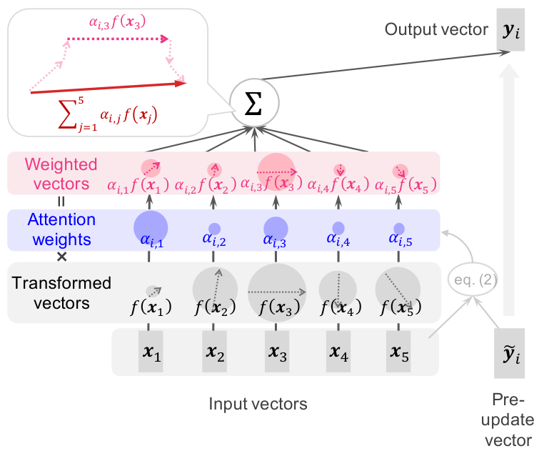

<p class="figure-caption"><strong>Figure 1.</strong> Attention 输出是 transformed vectors 的加权和。圆和箭头的大小表示标量或向量范数，仅看蓝色的 attention weights 会漏掉下方向量的大小与方向。来源：Kobayashi et al. (2020), Figure 2。</p>

### 2.2 多头、残差和后续层让问题更复杂

真实 Transformer block 更接近

$$
\begin{aligned}
m_i
&=
\sum_{h=1}^{H}
W_h^O
\left(
\sum_j A_{ij}^{(h)}V_j^{(h)}
\right),\\
x_i'
&=
x_i+m_i,\\
x_i^{\mathrm{next}}
&=
x_i'
+
\operatorname{MLP}
\left(
\operatorname{LN}(x_i')
\right),
\end{aligned}
$$

具体的 LayerNorm 位置会随 pre-norm 或 post-norm 结构改变。无论哪一种，平均多个 head 的 attention map 都会丢掉输出投影、向量方向和 head 间抵消；只看某一层又会漏掉残差保存的信息、MLP 的非线性变换与后续层对该方向的敏感度。

如果只做一阶近似，某条消息对最终标量输出 $f$ 的影响还应包含下游梯度：

$$
\Delta f_i
\approx
\left\langle
\nabla_o f,\,
\Delta o_i
\right\rangle.
$$

这也是为什么 gradient × attention、gradient × value 往往比 raw attention 更接近“针对某个输出的局部贡献”：它们至少把消息方向与下游敏感度联系起来。不过一阶近似仍会在强非线性、交互效应和大幅删除下失效。

## 3. 2019：Attention 作为解释受到系统质疑

早期 attention 可视化有一个很自然的语言跳跃：

```text
模型给某个词更高 attention
→ 模型更依赖这个词
→ 这个词解释了预测
```

Jain 和 Wallace 在 *Attention is not Explanation* 中用两个问题挑战了这条链。

第一，attention 与其他 feature-importance 指标是否一致？他们比较了 attention 与 input gradient、leave-one-out 等分数，发现很多任务中的 Kendall $\tau$ 相关性偏弱。

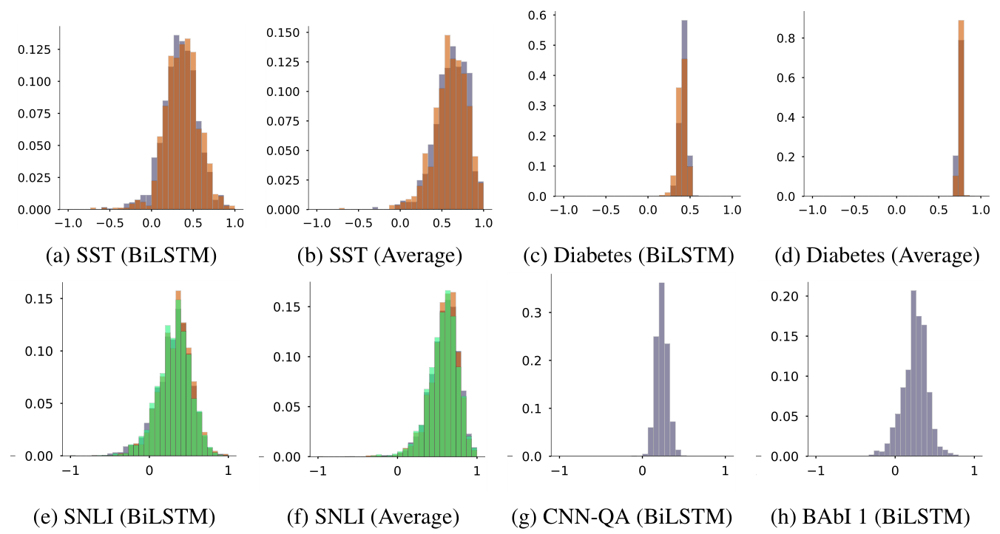

<p class="figure-caption"><strong>Figure 2.</strong> 不同数据集与编码器上，attention 和 gradient importance 的 Kendall τ 分布并不稳定地接近 1；不同颜色表示不同预测类别。来源：Jain &amp; Wallace (2019), Figure 2。</p>

第二，attention 分布是否由预测唯一决定？论文构造与原 attention 相差很大的 adversarial distributions，却让模型输出近似不变。如果两张完全不同的热图都能支持同一预测，就很难把其中一张直接称为唯一解释。

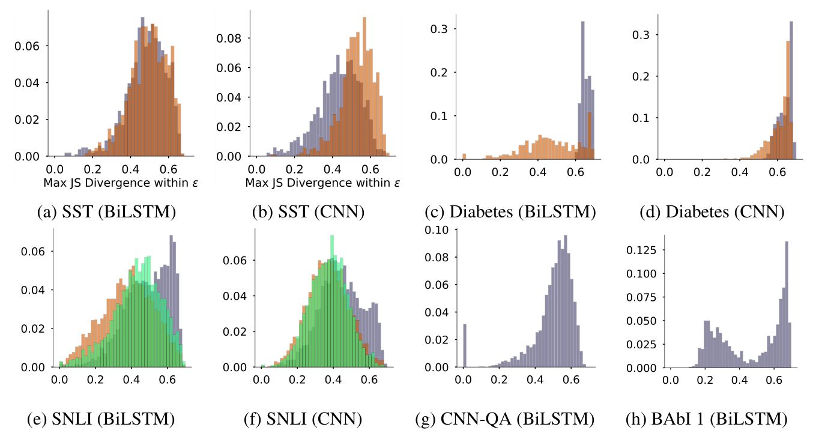

<p class="figure-caption"><strong>Figure 3.</strong> 原 attention 与 adversarial attention 之间可以具有较大的 Jensen–Shannon divergence，同时输出差异仍受约束。来源：Jain &amp; Wallace (2019), Figure 4。</p>

Serrano 和 Smith 在 *Is Attention Interpretable?* 中得到更温和的结论：按 attention 从高到低擦除表示，通常比随机顺序更快改变预测，但 attention 只是一个有噪声的影响指标，并不总能稳定排序真正关键的输入。

随后 Wiegreffe 和 Pinter 指出，“解释”没有被唯一地定义。人工优化出的 adversarial attention 未必代表另一个自然训练模型会学到的 attention；评价还应包含多随机种子、均匀 attention 基线和端到端 adversarial training 等对照。争论因此没有收敛到“attention 完全无意义”，而是收敛到一个更窄、更可靠的命题：

> 不能只凭 raw attention heatmap，就声称找到了最终预测的忠实原因。

Brunner 等人从 identifiability 给出另一个角度。当 token 数量大于 value 子空间秩时，attention 矩阵中的某些变化可以落入 value 的零空间，从而产生相同输出。Attention 确实参与了计算，但观察到的 attention map 未必是产生该输出的唯一分解。

还要注意，2019 年许多实验使用的是带 attention pooling 的 RNN 分类器，而不是今天的深层 ViT 或 decoder-only LLM。具体实验不能无条件外推；但“路由系数不等于完整贡献”这一数学问题仍然存在。

## 4. 第一条修复路线：从权重走向完整信息流

Attention 争论之后，一条研究路线继续追问：如果 raw attention 不够，怎样得到更接近模型行为的 attribution？

### 4.1 加入 value norm：读向哪里，不等于读入多少

Kobayashi 等人的 *Attention is Not Only a Weight* 把注意力输出重写为 transformed vectors 的加权和，并用

$$
C_{ij}^{\mathrm{norm}}
=
\left\|
\alpha_{ij}f(x_j)
\right\|
$$

衡量来自 token $j$ 的消息幅度。因为 $\alpha_{ij}\ge 0$，这个量也等于 $\alpha_{ij}\lVert f(x_j)\rVert$。

在 BERT 中，一些 special tokens 拿到很高的 attention weight，但 transformed-vector norm 很小；模型在路由层面“看向”它们，并不代表它们向输出注入了同样多的信息。

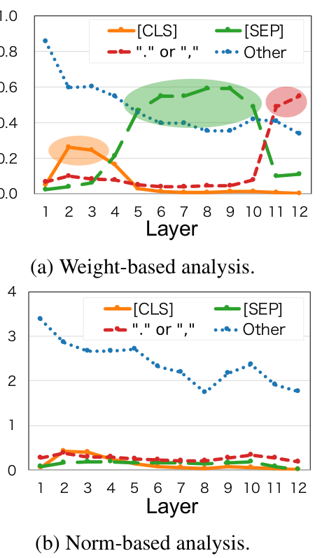

<p class="figure-caption"><strong>Figure 4.</strong> 上图只统计平均 attention weight，下图统计 attention-weighted transformed-vector norm。`[SEP]` 等 token 在两种分析下呈现完全不同的层间趋势。来源：Kobayashi et al. (2020), Figure 3。</p>

Value norm 是重要修正，但还不是最终贡献。范数丢掉了方向；多个大向量可以互相抵消；它也没有告诉我们最终分类头是否对这个方向敏感。更准确的说法是：

$$
\alpha_i\lVert u_i\rVert
\quad\text{衡量消息幅度，而不是完整因果效应。}
$$

### 4.2 跨层聚合：attention rollout 与 attention flow

深层 Transformer 中，某个 token 的信息会沿多层 attention 与残差路径传播。Abnar 和 Zuidema 将网络视为一个分层信息流图，提出 attention rollout 与 attention flow。

Rollout 先把残差路径加入 attention：

$$
\widetilde A^{(\ell)}
=
\operatorname{row\_normalize}
\left(
A^{(\ell)}+I
\right),
$$

再递归相乘：

$$
R^{(\ell)}
=
\widetilde A^{(\ell)}
\widetilde A^{(\ell-1)}
\cdots
\widetilde A^{(1)}.
$$

Attention flow 则把边权视为容量，通过最大流计算输入到高层 token 的信息通道。

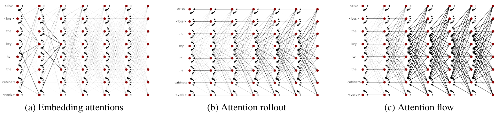

<p class="figure-caption"><strong>Figure 5.</strong> 对同一个 Transformer，raw embedding attention、rollout 与 flow 给出不同的跨层路径视图。后两者试图把高层表示追溯到输入。来源：Abnar &amp; Zuidema (2020), Figure 1。</p>

Rollout 与 flow 比单层热图更好地处理了“信息混合”，并在论文实验中与 blank-out、input gradients 有更高相关性。但它们仍主要传播 attention 权重，没有完整纳入 value、output projection、LayerNorm、MLP 与非线性。

后续的 GlobEnc、ALTI、DecompX 等方法逐步扩展分解范围：从 attention 加入残差和 LayerNorm，再把 FFN 与分类头也纳入 token decomposition。研究越接近最终预测，就越难只停留在一张 attention matrix 上。

### 4.3 从观察转向干预：Value Zeroing

Value Zeroing 在某层将指定 token 的 value vector 置零，同时保留其 key、query 与路由位置，再观察目标表示的变化。与删除整个 token 相比，这个干预更精确地问：

> 如果该 token 不再向其他位置传递内容，模型内部表示会怎样变化？

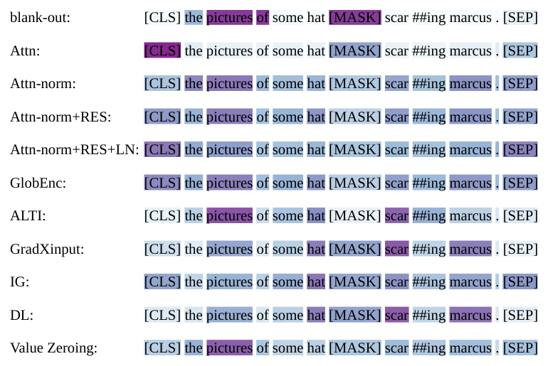

<p class="figure-caption"><strong>Figure 6.</strong> 同一个 masked-language-model 示例中，不同方法给出的高影响 token 明显不同；Value Zeroing 更集中于形成主谓一致线索的 cue word。来源：Mohebbi et al. (2023), Figure 4。</p>

Value Zeroing 比 raw attention 更接近内部因果干预，但仍不是无条件的 ground truth：它只切断 value 通道，不删除 key/query；每次干预可能改变后续层分布；token 间协同也意味着单点效应不能简单相加。

这条解释路线的总体方向可以概括为：

```text
raw weight
→ weighted value
→ residual-aware cross-layer flow
→ full-block decomposition
→ internal intervention
```

## 5. 第二条路线改变了问题：Token reduction 追求的是效用

Vision Transformer 将图像切成 $N$ 个 patch tokens。一个标准 block 的近似计算量包含

$$
\operatorname{FLOPs}_{\mathrm{attn}}
\approx
4Nd^2+2N^2d,
$$

以及隐藏维度约为 $4d$ 时的

$$
\operatorname{FLOPs}_{\mathrm{MLP}}
\approx
8Nd^2.
$$

减少 token 不只降低 $N^2$ 的 attention 交互，也会线性减少 QKV projection 与 MLP 计算。如果在较早层删除 token，节省会延续到所有后续 block。

于是 token reduction 的目标不是复原一张因果热图，而是构造一个便宜的决策：

$$
g_\phi(x_i,X,\ell,B)
\longrightarrow
\{\text{keep},\text{drop},\text{merge}\},
$$

其中 $\ell$ 是网络层，$B$ 是剩余预算。评价标准变成 accuracy、perplexity、latency、throughput 与 memory，而不是 attribution faithfulness。

这解释了为什么“不完美的 importance proxy”仍可能有效：

- 自然图像存在大量背景与局部重复；
- 模型可以在带 pruning 的训练中适应新的 token 分布；
- 许多方法会融合低分 token，而不是彻底删除信息；
- 中等压缩率只需要一个大致正确的排序；
- 任务损失会直接惩罚误删带来的性能下降。

换言之，剪枝分数首先是一个控制变量，其次才可能是解释。

## 6. 不依赖 raw attention：直接学习或重建 token

### 6.1 DynamicViT：学习 task-specific selection policy

DynamicViT 在若干 block 间插入轻量 prediction module。对 token $x_i$，模块同时使用局部特征与当前保留 token 的全局汇总：

$$
\begin{aligned}
z_i^{\mathrm{local}}
&=
\operatorname{MLP}(x_i),\\
z^{\mathrm{global}}
&=
\operatorname{Aggregate}
\left(
\{z_j^{\mathrm{local}}:D_j=1\}
\right),\\
\pi_i
&=
\operatorname{Softmax}
\left(
\operatorname{MLP}
([z_i^{\mathrm{local}},z^{\mathrm{global}}])
\right).
\end{aligned}
$$

$D_j$ 表示 token 是否仍被保留。选择器与分类模型端到端训练，并通过 attention masking 在训练期模拟不可导的 token deletion。

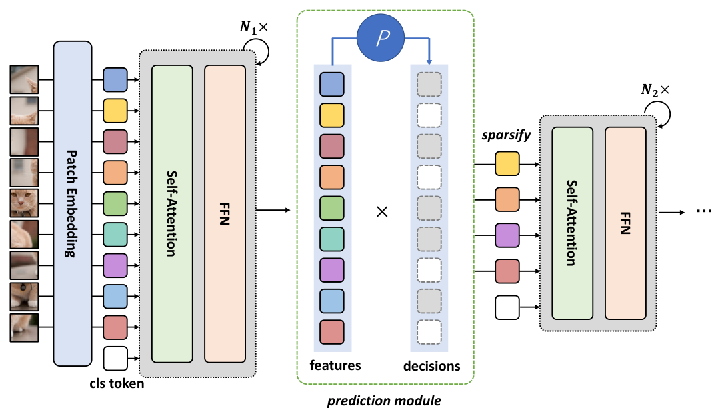

<p class="figure-caption"><strong>Figure 7.</strong> DynamicViT 在不同深度插入 prediction module，依据局部与全局特征逐级减少 token。来源：Rao et al. (2021), Figure 2。</p>

论文在多种 ViT 上逐步移除约 66% 输入 token，报告约 31%–37% FLOPs 降低、超过 40% 的吞吐提升，精度下降控制在约 0.5% 内。这个结果证明的是 learned policy 在任务损失下有效，不是 selector score 等于原模型中的真实因果重要性。

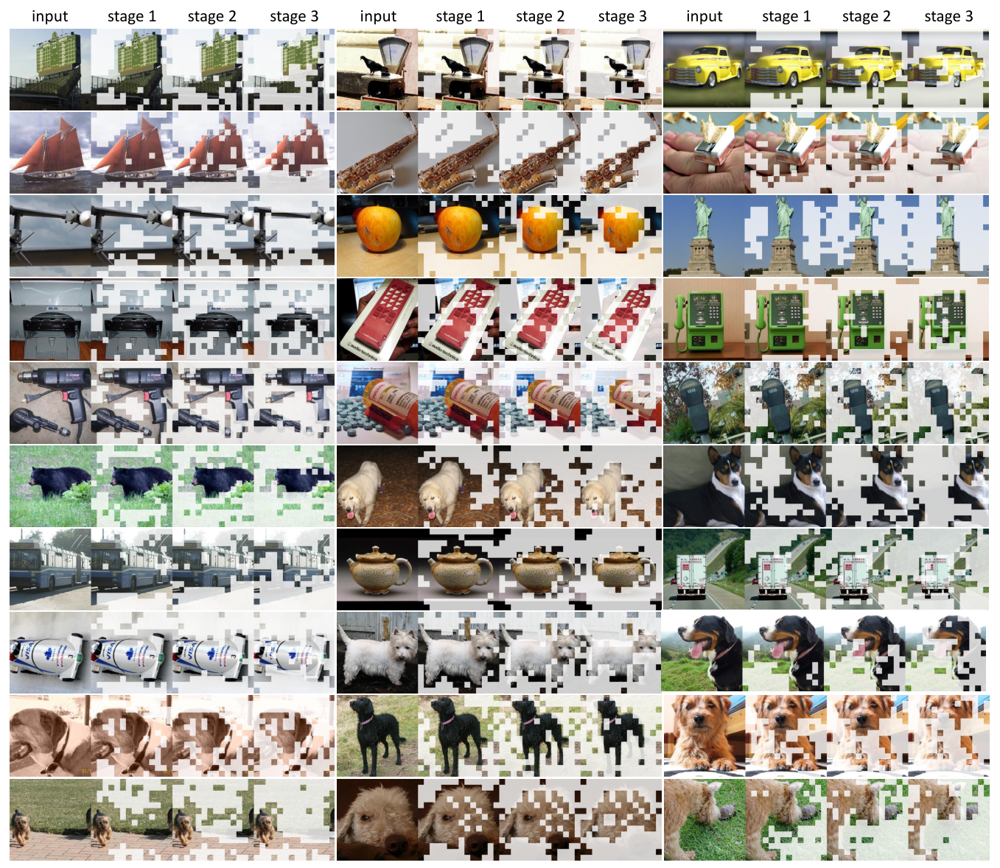

<p class="figure-caption"><strong>Figure 8.</strong> 从 input 到 stage 3，DynamicViT 逐步去掉背景与重复区域，同时保留与分类相关的主体结构。来源：Rao et al. (2021), Figure 5。</p>

### 6.2 TokenLearner：不选择原 token，而是生成新 token

TokenLearner 学习 $M$ 个空间注意函数，将密集位置重新聚合为少量 token：

$$
z_m
=
\frac{
\sum_i \gamma_m(x_i)x_i
}{
\sum_i \gamma_m(x_i)
},
\qquad
m=1,\ldots,M.
$$

它不回答“哪个原 patch 最重要”，而是回答：

> 怎样从整张特征图中生成 $M$ 个足够完成任务的新表示？

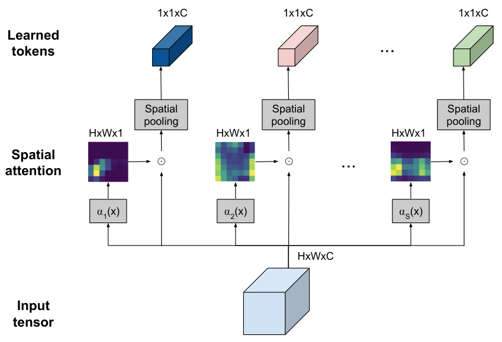

<p class="figure-caption"><strong>Figure 9.</strong> 多个 learned spatial attention maps 分别池化输入张量，产生少量输入自适应 token。来源：Ryoo et al. (2021), Figure 1。</p>

这更接近 adaptive tokenization 或 learned pooling。它提醒我们，压缩不必被限制为“给原 token 排名并删除尾部”；重新编码整个集合有时比寻找单点 importance 更自然。

## 7. Attention-guided pruning：为什么廉价代理仍然能工作

### 7.1 EViT：CLS attention 加低分 token 融合

在 ViT 分类器中，CLS token 最终进入分类头。EViT 因此使用 CLS 对 patch 的多头平均 attention：

$$
s_i
=
\frac{1}{H}
\sum_{h=1}^{H}
A_{\mathrm{CLS},i}^{(h)}.
$$

它保留 top-$K$ token，并把其余 token 按分数融合为一个 summary token，而不是全部丢弃：

$$
x_{\mathrm{fused}}
=
\frac{
\sum_{i\in\mathcal I_{\mathrm{low}}}s_ix_i
}{
\sum_{i\in\mathcal I_{\mathrm{low}}}s_i
}.
$$

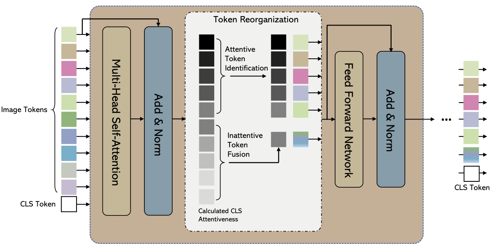

<p class="figure-caption"><strong>Figure 10.</strong> EViT 在 MHSA 后识别 attentive tokens，将低分 token 融合，再把缩短后的序列送入 FFN 与后续 block。来源：Liang et al. (2022), Figure 2。</p>

EViT 能工作有几层保险：

1. CLS attention 与分类任务确实存在统计相关性；
2. 低分 token 被融合而非完全删除；
3. token reorganization 进入训练过程；
4. 图像中存在显著空间冗余；
5. 方法用准确率验证 retention utility，而没有把热图当成忠实解释。

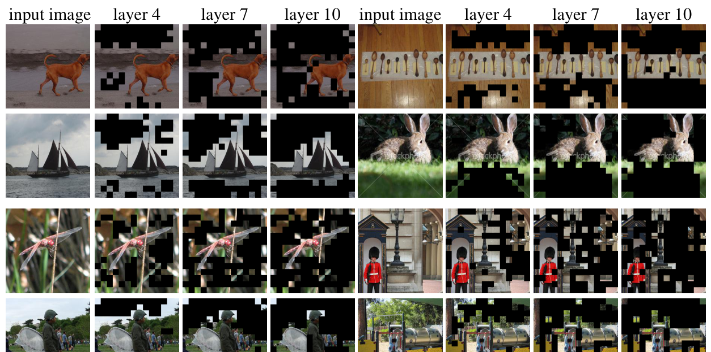

<p class="figure-caption"><strong>Figure 11.</strong> 随网络加深，EViT 逐渐融合背景或重复区域；黑色区域表示被归入 fused token 的位置。来源：Liang et al. (2022), Figure 3。</p>

因此，EViT 最稳妥的结论是：

> CLS attention 是一个便宜、可训练、在图像分类中有效的 retention proxy。

它并没有证明 CLS attention 是 token 的真实因果重要性。

### 7.2 ATS：从 attention 修正到 attention × value norm

Adaptive Token Sampling 明确注意到 attention 输出同时依赖 $A$ 与 $V$，于是把 token score 写成

$$
S_j
\propto
A_{\mathrm{CLS},j}
\lVert V_j\rVert.
$$

随后将归一化分数视为累积分布，通过 inverse transform sampling 自适应选择 token。不同输入可以得到不同 token 数量与空间位置。

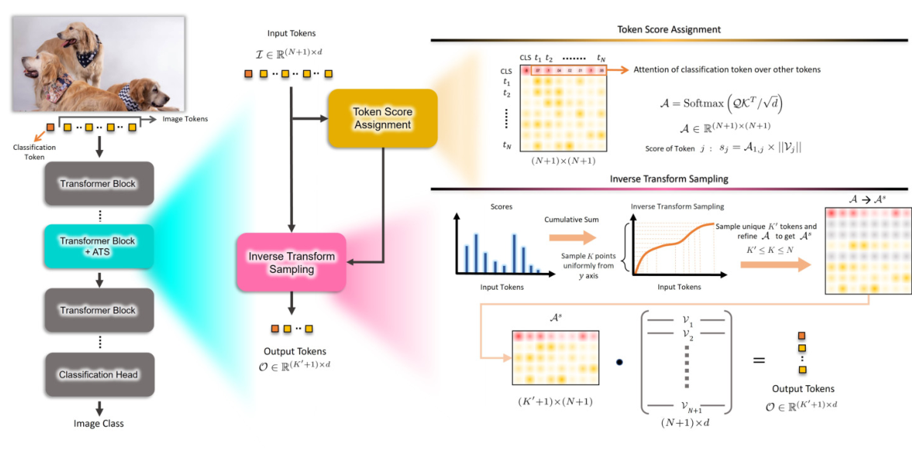

<p class="figure-caption"><strong>Figure 12.</strong> ATS 先用 CLS attention 与 value magnitude 计算 score，再通过 inverse transform sampling 选择 token，并重采样 attention rows 生成输出。来源：Fayyaz et al. (2022), Figure 1。</p>

ATS 是一座很清楚的桥：

```text
可解释性研究：attention 不是完整贡献
                     ↓
压缩研究：把 value magnitude 加回 token score
```

这不是说 $\alpha\lVert v\rVert$ 已经是真实 importance，而是压缩指标开始更忠实地对应 attention block 实际传递的消息。

## 8. “重要性”仍然不够：冗余与多样性是另一条轴

假设一张图有十个几乎相同的天空 token。它们可能都拿到中等分数，但全部保留没有必要。反过来，一个很小的目标区域可能分数不高，却包含无法由其他 token 替代的信息。

因此，压缩至少包含两个正交问题：

$$
\boxed{
\text{task relevance}
\quad+\quad
\text{set redundancy}
}
$$

单 token importance 是点属性；冗余是集合属性。前者不能独自决定一个最优子集。

### 8.1 ToMe：不问谁不重要，而问谁可以合并

Token Merging（ToMe）直接根据 token 相似度配对并合并。论文使用 attention keys 计算相似性，因为 key 已是模型为了匹配而学习的表示；再用 bipartite soft matching 以接近线性的额外成本选择 merge pairs。

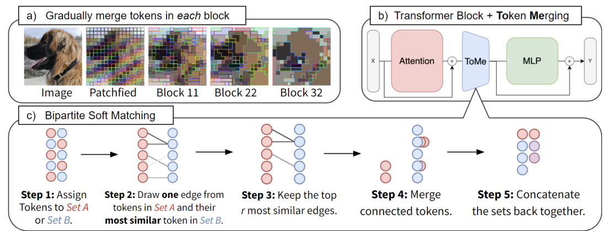

<p class="figure-caption"><strong>Figure 13.</strong> ToMe 在每个 block 中逐步合并相似 patch；下半部分展示五步 bipartite soft matching。来源：Bolya et al. (2023), Figure 1。</p>

合并以后，一个 token 可能代表多个原 patch。ToMe 记录 token size $s$，并在 attention logits 中加入 $\log s$：

$$
A
=
\operatorname{softmax}
\left(
\frac{QK^\top}{\sqrt d}
+
\log s
\right),
$$

使一个聚合 token 在 softmax 中近似保留它所代表的质量。

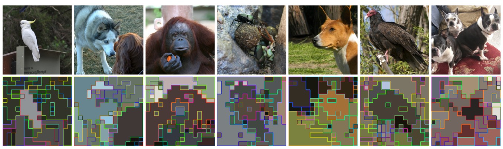

<p class="figure-caption"><strong>Figure 14.</strong> 相同内部颜色与边框表示被合并的 patches。ToMe 可以同时合并前景与背景中的相似区域，而不是只删除低 attention 位置。来源：Bolya et al. (2023), Figure 4。</p>

ToMe 揭示了一个关键区别：

$$
\text{mergeability}
\neq
\text{unimportance}.
$$

两个 token 都可能包含任务信息，但如果内容高度相似，就没有必要继续分别计算。

### 8.2 Beyond Attentive Tokens：同时保留显著性与多样性

*Beyond Attentive Tokens* 比较了三类策略：

- importance-only：保留高 CLS-attention token；
- diversity-only：聚类并保留具有代表性的 token；
- importance + diversity：保留判别性局部信息，同时合并重复的全局语义。

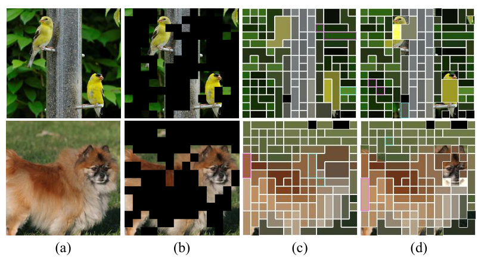

<p class="figure-caption"><strong>Figure 15.</strong> (a) 原图；(b) importance-only 遮掉低分区域；(c) diversity-only 聚类会损失鸟头、狗眼等判别局部；(d) 联合策略同时保留关键局部与多样背景。来源：Long et al. (2023), Figure 2。</p>

方法先按 CLS attention 将 token 分为 attentive 与 inattentive 两组；对低分组聚类并合并相似 token，对高分组也匹配同质 token，减少“高分但重复”的计算。


<p class="figure-caption"><strong>Figure 16.</strong> Token Merger 分别处理 attentive token matching 与 inattentive token clustering，并在多个深度重复使用。来源：Long et al. (2023), Figure 3。</p>

这一步把问题从“按一个分数排序”推进为预算下的集合选择。理想目标更接近

$$
\max_{S:\,|S|\le K}
\left[
\operatorname{Relevance}(S)
+
\lambda\operatorname{Diversity}(S)
\right],
$$

而不是简单地对每个 token 独立打分。

## 9. METR：Attention 不天然可靠，但可以被训练成控制信号

许多 ViT pruning 方法在较早 block 就开始删 token，因为越早删除，计算节省越大。但最终分类损失位于网络末端；早期 CLS token 缺少立即收集任务信息的压力，所以它的 attention 可能相当随意。

METR 对普通 DeiT-S 与经过 multi-exit tuning 的模型进行可视化。普通模型在 block 4 会漏掉狗头等明显区域；随着层数增加，CLS attention 才逐渐对准主体。加入早期任务监督后，浅层 attention 已明显改善。

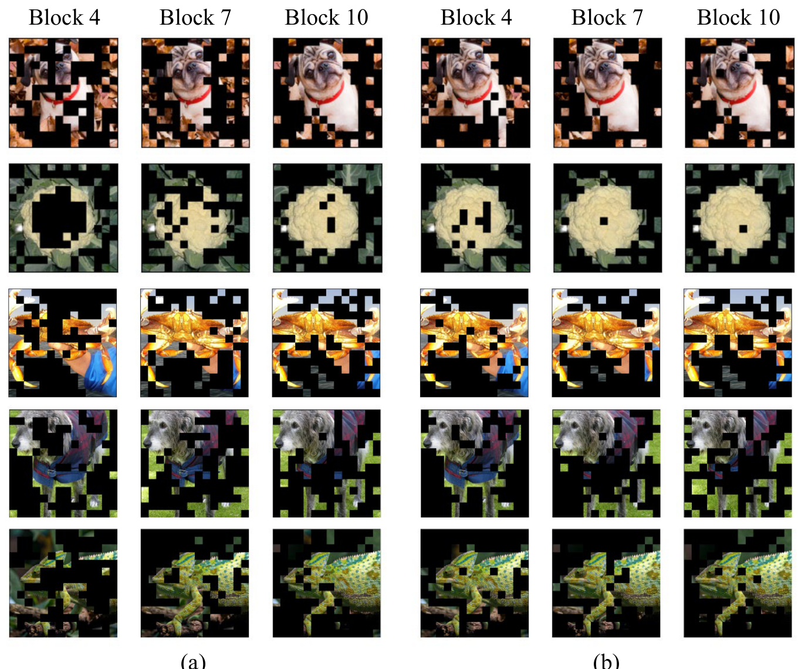

<p class="figure-caption"><strong>Figure 17.</strong> 左侧是官方 DeiT-S，右侧是加入 multi-exit loss 训练 30 epochs 的模型；每张图只显示 CLS attention 前 50% token。早期层在额外任务压力下更快聚焦于判别区域。来源：Liu et al. (2024), Figure 1。</p>

METR 在执行 token reduction 的 block 附近加入 early-exit head，并通过 self-distillation 提供更稳定的早期监督。训练完成后，这些 heads 可以删除，不增加推理成本。

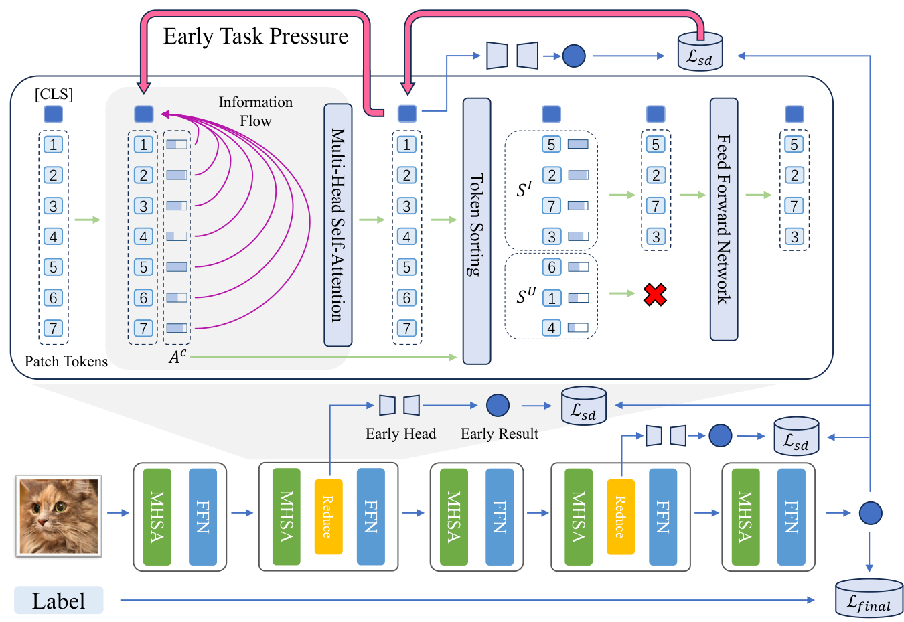

<p class="figure-caption"><strong>Figure 18.</strong> 紫色路径把 early task pressure 注入浅层 CLS；CLS attention 随后用于 token sorting，self-distillation 约束 early prediction。来源：Liu et al. (2024), Figure 2。</p>

METR 对“attention 能否指导剪枝”给出了最直接的回答：

> Attention score 不必天然等于 importance。只要训练目标知道它将控制 token 保留，损失函数就能把它校准成更好的 policy signal。

这时的 attention 是系统内部的内生控制变量。它因任务损失而具有实用性，但仍不自动成为原模型决策的完整因果解释。

## 10. LLM KV cache 重复了同样的历史

Autoregressive decoding 会缓存此前 token 的 keys 与 values。缓存大小随序列长度增长，长上下文生成因而受到显存与带宽限制。KV-cache pruning 再次面临同一个问题：哪些历史 token 值得保留？

### 10.1 H₂O：累计 attention 预测未来使用价值

H₂O 观察到 LLM attention 在推理期高度稀疏，少量 tokens 累积了大部分 attention mass。它将这些位置称为 heavy hitters，并在固定预算下同时保留：

- 最近 token，用于局部连续性；
- 累计 attention 较高的 heavy hitters，用于长期依赖。

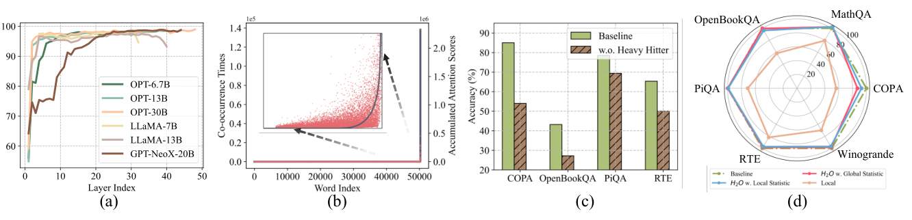

<p class="figure-caption"><strong>Figure 19.</strong> (a) 多个 LLM 的 layer-wise attention sparsity；(b) 累计 attention 的长尾分布；(c) 移除 heavy hitters 明显降低准确率；(d) H₂O 在相同 KV 预算下优于只保留局部窗口。来源：Zhang et al. (2023), Figure 2。</p>

这里的 attention score 预测的是**未来缓存价值**，而不是解释 LLM 为什么生成某个词。一个历史 token 即使不是当前输出的完整因果解释，也可能因为长期反复被查询而值得保留。

### 10.2 VATP：Value also matters 再次出现

VATP 检查 LLaMA2-7B-chat 后发现，value norm 在 token 与 head 之间高度不均匀。一些 attention sink 拿到很高 attention，却具有接近零的 value norm；另一些 token attention 普通，但 value magnitude 很大。

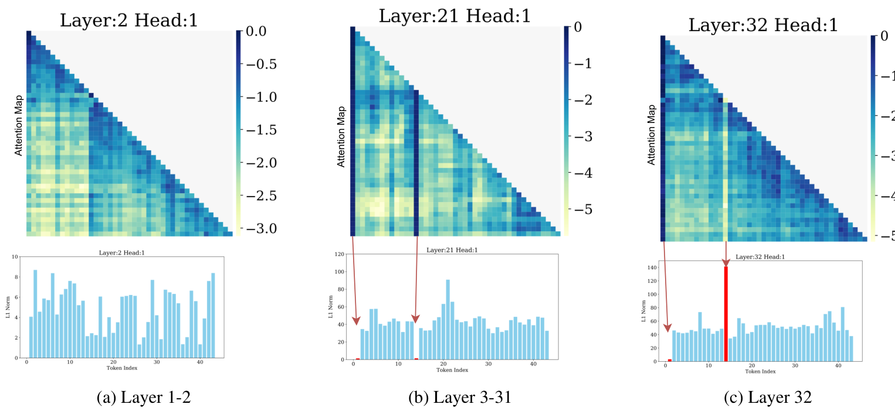

<p class="figure-caption"><strong>Figure 20.</strong> 上半部分是对数 attention map，下半部分是对应 token 的 ℓ₁ value norm。红色箭头标出的 attention sinks 具有巨大路由权重，却可能携带很小的 value。来源：Guo et al. (2024), Figure 1。</p>

VATP 因此将已有缓存策略的 attention statistic $S_k^t$ 与 value norm 相乘：

$$
I_k^t
=
S_k^t
\lVert v_k\rVert_1.
$$

$S_k^t$ 可以来自 H₂O 的累计 attention，也可以来自滑动窗口策略。VATP 删除乘积分数最低的 KV entry。

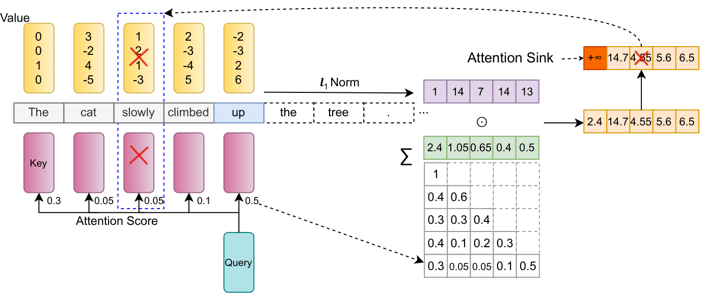

<p class="figure-caption"><strong>Figure 21.</strong> 一个高 attention、低 value-norm 的 sink 在乘积评分下不再自动被保留；最低 VATP score 对应的 KV 被移除。来源：Guo et al. (2024), Figure 2。</p>

ViT 与 LLM 在不同场景中独立走出了相似路径：

```text
ViT:
CLS attention
→ attention × value norm
→ importance + diversity / merging

LLM:
accumulated attention
→ accumulated attention × value norm
→ cache value under temporal budget
```

共同原因不是术语巧合，而是 attention block 的代数结构：真正进入输出的是 attention-weighted value。

## 11. 为什么仍然没有“真实 token importance”公式

把 attention 换成 gradient、deletion 或 intervention，并不会自动得到无争议的 ground truth。

### 11.1 热图合理，不代表依赖模型参数

Adebayo 等人的 saliency sanity checks 逐层随机化模型参数，发现一些看起来仍很漂亮的 heatmaps 对参数变化并不敏感。它们可能主要显示输入边缘或数据先验，而不是训练模型的决策逻辑。

任何 explanation map 至少应回答：

- 随机化模型后是否改变？
- 打乱标签重新训练后是否改变？
- 不同随机种子下是否稳定？
- 与简单的输入边缘基线相比是否真的多提供了模型信息？

### 11.2 删除实验会制造分布外输入

将 patch 涂黑、把单词替换成 `[MASK]` 或直接缩短序列，都可能产生训练时罕见的输入。性能下降可能来自 OOD shift，而不完全来自删除了关键证据。

ROAR 通过“删除后重新训练”缓解这个问题，但它回答的是剩余数据中还有多少可学习信息；重新训练后的模型已不是原模型，所以它也不是原模型即时因果依赖的纯测量。

### 11.3 Token 之间存在交互

两个 token 可能单独删除都无影响，因为它们互为备份；同时删除却造成灾难。也可能每个 token 单独看都重要，但合并后仍能无损表达。于是

$$
I_i+I_j
\neq
I_{\{i,j\}}
$$

是常态而不是例外。Shapley value 用不同 coalition 中的平均边际贡献处理交互，但计算代价随 token 数指数增长，而且仍依赖“缺失 token 如何表示”的定义。

### 11.4 解释质量与压缩质量必须分开评估

一个严谨实验应明确自己在验证哪种契约。

如果目标是解释，应报告：

- 输出指定的 faithfulness，而不只是视觉合理性；
- parameter / label randomization；
- 多种干预与基线；
- sufficiency、comprehensiveness 或 deletion/insertion 曲线；
- OOD 控制与跨随机种子稳定性。

如果目标是压缩，应报告：

- 完整任务指标，而不只是 score correlation；
- 真实 latency、throughput 与 peak memory，而不只 FLOPs；
- 不同 batch size、序列长度和硬件；
- 是否需要重训练、额外模块与动态控制开销；
- 不同预算下的 Pareto frontier；
- 分类之外的检测、分割、生成或长上下文任务。

FLOPs 下降不保证 wall-clock speedup。动态 token 数可能破坏 batch 规整性；gather、scatter、sorting 与 kernel launch 都有成本。一个“理论上删得很好”的方法，可能在真实硬件上并不快。

## 12. 把常见方法放回它真正回答的问题

| 方法 | 它实际测量或优化什么 | 主要遗漏 |
|---|---|---|
| Raw attention | 当前 query 的路由分布 | value、方向、下游效应 |
| Attention × value norm | 当前消息幅度 | 方向、抵消、非线性 |
| Rollout / flow | 跨层 attention 路径 | 完整 block 变换 |
| Gradient × message | 对指定输出的一阶敏感度 | 大幅干预与高阶交互 |
| Value Zeroing | 切断内部 value 内容后的表示变化 | key/query 与分布变化 |
| Input deletion | 某种输入干预后的预测变化 | OOD 与干预定义 |
| Learned selector | 任务损失下的保留策略 | 不保证解释忠实性 |
| TokenLearner | 少量新 token 的重编码 | 不对应原 token 排名 |
| Similarity merging | 哪些 token 可用共同表示 | 不直接衡量任务相关性 |
| Importance + diversity | 相关且不重复的 token 子集 | 仍受预算与相似度定义影响 |
| KV eviction score | 历史 token 的未来缓存价值 | 不解释完整生成原因 |

这里最容易犯的错误，是把一个方法回答的问题换成更强的措辞。例如：

```text
实验支持：
这个 score 能在 70% keep ratio 下保持准确率。

不能自动推出：
这个 score 找到了原模型真正依赖的全部 token。
```

## 13. 一条更可信的五阶段主线

回看这些工作，token importance 的演化可以压缩成五个层级。

### 第一阶段：路由权重

$$
I_i=\alpha_i.
$$

它描述模型当前从哪里读取，便宜、直观，但只看到了 attention block 的一个因子。

### 第二阶段：消息幅度

$$
I_i=\alpha_i\lVert v_i\rVert.
$$

它开始衡量实际传递了多少内容，但范数仍丢失方向与下游用途。

### 第三阶段：输出敏感度

$$
I_i
\approx
\left\langle
\nabla_o f,\,
\alpha_i v_i
\right\rangle.
$$

它把消息与指定输出联系起来，却仍是局部线性近似。

### 第四阶段：干预效应

$$
I_i
=
d\!\left(
f(X),
f(\operatorname{do}(X,i))
\right).
$$

它直接测量切断信息后的变化，但答案依赖干预定义，也会遇到 OOD 与 token 交互。

### 第五阶段：预算下的集合价值

$$
\begin{aligned}
S^\star
=
\arg\min_S
\big[
&\mathcal L_{\mathrm{task}}(S)
+\lambda_1\mathcal C(S)\\
&+\lambda_2\mathcal R(S)
\big],
\end{aligned}
$$

其中 $\mathcal C$ 表示计算成本，$\mathcal R$ 表示冗余或其他集合约束。这个目标同时考虑任务相关性、消息内容、下游敏感度、token 冗余、层级位置、压缩预算与真实硬件效率。

现代 token compression 正在从第一阶段向第五阶段移动。

## 14. 阅读 token pruning 论文时，我会检查什么

今后看到一篇把 score 称为 “token importance” 的论文，可以依次问：

1. **这个分数对应哪个 query、head 和 layer？**  
   CLS attention、平均 attention 与累计 attention 回答的是不同问题。

2. **是否考虑 value 与 output projection？**  
   如果只用 $\alpha$，作者是否解释了为什么这个低成本代理在当前任务中足够？

3. **删除、融合还是重编码？**  
   三种操作保留的信息不同，不能只比较 keep ratio。

4. **模型是否在训练中知道 token 会被删？**  
   端到端训练后的 policy signal 与普通模型的 post-hoc heatmap 不是同一种证据。

5. **是否考虑冗余和多样性？**  
   Top-$K$ importance 很容易保留一组高度重复的 token。

6. **用什么契约评价？**  
   Accuracy 保持证明 compression utility；faithfulness test 才能支持 explanation claim。

7. **是真实加速还是 FLOPs 估算？**  
   动态长度、sorting 和不规则 memory access 可能吞掉理论收益。

8. **结论是否跨预算、任务和架构？**  
   分类中的空间冗余不能自动外推到检测、分割或精细生成。

## 15. 结论

“Attention is not Explanation” 从未推出 “Attention is useless”。它真正否定的是一个过强等号：

$$
\text{attention weight}
\not\equiv
\text{token 的完整因果贡献}.
$$

Raw attention 仍然有价值，因为它是模型内部真实参与计算的路由量，具有输入依赖、几乎零额外成本和良好的可训练性。在存在冗余、采用温和预算、保留 summary token、或把 pruning 纳入训练时，它可以成为有效的 retention proxy。

但一个成熟的 token reduction 系统通常还需要补上 attention 缺失的部分：

- 用 value-aware score 描述消息幅度；
- 用跨层或梯度信息描述下游敏感度；
- 用 intervention 检验局部因果影响；
- 用 merging、clustering 与 diversity 处理集合冗余；
- 用 task loss 校准控制信号；
- 用真实硬件指标验证压缩效用。

因此，更准确的最终判断是：

> Raw attention 是一个有信息但有偏的路由信号。它可以服务于压缩控制，却不足以独自承担因果解释。所谓 token importance，最好被理解为论文在特定任务、层级、干预和预算下定义的 token 选择分数，而不是脱离上下文的客观属性。

## 参考资料

1. Jain, S. & Wallace, B. C. [Attention is not Explanation](https://aclanthology.org/N19-1357/). NAACL 2019.
2. Serrano, S. & Smith, N. A. [Is Attention Interpretable?](https://aclanthology.org/P19-1282/). ACL 2019.
3. Wiegreffe, S. & Pinter, Y. [Attention is not not Explanation](https://aclanthology.org/D19-1002/). EMNLP-IJCNLP 2019.
4. Brunner, G. et al. [On Identifiability in Transformers](https://openreview.net/forum?id=BJg1f6EFDB). ICLR 2020.
5. Kobayashi, G. et al. [Attention is Not Only a Weight: Analyzing Transformers with Vector Norms](https://aclanthology.org/2020.emnlp-main.574/). EMNLP 2020.
6. Abnar, S. & Zuidema, W. [Quantifying Attention Flow in Transformers](https://aclanthology.org/2020.acl-main.385/). ACL 2020.
7. Modarressi, A. et al. [Incorporating Residual and Normalization Layers into Analysis of BERT's Attention](https://aclanthology.org/2021.emnlp-main.373/). EMNLP 2021.
8. Mohebbi, H. et al. [Quantifying Context Mixing in Transformers](https://aclanthology.org/2023.eacl-main.245/). EACL 2023.
9. Modarressi, A. et al. [DecompX: Explaining Transformers Decisions by Propagating Token Decomposition](https://aclanthology.org/2023.acl-long.149/). ACL 2023.
10. Rao, Y. et al. [DynamicViT: Efficient Vision Transformers with Dynamic Token Sparsification](https://proceedings.neurips.cc/paper/2021/hash/747d3443e319a22747fbb873e8b2f9f2-Abstract.html). NeurIPS 2021.
11. Ryoo, M. S. et al. [TokenLearner: Adaptive Space-Time Tokenization for Videos](https://proceedings.neurips.cc/paper/2021/hash/6a30e32e56fce5cf381895dfe6ca7b6f-Abstract.html). NeurIPS 2021.
12. Liang, Y. et al. [EViT: Expediting Vision Transformers via Token Reorganizations](https://openreview.net/forum?id=BjyvwnXXVn_). ICLR 2022.
13. Fayyaz, M. et al. [Adaptive Token Sampling for Efficient Vision Transformers](https://arxiv.org/abs/2111.15667). ECCV 2022.
14. Bolya, D. et al. [Token Merging: Your ViT But Faster](https://openreview.net/forum?id=JroZRaRw7Eu). ICLR 2023.
15. Long, S. et al. [Beyond Attentive Tokens: Incorporating Token Importance and Diversity for Efficient Vision Transformers](https://openaccess.thecvf.com/content/CVPR2023/html/Long_Beyond_Attentive_Tokens_Incorporating_Token_Importance_and_Diversity_for_Efficient_CVPR_2023_paper.html). CVPR 2023.
16. Liu, D. et al. [A Simple Romance Between Multi-Exit Vision Transformer and Token Reduction](https://openreview.net/forum?id=gJeYtRuguR). ICLR 2024.
17. Zhang, Z. et al. [H₂O: Heavy-Hitter Oracle for Efficient Generative Inference of Large Language Models](https://papers.nips.cc/paper_files/paper/2023/hash/6ceefa7b15572587b78ecfcebb2827f8-Abstract-Conference.html). NeurIPS 2023.
18. Guo, Z. et al. [Attention Score is not All You Need for Token Importance Indicator in KV Cache Reduction](https://aclanthology.org/2024.emnlp-main.1178/). EMNLP 2024.
19. Adebayo, J. et al. [Sanity Checks for Saliency Maps](https://papers.nips.cc/paper/8160-sanity-checks-for-saliency-maps). NeurIPS 2018.
20. Hooker, S. et al. [A Benchmark for Interpretability Methods in Deep Neural Networks](https://papers.nips.cc/paper/9167-a-benchmark-for-interpretability-methods-in-deep-neural-networks). NeurIPS 2019.
21. Wu, J. et al. [On the Faithfulness of Vision Transformer Explanations](https://openaccess.thecvf.com/content/CVPR2024/html/Wu_On_the_Faithfulness_of_Vision_Transformer_Explanations_CVPR_2024_paper.html). CVPR 2024.
22. Hesse, R. et al. [Benchmarking the Attribution Quality of Vision Models](https://papers.nips.cc/paper_files/paper/2024/hash/b17799e0bbbf65687f4e2df1f98aa225-Abstract-Datasets_and_Benchmarks_Track.html). NeurIPS 2024.
23. Sundararajan, M. et al. [Axiomatic Attribution for Deep Networks](https://arxiv.org/abs/1703.01365). ICML 2017.

<p class="figure-caption">本文中的论文图片均由相应论文 PDF 的完整原图区域提取；图注注明了作者、年份与原始 Figure 编号。图片版权归原作者与出版方所有，此处用于研究综述与教学说明。</p>
