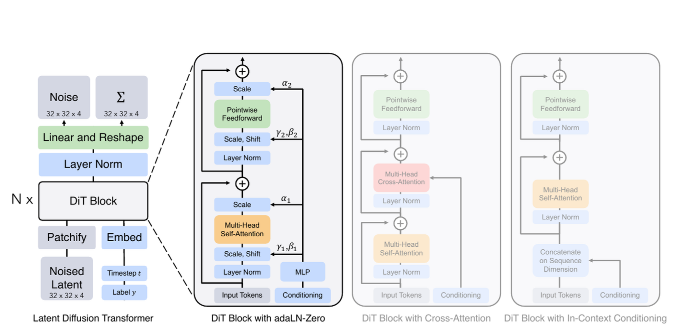
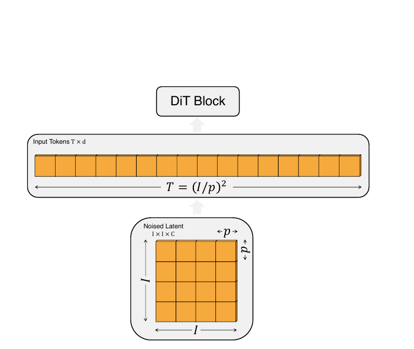
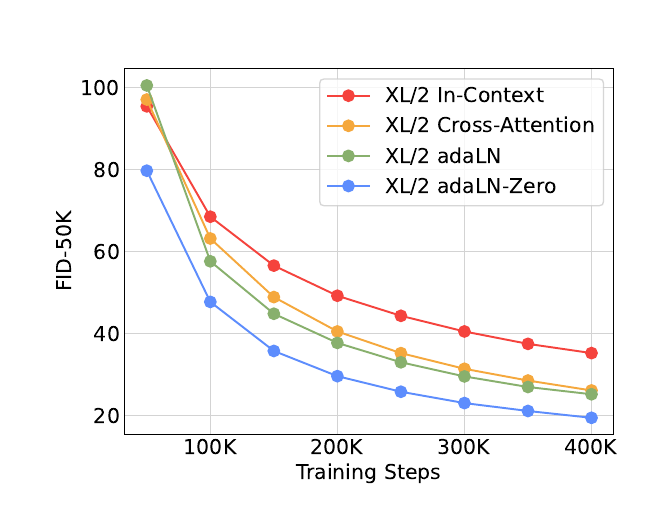
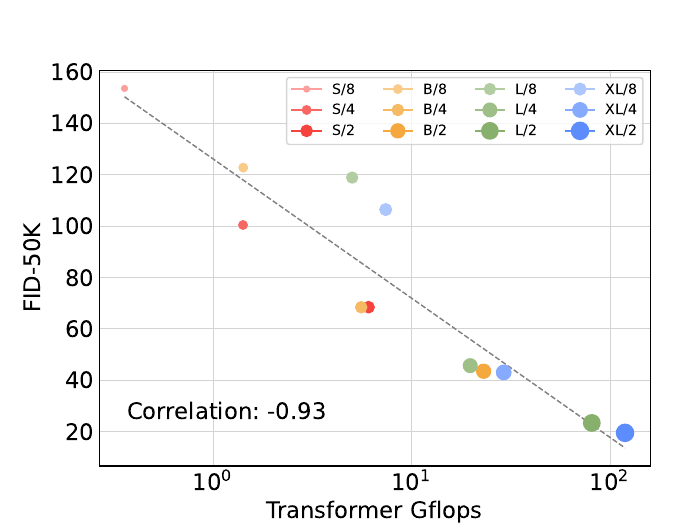
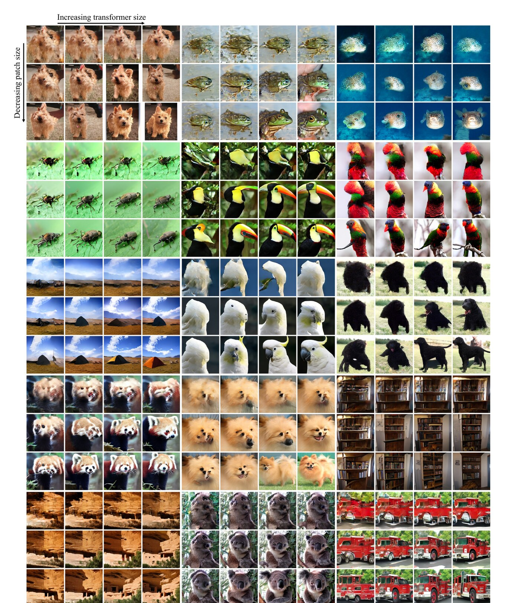

DiT 并没有发明一种新的扩散目标。它保留了 DDPM 的概率模型、前向加噪过程与反向生成过程，只把负责预测反向过程参数的 U-Net 换成了 Transformer。真正需要理解的问题因此不是“Transformer 为什么也能画图”，而是：**一个带噪的二维 latent，怎样被改写成 token 序列；时间步与类别怎样改变每一层计算；最后的 token 又怎样变回扩散采样器所需的均值与方差。**

本文从最大似然开始，把 ELBO、闭式后验、噪声预测和 score 的关系推到可以逐项核对的程度，再进入 DiT 的结构。全文采用如下记号：$x_0$ 表示像素空间中的真实图像，$z_0$ 表示 VAE 编码后的 latent；介绍 DDPM 时使用 $x_t$，进入 DiT 后使用 $z_t$。$q$ 始终表示人为规定、没有可学习参数的前向过程，$p_\theta$ 表示需要学习的反向过程。

> 本文主要依据 [Peebles & Xie (2023)](https://arxiv.org/abs/2212.09748) 的 DiT 论文及其[官方实现](https://github.com/facebookresearch/DiT)。DDPM、学习方差、latent diffusion 与 CFG 的背景分别回到对应原始论文；图像来源在图注中标明。

## 1. 从数据分布到最大似然

一张自然图像可以看成高维连续空间中的一个点。真实世界不断产生图像，这些点形成一个未知分布 $p_{\mathrm{data}}(x)$。生成模型的目标，是构造一个带参数的分布 $p_\theta(x)$，使它尽量接近 $p_{\mathrm{data}}$。

对连续图像而言，$p_\theta(x)$ 是**概率密度**，不是分类器输出的“属于猫的概率”。单点概率在连续空间中可以为零，但一小片区域的概率由密度积分得到。假设训练集 $\mathcal D=\{x^{(i)}\}_{i=1}^{m}$ 独立采样自真实分布，最大似然估计为

$$
\theta^\star
=\arg\max_\theta \prod_{i=1}^{m}p_\theta(x^{(i)})
=\arg\max_\theta \sum_{i=1}^{m}\log p_\theta(x^{(i)}).
$$

除以样本数不会改变最优解。根据大数定律，样本平均在数据足够多时逼近真实分布下的期望：

$$
\frac{1}{m}\sum_{i=1}^{m}\log p_\theta(x^{(i)})
\;\xrightarrow[m\to\infty]{}\;
\mathbb E_{x\sim p_{\mathrm{data}}}
\!\left[\log p_\theta(x)\right].
$$

最大化这个期望又等价于最小化前向 KL 散度，因为

$$
D_{\mathrm{KL}}\!\left(p_{\mathrm{data}}\Vert p_\theta\right)
=\mathbb E_{p_{\mathrm{data}}}\!\left[\log p_{\mathrm{data}}(x)\right]
-\mathbb E_{p_{\mathrm{data}}}\!\left[\log p_\theta(x)\right],
$$

第一项与 $\theta$ 无关。生成学习的第一条主线由此确定：模型要寻找一个能够给真实数据区域较高密度的参数化分布。

## 2. 扩散模型是一条隐变量链

直接为复杂图像分布写出可计算的 $p_\theta(x_0)$ 很困难。扩散模型引入一串与图像同维度的隐变量 $x_1,\ldots,x_T$。前向过程 $q$ 逐步加噪，反向过程 $p_\theta$ 逐步去噪：

$$
q(x_{1:T}\mid x_0)
=\prod_{t=1}^{T}q(x_t\mid x_{t-1}),
\qquad
p_\theta(x_{0:T})
=p(x_T)\prod_{t=1}^{T}p_\theta(x_{t-1}\mid x_t).
$$

$q$ 是训练前就固定的“破坏规则”，没有参数需要学习；$p_\theta$ 才是神经网络参与的“恢复规则”。当 $T$ 足够大且噪声日程合理时，末端 $x_T$ 接近标准高斯分布，因此生成时可以从 $x_T\sim\mathcal N(0,I)$ 起步。

前向过程沿 $x_0\rightarrow x_t\rightarrow x_T$ 加入噪声；生成时，学习到的反向过程沿 $x_T\rightarrow x_t\rightarrow x_0$ 逐步恢复样本。两个方向使用相同的时间索引，却承担完全不同的角色。

## 3. 前向过程为什么能一步采样

令 $\beta_t\in(0,1)$ 为第 $t$ 步的噪声强度，并记 $\alpha_t=1-\beta_t$。DDPM 的一步转移定义为

$$
q(x_t\mid x_{t-1})
=\mathcal N\!\left(
x_t;\sqrt{\alpha_t}\,x_{t-1},\beta_t I
\right).
$$

每一步先把已有信号缩小 $\sqrt{\alpha_t}$，再加入方差为 $\beta_t$ 的独立高斯噪声。连续应用高斯线性变换后仍然得到高斯分布。定义累计乘积 $\bar\alpha_t=\prod_{s=1}^{t}\alpha_s$，便可把中间步骤积分掉：

$$
q(x_t\mid x_0)
=\mathcal N\!\left(
x_t;\sqrt{\bar\alpha_t}\,x_0,
(1-\bar\alpha_t)I
\right).
$$

使用重参数化技巧，可以直接从 $x_0$ 采样任意时间步：

$$
\epsilon\sim\mathcal N(0,I),
\qquad
x_t=\sqrt{\bar\alpha_t}\,x_0
+\sqrt{1-\bar\alpha_t}\,\epsilon.
$$

因此训练一个样本时不需要执行 $1,2,\ldots,t$ 共 $t$ 次加噪。只需随机抽一个 $t$ 和一份 $\epsilon$，一次计算就得到 $x_t$。

## 4. ELBO 从哪里来

我们想最大化 $\log p_\theta(x_0)$，但它需要对全部隐变量积分。在积分中乘除同一个前向分布 $q(x_{1:T}\mid x_0)$，就可以把积分改写为关于 $q$ 的期望：

$$
\begin{aligned}
\log p_\theta(x_0)
&=\log
\mathbb E_{q(x_{1:T}\mid x_0)}
\left[
\frac{p_\theta(x_{0:T})}
{q(x_{1:T}\mid x_0)}
\right]\\
&\ge
\mathbb E_q
\left[
\log p_\theta(x_{0:T})
-\log q(x_{1:T}\mid x_0)
\right].
\end{aligned}
$$

不等号来自 Jensen 不等式：对数是凹函数，因此“期望的对数”不大于“对数的期望”。右侧就是 evidence lower bound，简称 ELBO。最大化 ELBO 等价于最小化它的负值。利用马尔可夫分解后，负 ELBO 可以整理为

$$
\begin{aligned}
\mathcal L_{\mathrm{VLB}}
=\mathbb E_q\Big[
&D_{\mathrm{KL}}\!\left(q(x_T\mid x_0)\Vert p(x_T)\right)\\
&+\sum_{t=2}^{T}
D_{\mathrm{KL}}\!\left(
q(x_{t-1}\mid x_t,x_0)
\Vert p_\theta(x_{t-1}\mid x_t)
\right)\\
&-\log p_\theta(x_0\mid x_1)
\Big].
\end{aligned}
$$

第一项检查加噪终点是否接近先验 $\mathcal N(0,I)$；中间的 KL 项训练每个反向步骤逼近真实后验；最后一项是从 $x_1$ 重建 $x_0$ 的负对数似然。由于前向过程固定，第一项没有可学习参数。神经网络训练的核心，是中间每个时间步的反向匹配。

## 5. 闭式后验与噪声预测

训练时同时知道干净样本 $x_0$ 和由它产生的 $x_t$，所以真实单步后验可以由高斯条件分布直接算出：

$$
q(x_{t-1}\mid x_t,x_0)
=\mathcal N\!\left(
x_{t-1};
\tilde\mu_t(x_t,x_0),
\tilde\beta_t I
\right),
$$

$$
\tilde\mu_t
=
\frac{\sqrt{\bar\alpha_{t-1}}\beta_t}
{1-\bar\alpha_t}x_0
+
\frac{\sqrt{\alpha_t}(1-\bar\alpha_{t-1})}
{1-\bar\alpha_t}x_t,
\qquad
\tilde\beta_t
=
\frac{1-\bar\alpha_{t-1}}
{1-\bar\alpha_t}\beta_t.
$$

采样时没有 $x_0$，无法直接使用这个均值。DDPM 最常用的参数化不是直接预测均值，而是预测生成 $x_t$ 时加入的噪声 $\epsilon$。把 $x_0=(x_t-\sqrt{1-\bar\alpha_t}\epsilon)/\sqrt{\bar\alpha_t}$ 代回后验均值，可以写成

$$
\mu_\theta(x_t,t)
=
\frac{1}{\sqrt{\alpha_t}}
\left(
x_t-
\frac{\beta_t}{\sqrt{1-\bar\alpha_t}}
\epsilon_\theta(x_t,t)
\right).
$$

$\epsilon_\theta$ 因而不是与概率模型无关的工程技巧，它通过上式确定了反向高斯分布的均值。将 ELBO 中对应 KL 项展开，会得到带时间权重的噪声均方误差。Ho 等人发现，去掉该权重的简化目标通常有更好的样本质量：

$$
\mathcal L_{\mathrm{simple}}
=
\mathbb E_{\substack{x_0\sim p_{\mathrm{data}}\\
t\sim\mathcal U\{1,\ldots,T\}\\
\epsilon\sim\mathcal N(0,I)}}
\left[
\left\|
\epsilon-\epsilon_\theta(x_t,t)
\right\|_2^2
\right].
$$

训练时给模型一个随机噪声级别的样本，让它回归那次实际加入的高斯噪声；采样时再把噪声预测代入 $\mu_\theta$，得到下一步 $x_{t-1}$ 的分布。

## 6. Score function：从密度梯度到去噪方向

对可微密度 $p(x)$，score function 定义为

$$
s_p(x)=\nabla_x\log p(x).
$$

它不是“样本得分”，也不是标量概率，而是与 $x$ 同维度的向量。它指向局部对数密度增长最快的方向。若 $p(x)=\mathcal N(\mu,\sigma^2)$，则

$$
s_p(x)=-\frac{x-\mu}{\sigma^2}.
$$

向量总是指回高密度中心。score 还有一个重要性质：它不依赖归一化常数。若

$$
p(x)=\frac{\tilde p(x)}{Z},
$$

且 $Z$ 与 $x$ 无关，那么

$$
\nabla_x\log p(x)=\nabla_x\log\tilde p(x)-\nabla_x\log Z
=\nabla_x\log\tilde p(x).
$$

因此可以学习“概率质量往哪里增加”，而不必先计算高维积分 $Z$。不过训练数据只给样本，不给 $\nabla_x\log p_{\mathrm{data}}(x)$。Denoising score matching 先用已知噪声核把数据平滑为 $q_t(x_t)$，再从干净—带噪样本对中学习各噪声尺度的 score。

对给定 $x_0$ 的 DDPM 加噪高斯分布，直接求导：

$$
\nabla_{x_t}\log q(x_t\mid x_0)
=-
\frac{x_t-\sqrt{\bar\alpha_t}x_0}
{1-\bar\alpha_t}
=-
\frac{\epsilon}{\sqrt{1-\bar\alpha_t}}.
$$

模型只接收 $x_t$ 和 $t$，看不到 $x_0$。在均方误差下，最优噪声预测器为

$$
\epsilon_\theta^\star(x_t,t)=\mathbb E[\epsilon\mid x_t].
$$

把条件 score 关于后验 $q(x_0\mid x_t)$ 取期望，就得到加噪边缘分布的 score：

$$
\begin{aligned}
\nabla_{x_t}\log q_t(x_t)
&=\mathbb E_{q(x_0\mid x_t)}
\left[\nabla_{x_t}\log q(x_t\mid x_0)\right]\\
&=-\frac{\mathbb E[\epsilon\mid x_t]}{\sqrt{1-\bar\alpha_t}}.
\end{aligned}
$$

所以在 VP/DDPM 参数化下，噪声预测与 score 只差一个时间相关的负比例因子：

$$
s_\theta(x_t,t)
\approx
-\frac{\epsilon_\theta(x_t,t)}
{\sqrt{1-\bar\alpha_t}}.
$$

还可以从后验均值看同一件事。由 Tweedie 型恒等式，

$$
\mathbb E[x_0\mid x_t]
=\frac{x_t+(1-\bar\alpha_t)\nabla_{x_t}\log q_t(x_t)}
{\sqrt{\bar\alpha_t}}.
$$

给定 $x_t$，score 决定了对干净样本 $x_0$ 的最优平方误差估计。<strong>Score function 因此是密度几何、噪声预测与去噪估计之间的共同接口。</strong>DiT 默认输出 $\epsilon_\theta$，但它最终提供给采样器的正是这个时间相关的去噪方向。

## 7. DiT 实际接收的不是图片

原始 DiT 采用 latent diffusion 的两阶段设计。预训练 VAE 的编码器 $E$ 先把像素图像压缩为 latent：

$$
\begin{aligned}
z_0 &= E(x_0),\\[3pt]
x_0 &\in \mathbb R^{256 \times 256 \times 3},\\
z_0 &\in \mathbb R^{32 \times 32 \times 4}.
\end{aligned}
$$

扩散过程在 $z$ 空间执行：$z_t=\sqrt{\bar\alpha_t}z_0+\sqrt{1-\bar\alpha_t}\epsilon$。采样得到 $\hat z_0$ 后，再由冻结的解码器 $D$ 还原图像 $\hat x_0=D(\hat z_0)$。所以“DiT 是纯 Transformer 图像生成器”并不准确：完整系统仍包含卷积 VAE；Transformer 替换的是 latent diffusion 中反复调用的去噪主干。

<strong>Figure 1.</strong> DiT 将带噪 latent 切成 patch token，经过条件 Transformer blocks，再映射回空间张量。来源：Peebles &amp; Xie (2023), Figure 3。

| 输入  | 形状                       | 含义                            |
|-------|----------------------------|---------------------------------|
| $z_t$ | $N\times4\times32\times32$ | 随机时间步的带噪 latent         |
| $t$   | $N$                        | 每个样本的噪声时间步            |
| $y$   | $N$                        | ImageNet 类别；可被替换为空条件 |

## 8. 从二维 latent 到 token

Transformer 接收序列，而 $z_t$ 是二维特征图。设空间边长为 $I$、通道数为 $C$、patch 边长为 $p$。一个 kernel size 与 stride 都等于 $p$ 的卷积，可以同时完成切块与线性投影：

$$
T=\left(\frac{I}{p}\right)^2,
\qquad
Z^{(0)}
=\operatorname{PatchEmbed}(z_t)+P_{\mathrm{2D}},
\qquad
Z^{(0)}\in\mathbb R^{N\times T\times d}.
$$

$P_{\mathrm{2D}}$ 是固定二维正余弦位置编码，$d$ 是隐藏维度。对于 $I=32$：

| 模型后缀 | patch $p$ | token 数 $T$ |
|----------|-----------|--------------|
| DiT-\*/8 | 8         | 16           |
| DiT-\*/4 | 4         | 64           |
| DiT-\*/2 | 2         | 256          |

<strong>Figure 2.</strong> latent 每条边的 patch 数为 I/p，二维 token 总数随 1/p² 增长。来源：Peebles &amp; Xie (2023), Figure 4。

“减小 patch 不增加参数”应理解为**几乎不改变 Transformer 主干参数**，而不是严格零变化。patch embedding 与输出层参数会随 $p$ 改变，但相对由 $L$ 层、宽度 $d$ 决定的主干很小；论文观察到总参数量变化可以忽略，而计算量显著增加。

## 9. adaLN-Zero 的精确含义

去噪器必须知道当前噪声强度；类别条件模型还要知道目标类别。DiT 先把二者分别嵌入并相加：

$$
c=e_t(t)+e_y(y)\in\mathbb R^d.
$$

论文比较了四种条件进入 block 的方式。in-context conditioning 把条件当额外 token；cross-attention 让图像 token 查询条件；adaLN 用条件生成 LayerNorm 的缩放和平移；adaLN-Zero 进一步为注意力与 MLP 残差分支生成门控，并采用零初始化。

<strong>Figure 3.</strong> 在 DiT-XL/2 的对照实验中，adaLN-Zero 收敛更快，额外计算很小。来源：Peebles &amp; Xie (2023), Figure 5。

令无仿射参数的 LayerNorm 为 $\operatorname{LN}$，条件调制定义为

$$
\operatorname{modulate}(h;s,b)=h\odot(1+s)+b.
$$

每个 block 用一个线性层从条件 $c$ 产生六组长度为 $d$ 的向量：

$$
(s_{\mathrm{msa}},b_{\mathrm{msa}},g_{\mathrm{msa}},
s_{\mathrm{mlp}},b_{\mathrm{mlp}},g_{\mathrm{mlp}})
=W\,\operatorname{SiLU}(c).
$$

block 的计算为

$$
\begin{aligned}
h'
&=h+
g_{\mathrm{msa}}\odot
\operatorname{MSA}\!\left(
\operatorname{modulate}
(\operatorname{LN}(h);s_{\mathrm{msa}},b_{\mathrm{msa}})
\right),\\
h''
&=h'+
g_{\mathrm{mlp}}\odot
\operatorname{MLP}\!\left(
\operatorname{modulate}
(\operatorname{LN}(h');s_{\mathrm{mlp}},b_{\mathrm{mlp}})
\right).
\end{aligned}
$$

官方实现将产生这六组向量的线性层权重与偏置全部初始化为零。因此初始化时 $s=b=g=0$：调制退化为普通 LayerNorm，两个门控把残差分支输出乘成零，于是 $h''=h$。这才是“恒等映射初始化”的准确含义。它不是把 LayerNorm 输出置零，也不是让注意力永远为零；训练开始后 $W$ 离开零点，条件相关的残差更新逐渐被打开。

## 10. 输出头、噪声与方差

经过 $L$ 个 blocks 后，每个 token 先由条件 $c$ 调制最终 LayerNorm，再投影到 $p^2C_{\mathrm{out}}$ 维。unpatchify 把序列重新排列为空间张量：

$$
N\times T\times(p^2C_{\mathrm{out}})
\quad\longrightarrow\quad
N\times C_{\mathrm{out}}\times I\times I.
$$

当 `learn_sigma=True` 时，官方实现令 $C_{\mathrm{out}}=2C$。对 4 通道 latent，网络输出 8 通道：前 4 通道是 $\epsilon_\theta(z_t,t,y)$，后 4 通道是反向过程方差的逐坐标参数。

$$
p_\theta(z_{t-1}\mid z_t)
=\mathcal N\!\left(
z_{t-1};
\mu_\theta(z_t,t,y),
\Sigma_\theta(z_t,t,y)
\right),
\qquad
\Sigma_\theta=\operatorname{diag}(\sigma_1^2,\ldots,\sigma_n^2).
$$

网络不会输出一个 $n\times n$ 的完整协方差矩阵；对角高斯只需为每个 latent 坐标预测一个标量。沿用 Improved DDPM 的 learned-range 参数化时，输出也不是无约束的裸方差，而是用来在预设最小、最大对数方差之间插值的参数。噪声通道主要由 $\mathcal L_{\mathrm{simple}}$ 训练，学习方差时还保留 VLB 中的方差项。

## 11. 计算量与扩展规律

设 token 数为 $T$、隐藏维度为 $d$、层数为 $L$，MLP ratio 为 4。若把一次乘加记作一次操作，一个标准 block 的主项约为

$$
\operatorname{MACs}_{\mathrm{block}}
\approx 12Td^2+2T^2d.
$$

Q、K、V 与注意力输出投影合计约 $4Td^2$，两层 MLP 约 $8Td^2$，注意力矩阵和对 Value 加权合计约 $2T^2d$。若统计工具把一次乘法和一次加法分别算一个 FLOP，数值通常再乘约 2；不同工具的 GFLOPs 绝对值可能不同，但增长关系不变：

$$
\operatorname{compute}(\mathrm{DiT})
=\mathcal O\!\left(L(Td^2+T^2d)\right).
$$

- **增加深度 $L$**：参数量与前向计算近似线性增长。
- **增加宽度 $d$**：大部分参数量和线性层计算近似按 $d^2$ 增长。
- **减小 patch $p$**：$T=I^2/p^2$ 增长；$p$ 减半使线性项约变为 4 倍，注意力二次项约变为 16 倍。

最后一条不代表总 GFLOPs 一定严格增加 16 倍，因为在 DiT 的宽度和 token 范围内，$Td^2$ 可能仍占很大比例。正确做法是保留两个主项，而不是只看到注意力的 $T^2$。

| 配置   | 层数 $L$ | 宽度 $d$ | Heads | 参数量  |
|--------|----------|----------|-------|---------|
| DiT-S  | 12       | 384      | 6     | 约 33M  |
| DiT-B  | 12       | 768      | 12    | 约 130M |
| DiT-L  | 24       | 1024     | 16    | 约 458M |
| DiT-XL | 28       | 1152     | 16    | 约 675M |

<strong>Figure 4.</strong> 400K 训练步时，GFLOPs 与 FID-50K 呈强负相关；FID 越低越好。来源：Peebles &amp; Xie (2023), Figure 8。

<strong>Figure 5.</strong> 每组固定初始噪声和类别。横向增大模型、纵向减小 patch 后，结构和细节整体改善。来源：Peebles &amp; Xie (2023), Figure 7。

“scalable” 是实验结论，不是无条件定律。它表示主干提供了清晰、可组合的扩展方式，并且在论文测试范围内收益平滑；它不保证无限增加计算都会同样有效。论文中的 GFLOPs 也只是一次 DiT 前向，不是生成一张图的总成本；若采样器调用模型 250 次，主干成本就会重复约 250 次。

## 12. Classifier-Free Guidance

CFG 在训练时以一定概率把类别 $y$ 替换为空条件 $\varnothing$，使同一个模型既学到条件预测 $\epsilon_\theta(z_t,t,y)$，也学到无条件预测 $\epsilon_\theta(z_t,t,\varnothing)$。DiT 官方配置中的类别 dropout 概率为 0.1。采样时组合两次预测：

$$
\epsilon_{\mathrm{cfg}}
=\epsilon_{\mathrm{uncond}}
+s\left(
\epsilon_{\mathrm{cond}}
-\epsilon_{\mathrm{uncond}}
\right).
$$

$s=0$ 时使用无条件预测；$s=1$ 时回到普通条件预测；$s>1$ 时沿“条件相对无条件造成的差值方向”外推。由于噪声与 score 只差时间比例，这也可以理解为放大条件 score 相对于无条件 score 的偏移。更大的 $s$ 往往提高条件一致性，却会牺牲分布覆盖和多样性；过大时还可能引入过饱和或结构失真。

## 13. 一次训练更新的随机性

把前面的步骤合并，DiT 的总体训练目标可以写成

$$
\begin{gathered}
x_0\sim p_{\mathrm{data}},\\
t\sim\mathcal U\{1,\ldots,T\},\\
\epsilon\sim\mathcal N(0,I),\\[6pt]
z_0=E(x_0),\\
z_t=\sqrt{\bar\alpha_t}\,z_0
  +\sqrt{1-\bar\alpha_t}\,\epsilon,\\[6pt]
\mathcal L_{\mathrm{simple}}(\theta)
=
\mathbb E_{x_0,t,\epsilon}
\left[
\left\|
\epsilon-\epsilon_\theta(z_t,t,y)
\right\|_2^2
\right].
\end{gathered}
$$

固定数据分布、模型和目标后，$\mathcal L(\theta)$ 作为参数的函数在理论上是固定的。训练曲线的抖动不是“全局 loss 地形每一步被重画”，而是每次更新只用随机估计

$$
\widehat{\mathcal L}_B(\theta)
=
\frac{1}{|B|}
\sum_{i\in B}
\left\|
\epsilon^{(i)}-
\epsilon_\theta
\left(z_{t_i}^{(i)},t_i,y_i\right)
\right\|_2^2.
$$

随机性来自 mini-batch 中的图像、每张图的时间步、高斯噪声，以及类别是否被 dropout。不同组合给出略有差异的梯度；它们的平均方向逼近总体梯度，因此 SGD 的轨迹会抖动，却总体朝低损失区域前进。

## 14. 完整数据流复盘

1.  从数据集取图像 $x_0$ 与类别 $y$，用冻结 VAE 得到 $z_0=E(x_0)$。
2.  采样 $t$ 和 $\epsilon$，构造 $z_t=\sqrt{\bar\alpha_t}z_0+\sqrt{1-\bar\alpha_t}\epsilon$。
3.  按 $p\times p$ patch 切分 $z_t$，投影到 $d$ 维并加入二维位置编码，得到 $T=I^2/p^2$ 个 token。
4.  把时间嵌入与类别嵌入相加为 $c$；训练 CFG 时，部分类别被替换为空条件。
5.  每个 block 用 $c$ 生成 LayerNorm 的 shift、scale 和两条残差分支的 gate；注意力负责 token 间通信，MLP 负责逐 token 变换。
6.  最终层把每个 token 投影到 $p^2(2C)$ 维并 unpatchify。前 $C$ 通道预测噪声，后 $C$ 通道参数化对角方差。
7.  用真实 $\epsilon$ 监督噪声预测；学习方差时再加入 VLB 方差项，反向传播只更新 DiT。

生成时方向相反：从 $z_T\sim\mathcal N(0,I)$ 出发；每个时间步让 DiT 预测噪声与方差，必要时用 CFG 合成条件预测；采样 $z_{t-1}\sim p_\theta(z_{t-1}\mid z_t)$，直到 $z_0$；最后用 VAE 解码器生成图像。

因而，DiT 的贡献可以被准确地放回整个概率模型中：**DDPM 决定学什么，VAE 决定在哪个表示空间学习，patchify 决定 Transformer 看到多少 token，adaLN-Zero 决定条件如何稳定控制深层残差更新，输出头把 token 重新翻译成反向高斯分布的参数，而 scaling 实验研究这些选择怎样把更多前向计算转化为更好的生成质量。**

## References

1.  Peebles, W. & Xie, S. (2023). <a href="https://arxiv.org/abs/2212.09748" target="_blank" rel="noreferrer">Scalable Diffusion Models with Transformers</a>.
2.  Ho, J., Jain, A. & Abbeel, P. (2020). <a href="https://arxiv.org/abs/2006.11239" target="_blank" rel="noreferrer">Denoising Diffusion Probabilistic Models</a>.
3.  Nichol, A. & Dhariwal, P. (2021). <a href="https://arxiv.org/abs/2102.09672" target="_blank" rel="noreferrer">Improved Denoising Diffusion Probabilistic Models</a>.
4.  Rombach, R. et al. (2022). <a href="https://arxiv.org/abs/2112.10752" target="_blank" rel="noreferrer">High-Resolution Image Synthesis with Latent Diffusion Models</a>.
5.  Ho, J. & Salimans, T. (2022). <a href="https://arxiv.org/abs/2207.12598" target="_blank" rel="noreferrer">Classifier-Free Diffusion Guidance</a>.
6.  Official implementation: <a href="https://github.com/facebookresearch/DiT" target="_blank" rel="noreferrer">facebookresearch/DiT</a>.
