一个多模态大模型回答问题时，我们很容易画出一张直觉图：图像、视频和音频进入模型，在 Transformer 中逐渐融合，最后产生答案。

但这张图几乎没有解释力。

真正困难的问题是：**某一帧、某一个物体或某一段声音，究竟在第几层进入了决策？它先写入了哪个 token？模型是在持续读取原始模态，还是很早就把视觉和听觉压缩成语言侧表示？当答案错误时，错误发生在感知、跨模态融合，还是最终生成阶段？**

过去几年，一条逐渐清晰的研究线索开始回答这些问题。它从“注意力能不能解释模型”出发，经过 causal tracing、activation patching 和 Attention Knockout，先定位语言模型中的事实回忆路径，再迁移到图像 VLM，随后扩展到 VideoLLM 和音视频 MLLM。

其中三篇工作构成了一条非常自然的递进路线：

- [Cross-modal Information Flow in Multimodal Large Language Models](https://openaccess.thecvf.com/content/CVPR2025/html/Zhang_Cross-modal_Information_Flow_in_Multimodal_Large_Language_Models_CVPR_2025_paper.html)，CVPR 2025：图像信息如何进入语言 token，再汇聚到预测位置。
- [Map the Flow: Revealing Hidden Pathways of Information in VideoLLMs](https://arxiv.org/abs/2510.13251)，ICLR 2026：视频模型在上述路径之前，如何通过跨帧注意力形成时空表示。
- [From Senses to Decisions: The Information Flow of Auditory and Visual Perception in Multimodal LLMs](https://arxiv.org/abs/2606.10147)，2026 年预印本：音频、视觉、问题、参考项和答案选项如何形成任务相关、输入结构相关的多路路由。

把三篇论文放在一起，可以先得到一张高度压缩的路线图：

```text
图像 VLM
图像 token
  → 低层：全局视觉信息写入问题 token
  → 中层：问题相关物体再次写入问题 token
  → 中高层：问题 token 将融合结果传给最后 token
  → 输出答案

VideoLLM
各帧 video token
  → 早中层：跨帧交互，建立时空表示
  → 中层：视频信息写入时间词、问题词或候选项
  → 中高层：问题与候选项汇聚到最后 token
  → 输出答案

单段音视频 MLLM
音频 token + 视频 token
  → 按任务需要写入问题 token
  → 问题 token 传给最后 token
  → 输出答案

多段交错音视频 MLLM
候选模态 + 问题 → reference token → 最后 token
候选模态        → option token    → 最后 token
```

这篇文章不只复述三篇论文，而是试图回答一个更一般的问题：

> 在 decoder-only Transformer 的因果注意力约束下，不同输入拓扑如何诱导串行、并行或分支式的信息路由？

本文截图均取自原论文，仅用于学术评论与方法梳理，版权归原作者所有。

## 1. 首先澄清：什么叫“信息流”

“信息流”在不同论文里可能指完全不同的东西。把它们混在一起，是这一领域最常见的误读来源。

### 1.1 注意力连接：模型可能从哪里读取信息

对于第 $l$ 层、第 $h$ 个注意力头，注意力矩阵可以写为：

$$
A^{(l,h)}
=
\operatorname{softmax}
\left(
\frac{Q^{(l,h)}K^{(l,h)\top}}{\sqrt{d_k}}
+M
\right),
$$

其中 $M$ 包含因果掩码。元素 $A_{ij}^{(l,h)}$ 表示目标位置 $i$ 对源位置 $j$ 分配了多少权重。

它描述的是一条**潜在通信边**。但高权重不一定代表高因果贡献：value 向量可能没有有效内容，多个注意力头可能相互抵消，也可能存在冗余旁路。

### 1.2 表示可解码性：某层是否已经包含信息

Logit Lens、linear probe、词表投影和语义相似度回答的是：

> 给定某层隐藏状态，能否读出对象类别、时间概念或最终答案？

例如 Logit Lens 可以写成：

$$
p_l(y)
=
\operatorname{softmax}
\left(
W_U\operatorname{LN}(h_l)
\right).
$$

如果中层已经能读出正确答案，只能说明答案在这个表示空间中**可访问**；它不自动证明模型后续真的使用了这段信息。

### 1.3 因果必要性：切断路径会不会改变答案

Attention Knockout、causal tracing 和 activation patching 通过干预模型内部状态，试图回答：

> 没有这条边、这个 token 或这个层，模型还能得到相同答案吗？

这是三篇主论文最核心的方法层。

### 1.4 功能充分性：只保留这条路径是否仍能完成任务

仅仅发现“切断会掉点”还不够。更强的验证是：

> 屏蔽大量其他边，只保留识别出的有效路径，模型性能是否基本不变？

*Map the Flow* 和 *From Senses to Decisions* 已经开始进行这类验证。它让“信息流图”从一张解释性示意图，向可用于稀疏推理和 token 生命周期管理的计算结构迈进。

### 1.5 信息组成：决策里有多少视觉、语言和协同信息

Partial Information Decomposition（PID）进一步把预测信息分解为：

$$
I(Y;V,L)
=
R+U_V+U_L+S,
$$

其中：

- $R$：视觉与语言都包含的冗余信息；
- $U_V$：视觉独有信息；
- $U_L$：语言独有信息；
- $S$：只有联合观察视觉和语言才能得到的协同信息。

PID 回答的是“融合了多少”，而不是“一条具体神经路径经过哪里”。因此它与 Attention Knockout 是互补关系，而不是替代关系。

## 2. 为什么不能直接把注意力图当作解释

多模态信息流研究的前史，是围绕 attention faithfulness 展开的争论。

Jain 和 Wallace 在 [Attention is not Explanation](https://aclanthology.org/N19-1357/) 中发现，注意力权重与梯度重要性经常不一致，而且可以构造明显不同的注意力分布，却得到近似相同的预测。Wiegreffe 和 Pinter 随后强调，注意力能否成为解释取决于解释的定义、对照实验和可证伪性。

Abnar 和 Zuidema 的 [Quantifying Attention Flow in Transformers](https://aclanthology.org/2020.acl-main.385/) 提出 attention rollout 和 attention flow。它们不再只看单层注意力，而是把多层连接和残差路径纳入传播图。

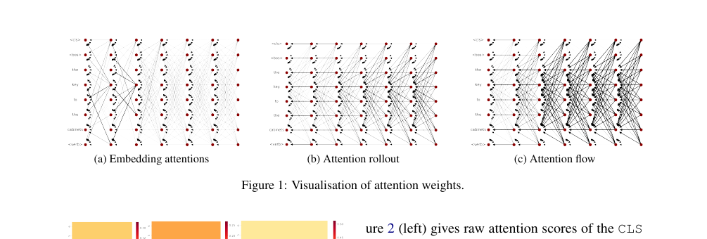

<p class="figure-caption"><strong>Figure 1.</strong> 原始注意力、Attention Rollout 与 Attention Flow 的差异。单层权重只显示局部连接；rollout 和 flow 尝试沿多层网络追踪输入到输出的有效通道。来源：Abnar & Zuidema, <a href="https://aclanthology.org/2020.acl-main.385/">Quantifying Attention Flow in Transformers</a>, ACL 2020, Figure 1。</p>

这一步非常重要，但仍然是基于权重的图分析。后来的多模态工作普遍接受一个更谨慎的原则：

> 注意力可以提示通信结构，但只有干预才能建立“这条路径对输出必要”的证据。

## 3. 从 causal tracing 到 Attention Knockout

### 3.1 Causal tracing：污染、恢复、观察输出

Meng 等人的 [Locating and Editing Factual Associations in GPT](https://proceedings.neurips.cc/paper_files/paper/2022/hash/6f1d43d5a82a37e89b0665b33bf3a182-Abstract-Conference.html) 把因果干预系统化为三步：

1. 在 clean run 中记录正常预测和内部激活；
2. 污染输入，使模型不能正常回忆事实；
3. 把某个 token、某一层的 clean activation 恢复到 corrupted run，观察正确答案概率是否恢复。

可以把某个位置和层的间接效应写成：

$$
\operatorname{IE}(i,l)
=
p\left(y^*\mid \operatorname{restore}(h_i^l)\right)
-p\left(y^*\mid \text{corrupt}\right).
$$

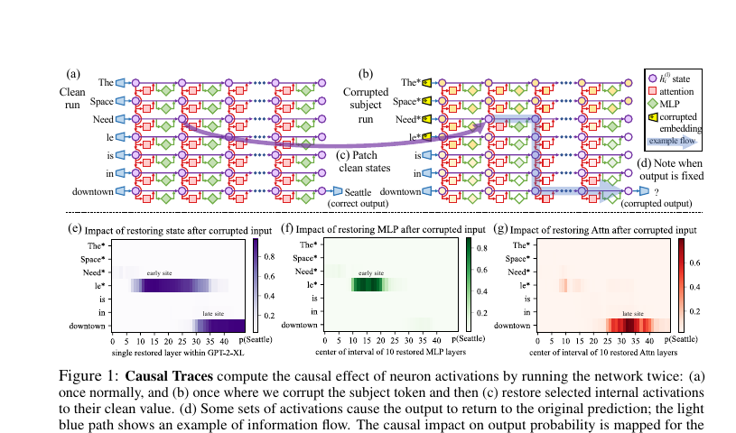

<p class="figure-caption"><strong>Figure 2.</strong> Causal tracing 的标准范式：先污染 subject，再逐层恢复隐藏状态、MLP 或 attention 激活，观察正确事实概率能否恢复。来源：Meng et al., <a href="https://arxiv.org/abs/2202.05262">Locating and Editing Factual Associations in GPT</a>, NeurIPS 2022, Figure 1。</p>

它把“某层编码了什么”变成“某层状态是否因果性地恢复了行为”，并直接推动了 ROME 模型编辑。

### 3.2 Attention Knockout：不改表示，只切断通信边

Geva 等人的 [Dissecting Recall of Factual Associations in Auto-Regressive Language Models](https://aclanthology.org/2023.emnlp-main.751/) 将事实回忆拆成三步：

1. 早期 MLP 丰富主体表示；
2. 关系 token 将关系信息传播到预测位置；
3. 后续注意力头从主体位置提取目标属性。

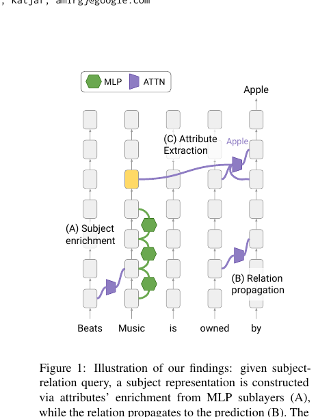

<p class="figure-caption"><strong>Figure 3.</strong> 事实回忆的三阶段机制：subject enrichment、relation propagation 和 attribute extraction。后来的多模态信息流论文直接继承了这种“按 token 组切断注意力边”的思路。来源：Geva et al., <a href="https://aclanthology.org/2023.emnlp-main.751/">Dissecting Recall of Factual Associations</a>, EMNLP 2023, Figure 1。</p>

Attention Knockout 选择一个源 token 集合 $S$、一个目标 token 集合 $T$ 和一段层窗口 $\mathcal{L}$，在这些层中禁止 $T$ 读取 $S$：

$$
\widetilde{A}_{ij}^{(l,h)}=0,
\quad
l\in\mathcal{L},\ i\in T,\ j\in S,
$$

然后重新归一化剩余注意力，测量正确答案概率变化：

$$
\Delta_{S\rightarrow T}^{\mathcal{L}}
=
\frac{
 p_{\text{KO}}(y^*)-p_{\text{base}}(y^*)
}{p_{\text{base}}(y^*)}.
$$

如果 $\Delta$ 显著为负，说明这段层窗口中的 $S\rightarrow T$ 通信对当前预测具有因果必要性。

它比直接删除 token 更细：删除 token 同时改变位置、上下文长度和大量边；Attention Knockout 只切断某一类定向通信。

但它也有局限。窗口过窄时，信息可能绕道传播；窗口过宽时，又可能同时破坏多个功能阶段。Transformer 还可能出现 self-repair，使一次局部消融低估真实贡献。因此，可靠结论通常需要窗口敏感性、反向消融、随机边对照和路径充分性实验。

## 4. 2023—2024：因果工具进入视觉语言模型

### 4.1 BLIP：第一次把 causal tracing 迁移到 VLM

Palit 等人的 [Towards Vision-Language Mechanistic Interpretability](https://openaccess.thecvf.com/content/ICCV2023W/CLVL/html/Palit_Towards_Vision-Language_Mechanistic_Interpretability_A_Causal_Tracing_Tool_for_BLIP_ICCVW_2023_paper.html) 将语言模型 causal tracing 改造到 BLIP：污染图像编码，再把 clean run 的中间状态 patch 到 corrupted run。

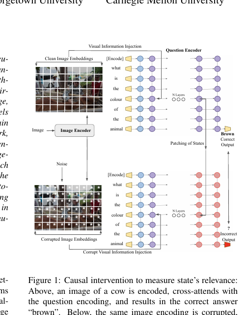

<p class="figure-caption"><strong>Figure 4.</strong> BLIP causal tracing：clean image 得到正确答案，corrupted image 导致错误答案，再逐层恢复中间状态以测量其因果作用。来源：Palit et al., <a href="https://arxiv.org/abs/2308.14179">Towards Vision-Language Mechanistic Interpretability</a>, ICCV Workshop 2023, Figure 1。</p>

这篇工作的意义不在于给出了一条最终通用路线，而在于证明：语言模型的因果解释工具可以跨过视觉编码器、cross-attention 和文本解码器的架构边界。

它观察到 BLIP 较后层表示具有明显因果作用。这个结论不能直接与后来的 LLaVA “早中层融合”对立，因为 BLIP 通过显式 cross-attention 注入视觉，而 LLaVA 把视觉 token 拼接到 decoder 输入中；不同架构的“第几层”承担不同功能。

### 4.2 MultiModalCausalTrace：存储位置与传输路径是两件事

Basu 等人的 [Understanding Information Storage and Transfer in Multi-modal Large Language Models](https://proceedings.neurips.cc/paper_files/paper/2024/hash/0dfe31d6e703e138d46a7d2fced38b7c-Abstract-Conference.html) 明确区分：

- **information storage**：事实知识主要存在哪些参数和层；
- **information transfer**：输入图像和问题如何把信息送到这些位置，再送到输出。

研究在 LLaVA 和 multimodal Phi-2 上发现，相比纯语言模型，MLLM 在更早的 MLP 和 self-attention 层调用知识；同时，一小部分视觉 token 承担了主要信息传输。

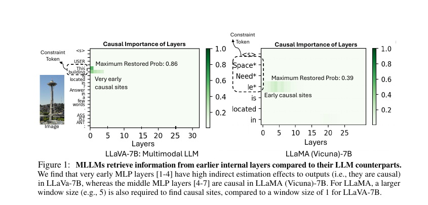

<p class="figure-caption"><strong>Figure 5.</strong> LLaVA-7B 的强因果位置更靠前，而语言骨干 LLaMA/Vicuna 的相关位置偏中层。来源：Basu et al., <a href="https://arxiv.org/abs/2406.04236">Understanding Information Storage and Transfer in Multi-modal Large Language Models</a>, NeurIPS 2024, Figure 1。</p>

该工作还提出 MultEdit，直接编辑这些早期因果 MLP。这说明定位信息流不仅用于“看懂模型”，也能指导知识修正。

### 4.3 NOTICE：干预本身也必须可信

许多 causal tracing 方法给 embedding 添加高斯噪声，但噪声可能把输入推到模型从未见过的区域，制造虚假的因果热区。

[What Do VLMs NOTICE?](https://aclanthology.org/2025.naacl-long.571/) 使用 Semantic Image Pairs（SIP）和 Symmetric Token Replacement（STR）构造语义最小对：只改变对象、状态或表情等一个因素，同时保持输入自然。

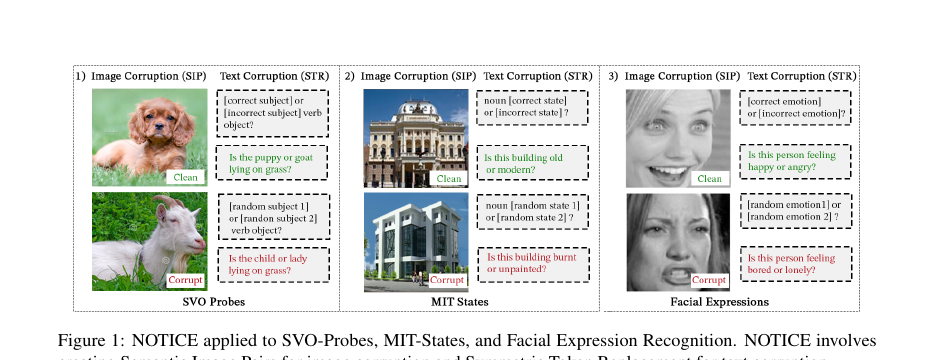

<p class="figure-caption"><strong>Figure 6.</strong> NOTICE 用语义图像对替代高斯噪声污染，并用对称 token 替换构造文本反事实，使 clean/corrupt 输入保持在自然分布附近。来源：Golovanevsky et al., <a href="https://aclanthology.org/2025.naacl-long.571/">What Do VLMs NOTICE?</a>, NAACL 2025, Figure 1。</p>

NOTICE 进一步发现，BLIP 的部分 cross-attention heads 执行对象检测、对象抑制和异常值抑制；LLaVA 的重要 self-attention heads 更偏向异常值抑制。这提醒我们：即使任务相同，不同视觉注入架构也可能形成不同 circuit。

## 5. Cross-modal Information Flow：图像如何变成答案

[Cross-modal Information Flow in Multimodal Large Language Models](https://openaccess.thecvf.com/content/CVPR2025/html/Zhang_Cross-modal_Information_Flow_in_Multimodal_Large_Language_Models_CVPR_2025_paper.html) 是这条研究线第一次把 decoder-only MLLM 的主要通信路径系统地画出来。

论文研究 LLaVA-1.5、LLaVA-1.6 和 Llama3-LLaVA-NeXT 等模型，主要使用经过筛选的 GQA 样本，并把输入划分为：

- image tokens；
- question tokens；
- last token，即生成第一个答案 token 前的最后输入位置。

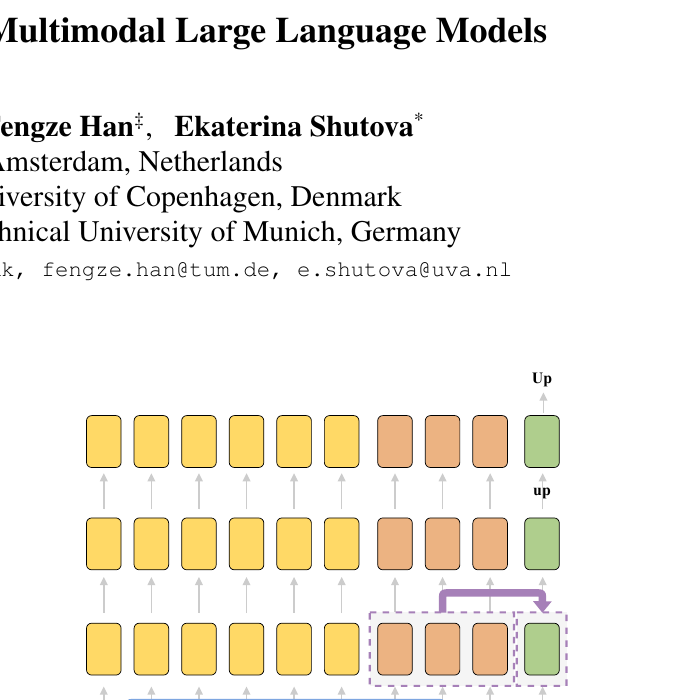

<p class="figure-caption"><strong>Figure 7.</strong> 论文的核心图：视觉信息不是始终直接流向输出，而是在不同层段先进入 question tokens，再由 question tokens 汇聚到 last token。来源：Zhang et al., <a href="https://openaccess.thecvf.com/content/CVPR2025/html/Zhang_Cross-modal_Information_Flow_in_Multimodal_Large_Language_Models_CVPR_2025_paper.html">Cross-modal Information Flow</a>, CVPR 2025, Figure 1。</p>

### 5.1 第一个问题：谁真正控制最后预测位置

作者分别切断：

- question $\rightarrow$ last；
- image $\rightarrow$ last；
- last $\rightarrow$ last 的历史自回归信息。

结果显示，**question $\rightarrow$ last 是最稳定、最显著的路径**。image $\rightarrow$ last 的直接作用通常较弱，说明图像并不是在最后几层持续直接驱动答案。

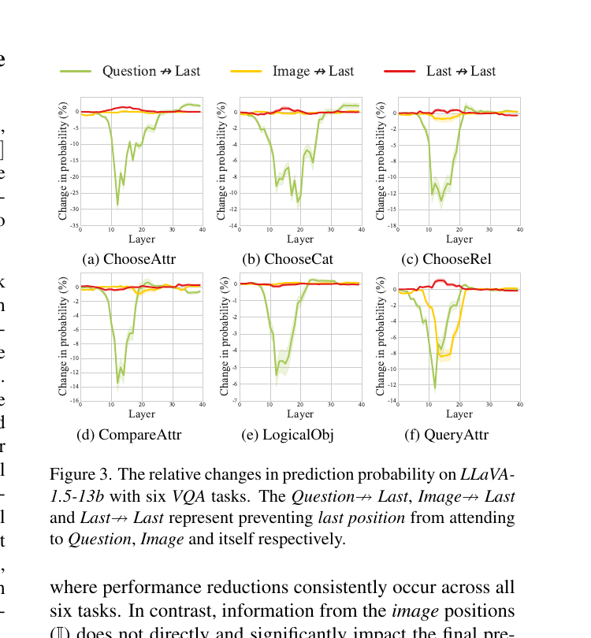

<p class="figure-caption"><strong>Figure 8.</strong> 切断 question 到 last 的注意力边会在中高层引起明显概率下降；直接切断 image 到 last 的影响更小。来源：Zhang et al., Cross-modal Information Flow, Figure 3。</p>

这给出一个关键解释：

> question token 并不只是静态指令。经过若干层后，它们已经成为包含视觉证据的多模态工作区；last token 主要从这个语言侧工作区读取决策信息。

### 5.2 第二个问题：图像什么时候写入问题 token

当作者切断 image $\rightarrow$ question 时，概率曲线通常出现两个不同层段的下降。

第一阶段位于较低层。此时整幅图像的许多 patch 都会影响问题 token，更像是全局场景信息的写入。

第二阶段位于中层。此时与问题相关的对象 patch 贡献明显高于无关 patch，模型开始执行任务相关的视觉选择。

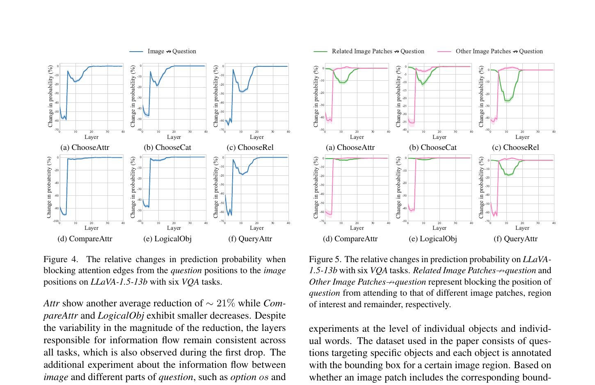

<p class="figure-caption"><strong>Figure 9.</strong> 左侧显示 image→question 的双阶段概率下降；右侧比较问题相关与无关图像区域，说明中层出现针对目标对象的选择性写入。来源：Zhang et al., Cross-modal Information Flow, Figures 4–5。</p>

因此，“视觉语言融合”不是一次性的对齐事件，而更像两次写入：

```text
第一次写入：这幅图大体是什么场景？
第二次写入：为了回答当前问题，真正需要哪个对象或区域？
```

### 5.3 第三个问题：模型何时已经知道答案

论文用 Logit Lens 读取 last token 在不同层的词表分布。很多样本在中层或中高层已经出现语义正确答案，后续层更多负责大小写、词形和输出格式修整。

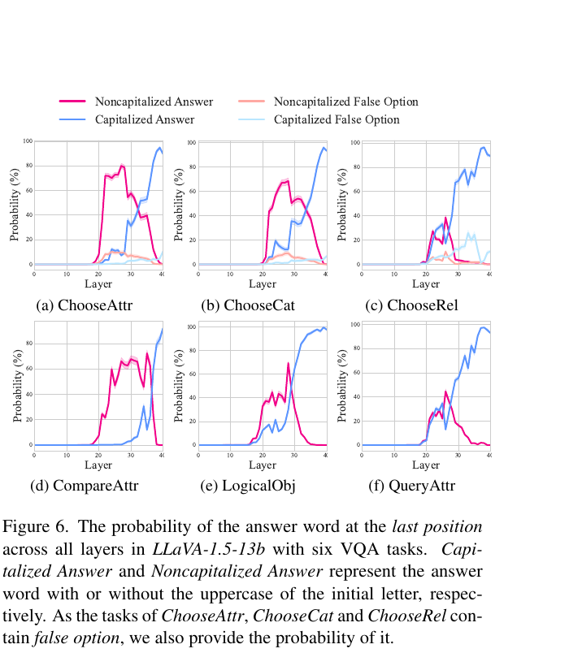

<p class="figure-caption"><strong>Figure 10.</strong> 中层已经能读出语义正确的答案，后层进一步把表示变成正确的表面形式。来源：Zhang et al., Cross-modal Information Flow, Figure 6。</p>

这把“决定答案内容”和“生成合法文本”区分开来：

- 中层完成多模态语义决策；
- 后层完成语言形式规范化和自回归生成准备。

### 5.4 这篇论文真正建立了什么

它建立的不是一个固定层号，而是一组功能阶段：

```text
低层：全局视觉写入
中层：问题相关区域选择与绑定
中高层：融合表示向预测位置汇聚
高层：语言形式修整
```

最值得保留的概念是 **language-side bottleneck**：视觉信息在有限层段内被压缩到少数 question tokens，后续推理越来越像语言模型内部的计算。

### 5.5 边界与限制

论文主要研究 LLaVA 式 token concatenation 架构、短答案 GQA 样本，而且聚焦模型原本回答正确的样本。开放式长文本、Q-Former、显式 cross-attention、MoE 和 streaming 模型都可能出现不同路径。

此外，平均曲线可能掩盖样本级差异。同一个模型在计数、空间关系和属性识别中，所依赖的视觉区域和融合层宽度并不一定相同。

## 6. Map the Flow：视频比图像多出的那一步

图像 VLM 可以把一张图直接写入语言 token，但视频首先要回答：不同帧之间发生了什么？

[Map the Flow](https://arxiv.org/abs/2510.13251) 将 token 分为帧级 video tokens、question tokens、option tokens 和 last token，并在 Attention Knockout 中增加了 **cross-frame attention** 干预。

论文以 TVBench 的 Action Antonym、Action Sequence、Scene Transition、Moving Direction 和 Object Count 等时间推理任务为主，并在多种 VideoLLM、长视频与空间任务上做扩展验证。

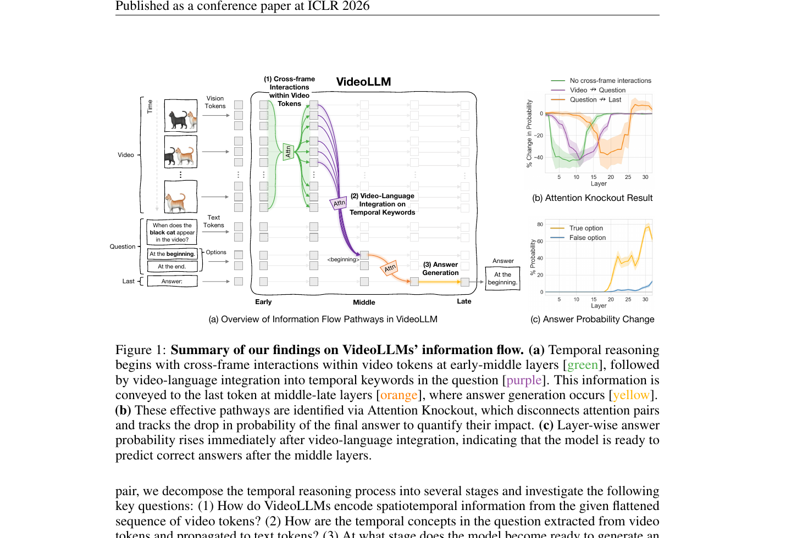

<p class="figure-caption"><strong>Figure 11.</strong> VideoLLM 的三阶段路线：早中层跨帧交互，中层视频—语言融合，中高层信息向 last token 汇聚。来源：Kim et al., <a href="https://arxiv.org/abs/2510.13251">Map the Flow</a>, ICLR 2026, Figure 1。</p>

### 6.1 第一阶段：跨帧交互建立时空表示

作者切断不同帧 token 之间的注意力边。对于经过 VideoQA 微调的模型，早中层出现明显概率下降；而对应的 ImageLLM 基座通常没有同样模式。

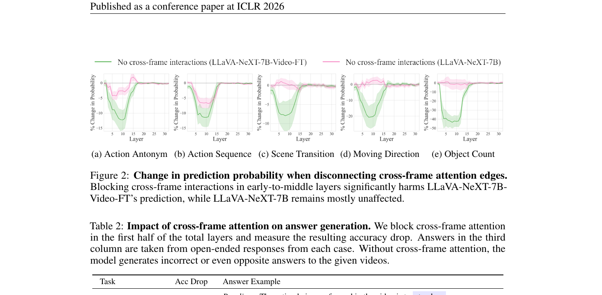

<p class="figure-caption"><strong>Figure 12.</strong> 在 Action Antonym、Action Sequence、Scene Transition、Moving Direction 和 Object Count 中，早中层 cross-frame knockout 显著伤害 VideoLLM。来源：Kim et al., Map the Flow, Figure 2。</p>

论文报告，在正确样本上切断前半层跨帧交互，会带来至少 18% 的准确率下降；Moving Direction 和 Object Count 的下降更大。切断后半层跨帧交互则影响很小。

这意味着 VideoLLM 不是在所有层持续“看帧与帧之间的关系”。它更像先用一段有限计算建立时空表示，之后操作已经聚合过的视频语义。

### 6.2 第二阶段：时空表示与时间词对齐

作者结合 Logit Lens 和语义相似度分析 video token。在早中层跨帧交互之后，视频表示逐渐与“开始、结束、先、后、移动、上、下”等时间和动作概念的语言 embedding 对齐。

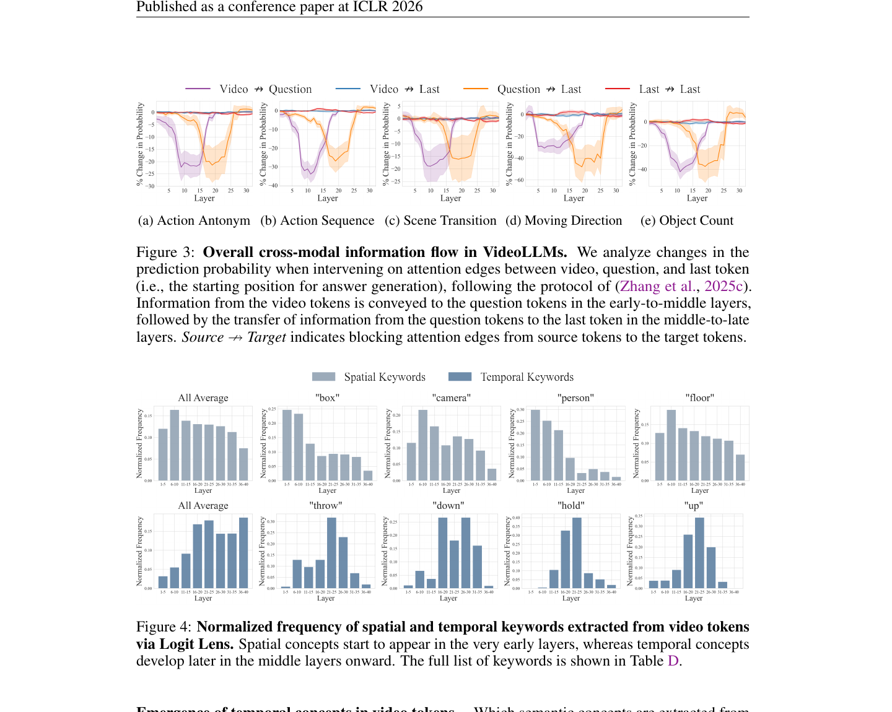

<p class="figure-caption"><strong>Figure 13.</strong> VideoLLM 中空间和时间概念的逐层演化，以及不同任务中相关概念出现的层段。来源：Kim et al., Map the Flow, Figures 3–5。</p>

这一步解释了为什么 video $\rightarrow$ question 主要发生在中层：question token 中的时间关键词，为视频表示提供了具有语义角色的接收位置。

### 6.3 跨帧交互让问题词能选择正确时间片段

论文对 “begins” 和 “ends” 等时间词可视化 video-to-question attention。正常情况下，不同词会选择不同帧段；切断跨帧交互后，这种语义选择性消失，注意力更容易退化为位置邻近偏置。

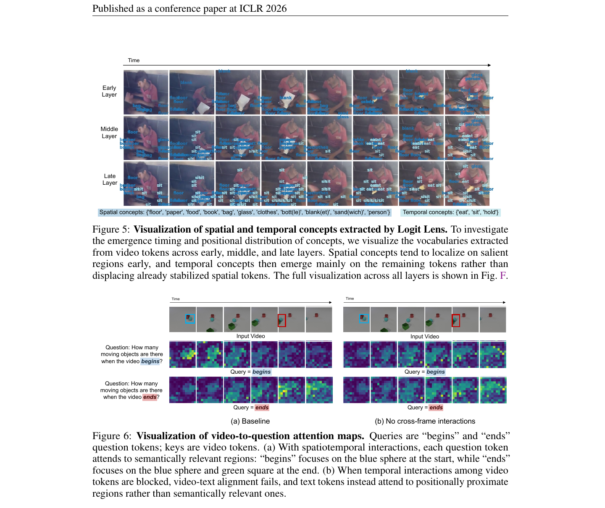

<p class="figure-caption"><strong>Figure 14.</strong> 正常跨帧交互使 “begins” 与 “ends” 等词对齐到相应视频阶段；禁止跨帧交互后，时间词无法稳定绑定正确片段。来源：Kim et al., Map the Flow, Figures 6–7。</p>

这说明跨帧阶段不是独立于语言的纯视觉预处理。它为后续语言 token 的选择性读取，构造了可被时间概念索引的表示。

### 6.4 第三阶段：候选项和问题向 last token 汇聚

在多项选择 VideoQA 中，option tokens 本身也会成为信息检查点。正确候选项在中层之后逐渐获得更高可解码概率，再通过 question/option $\rightarrow$ last 路径影响最终预测。

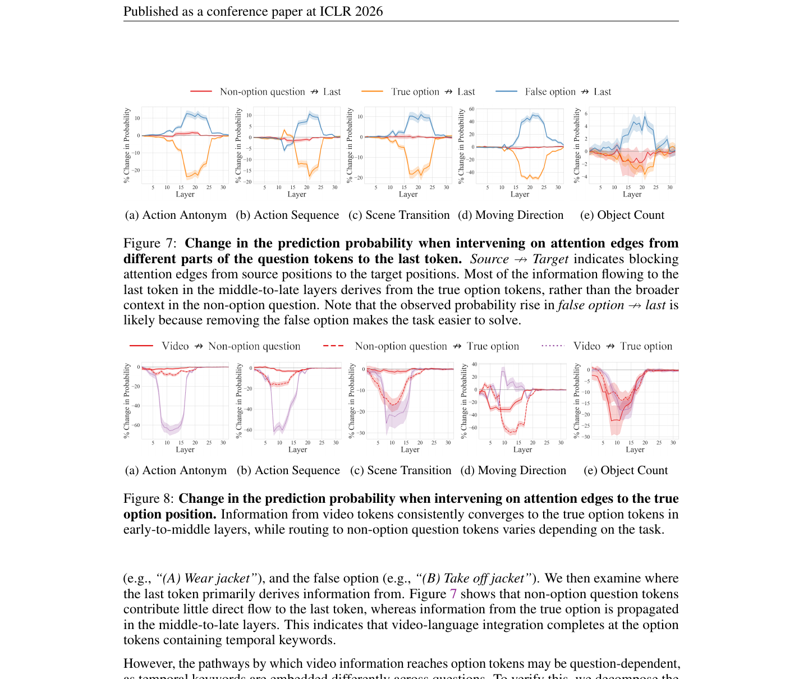

<p class="figure-caption"><strong>Figure 15.</strong> 问题、候选项和 last token 的概率演化。模型在视频—语言融合完成后，才稳定提升正确选项概率。来源：Kim et al., Map the Flow, Figures 8–9。</p>

因此 VideoLLM 的统一路径可以写为：

```text
视频帧
  → 跨帧时空表示
  → 时间词/问题词/候选项
  → last token
  → 答案
```

### 6.5 路径充分性：有效信息流可以支持稀疏推理

*Map the Flow* 不只做切断实验，还构造只保留有效层段的路径：

- 早中层保留 cross-frame；
- 中层保留 video $\rightarrow$ question；
- 中高层保留 question $\rightarrow$ last；
- 关闭大量 video $\rightarrow$ last、后层回写和其他边。

只保留这些路径时，模型在 TVBench 和 TOMATO 上仍接近完整注意力性能；相同比例的随机屏蔽则显著掉点。

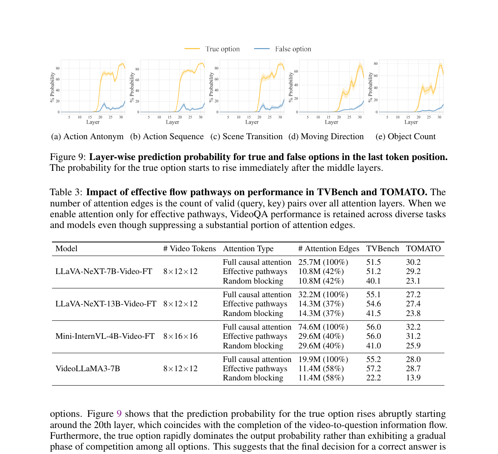

<p class="figure-caption"><strong>Figure 16.</strong> 结构化保留有效路径可以在屏蔽大量注意力边后维持性能，而随机屏蔽同等数量边会严重退化。来源：Kim et al., Map the Flow, effective-path experiments。</p>

作者在 LLaVA-NeXT-7B-Video-FT 上报告：只保留约 42% 的注意力边，也就是抑制约 58% 的边，TVBench 与 TOMATO 性能仍接近完整注意力。不同模型可保留的比例并不相同，但共同结论很稳定：**路径位置比边数量更重要。**

### 6.6 错误往往在融合之前已经形成

失败样本中，错误候选项沿 question $\rightarrow$ last 的传播模式可能与正确样本相似。真正异常的是更早的跨帧表示：模型可能建立了错误动作方向，或依赖单帧静态偏置。

因此，后续融合路径并不一定“坏掉”；它可能只是高效地传播了早期构造的错误证据。

这个区分直接影响干预策略：

```text
早期错误：应修复帧间建模、时间对齐或视觉采样
中期错误：应修复视频—语言绑定
后期错误：应修复候选汇聚、语言先验或解码
```

## 7. From Senses to Decisions：从单一路线到多路路由

图像和视频研究大多只有一个视觉模态入口。音视频 MLLM 同时面对：

- 音频与视觉是否提供互补信息；
- 两个模态冲突时谁占主导；
- 多段图像、音频和文本交错时，哪个 token 成为聚合器。

[From Senses to Decisions](https://arxiv.org/abs/2606.10147) 在 Qwen2.5-Omni 和 Video-SALMONN2 Plus 等模型上区分两类输入：一段带音轨的视频，以及多个音频、图像和文本项目交错排列的输入。

截至本文写作时，这篇工作仍是预印本，其多项选择设置和结论需要后续同行评审与开放生成实验继续验证。

### 7.1 先排除一个陷阱：后层高视觉注意力可能只是 sink

作者首先发现，部分模型在最后几层突然把大量注意力分配给视觉 token。直接看注意力图，很容易认为模型在决策末期重新读取视觉。

但 Attention Knockout 显示，切断这些后层视觉边对答案影响很小，因此它们更接近 visual attention sink，而不是有效信息流。

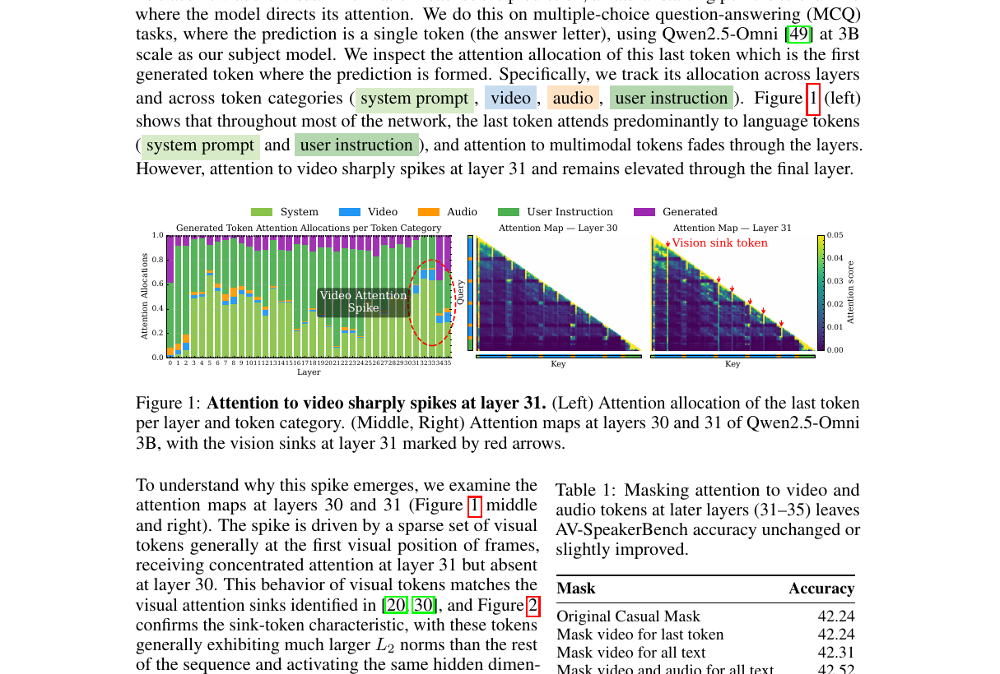

<p class="figure-caption"><strong>Figure 17.</strong> 晚层视觉注意力权重显著升高，但对应 knockout 几乎不改变答案概率，说明高注意力不等于因果使用。来源：Suharitdamrong et al., <a href="https://arxiv.org/abs/2606.10147">From Senses to Decisions</a>, Figure 1。</p>

这与 [See What You Are Told](https://arxiv.org/abs/2503.03321) 的视觉 sink 结论一致：某些视觉 token 由于隐藏维度出现巨大激活，会吸收大量注意力；删除这些 sink token 却不影响性能。

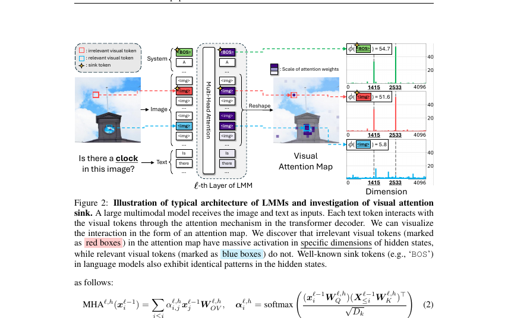

<p class="figure-caption"><strong>Figure 18.</strong> Visual Attention Sink 来自少数隐藏维度的异常大激活。论文据此提出 Visual Attention Redistribution，把浪费在 sink 上的注意力重新分配给有效视觉 token。来源：Kang et al., <a href="https://arxiv.org/abs/2503.03321">See What You Are Told</a>, ICLR 2025。</p>

### 7.2 单段音视频：仍然是模态写入问题，再汇聚到 last

在单段带音轨视频的任务中，整体路径仍与图像 VLM 接近：

```text
音频、视频 → question tokens → last token
```

区别是流量取决于任务。视觉识别和空间问题主要依赖视频；语音识别、声音事件和说话人相关问题才显著调用音频路径。

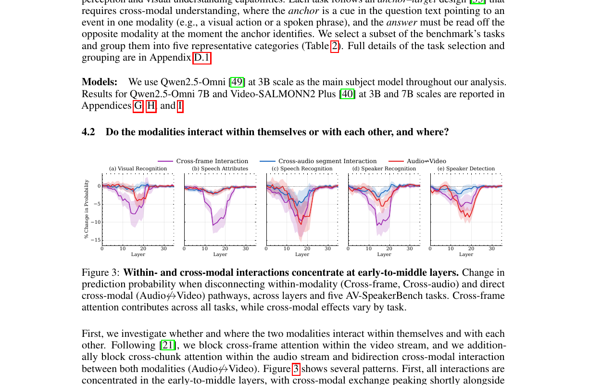

<p class="figure-caption"><strong>Figure 19.</strong> 不同任务中 audio/video→question 和 question→last 的因果曲线。模态贡献不是模型固有常数，而是由问题要求动态分配。来源：Suharitdamrong et al., From Senses to Decisions, Figures 3–4。</p>

这说明“音频模型是否使用声音”不能只用整体 benchmark 平均值回答。同一个模型可能在 ASR 上强依赖音频，在视觉问答上几乎关闭音频路径。

### 7.3 多段交错输入：串行主路变成并行支路

更有意思的是 interleaved setting。输入中包含多个候选音频/图像、一个 reference 和若干答案选项。作者发现模型不再只有一条 question-mediated 路线，而是形成两条并行路径：

```text
路径 A：Candidates + Question → Reference → Last
路径 B：Candidates            → Option tokens → Last
```

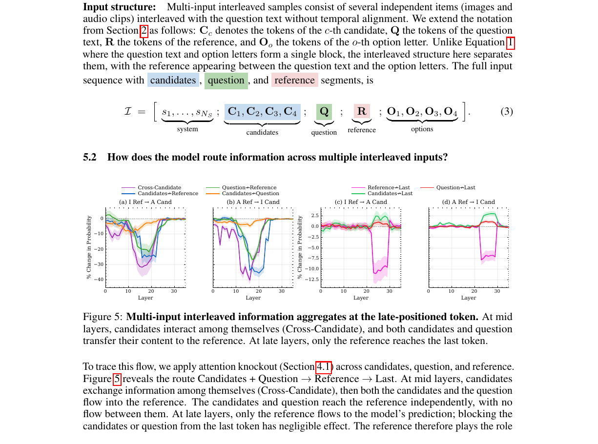

<p class="figure-caption"><strong>Figure 20.</strong> interleaved 输入中，reference token 与 option token 分别承担聚合功能，形成两条并行决策路径。来源：Suharitdamrong et al., From Senses to Decisions, Figure 5。</p>

问题文本主要通过 reference 路径到达预测；候选模态则既可写入 reference，也可直接影响答案选项 token。

这带来一个重要结论：

> 信息路由不仅由模态决定，也由 token 在序列中的语义角色和位置决定。

在因果注意力中，靠后的 token 能读取更多历史内容，因此 reference、option、role delimiter 或最后一个问题词，很容易自然形成聚合器。

### 7.4 option token 是独立的信息检查点

切断 candidate $\rightarrow$ option 或 option $\rightarrow$ last，会在特定层段显著降低正确答案概率。这说明答案字母并不是最后一步才被计算，它们在中层已经吸收候选模态信息，成为显式决策支路。

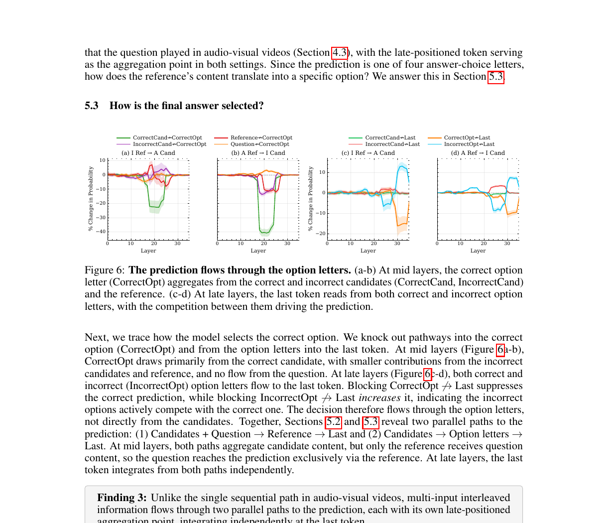

<p class="figure-caption"><strong>Figure 21.</strong> candidate→option 与 option→last 的干预结果，显示选项 token 在多输入匹配中承担独立聚合与路由功能。来源：Suharitdamrong et al., From Senses to Decisions, Figure 6。</p>

### 7.5 “传完即删”：模态 token 具有生命周期

当音频、视频或候选项已经把信息写入 reference、question 或 option tokens 后，作者删除这些原始模态 token，后续准确率往往变化很小，有时还略有提高。

这提示一种比静态 token pruning 更精确的策略：

```text
不是一开始判断某个 token 永远不重要，
而是判断它在完成信息转移后，何时不再重要。
```

换句话说，token 重要性是一个随层变化的生命周期，而不是固定分数。

## 8. 三篇主论文如何拼成统一模型

把图像、视频和音视频三条路线叠加，可以得到一个四阶段框架。

### 8.1 阶段 A：模态内部结构化

- 图像：视觉编码器已经提供空间 patch 表示，decoder 中的额外内部交互相对有限。
- 视频：必须在早中层通过跨帧注意力建立动作、顺序和变化表示。
- 音视频：音频与视觉可能各自保持较强模态内表示，并根据任务发生不同程度的跨模态交互。

### 8.2 阶段 B：模态信息写入语言侧锚点

常见接收位置包括：

- question token；
- 时间关键词；
- reference token；
- option token；
- role token 或特殊分隔符。

它们不是被预先设计成“记忆槽”的，但在因果掩码与输入顺序作用下，自然成为可以读取大量前文的聚合器。

### 8.3 阶段 C：聚合器向预测位置汇聚

当多模态证据已写入语言侧 token，last token 不再需要重复扫描全部模态。它主要读取已经压缩、任务相关的中间表示。

### 8.4 阶段 D：语言化决策与输出修整

高层负责：

- 候选项竞争；
- 语言先验与视觉证据权衡；
- 大小写、词形和格式；
- 自回归生成准备。

因此，多模态 Transformer 并不是让所有模态在所有层均匀融合。更准确的图景是：

> 模态信息在有限层段内被结构化、选择并写入少数后置 token；后续计算沿稀疏的语言化路径完成决策。

## 9. 一张方法与结论对照表

|研究|主要干预单位|核心问题|主要结论|
|---|---|---|---|
|Attention Flow, 2020|跨层注意力图|单层注意力如何跨层传播|rollout/flow 比 raw attention 更接近跨层依赖|
|ROME, 2022|隐藏状态、MLP、attention 恢复|事实知识在哪里被因果调用|中层 MLP 等位置可恢复事实预测|
|Geva et al., 2023|定向注意力边|事实回忆如何传播|主体丰富、关系传播、属性提取三阶段|
|BLIP causal tracing, 2023|图像污染与状态 patch|因果工具能否迁移到 VLM|较后层表示对 BLIP 生成具有因果作用|
|Basu et al., 2024|多模态 causal trace|存储与传输在哪里发生|MLLM 更早调用参数知识，少数视觉 token 负责传输|
|Cross-modal Flow, 2025|image/question/last 边|图像如何进入答案|全局写入、目标写入、问题到 last 汇聚|
|Map the Flow, 2026|跨帧、video/question/option/last 边|时间推理如何形成|跨帧建模先于视频—语言融合，路径可结构化稀疏|
|From Senses to Decisions, 2026|audio/video/reference/option/last 边|多模态与多输入如何路由|任务相关模态流量，交错输入产生并行路径|

## 10. 相邻证据：统一路线并不意味着统一 circuit

### 10.1 同一任务，视觉和文本可能调用不同子图

[Same Task, Different Circuits](https://arxiv.org/abs/2506.09047) 比较同构的视觉任务和文本任务，发现两种模态使用的 circuit 大体不重叠，但执行相似功能。论文报告平均只有约 18% 组件共享。

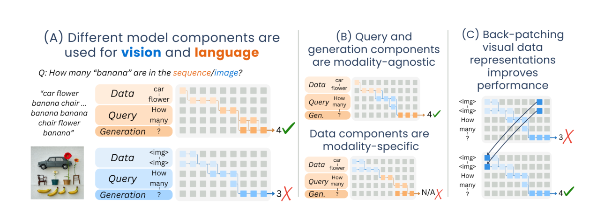

<p class="figure-caption"><strong>Figure 22.</strong> 同一抽象任务在图像和文本输入下可调用不同计算子图；视觉表示往往到较深层才与高性能文本表示对齐。来源：Nikankin et al., <a href="https://arxiv.org/abs/2506.09047">Same Task, Different Circuits</a>, 2025。</p>

作者把较后层的视觉表示 back-patch 到更早层，平均缩小约三分之一的视觉—文本性能差距。这支持一个更细的解释：视觉信息可能并非缺失，而是**语言化得太晚**，来不及充分影响后续位置。

### 10.2 音频信息存在，不代表最终输出会使用它

[Do Audio-Visual Large Language Models Really See and Hear?](https://arxiv.org/abs/2604.02605) 构造音频与视觉冲突的反事实样本。模型的中间表示可以 probe 出丰富音频语义，但深层融合常由视觉表示主导，最终文本忽略声音证据。

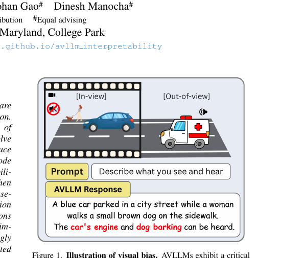

<p class="figure-caption"><strong>Figure 23.</strong> 画面中是普通车辆和行人，音频却包含画外救护车警笛；模型生成主要描述视觉内容，忽略关键声音。来源：Selvakumar et al., <a href="https://arxiv.org/abs/2604.02605">Do Audio-Visual Large Language Models Really See and Hear?</a>, 2026, Figure 1。</p>

这与 *From Senses to Decisions* 并不必然矛盾。后者主要分析多项选择任务和定向注意力边；前者研究自由描述和显式模态冲突。输出长度、任务目标和冲突程度都会改变深层路由。

更一般的结论是：

> 信息“存在于隐藏状态”与信息“被最终生成采用”是两个不同问题。

## 11. 信息论视角：视觉真的与语言产生协同了吗

[How Vision Becomes Language](https://arxiv.org/abs/2602.15580) 使用逐层 PID，把预测信息分为视觉独有、语言独有、冗余和协同成分。

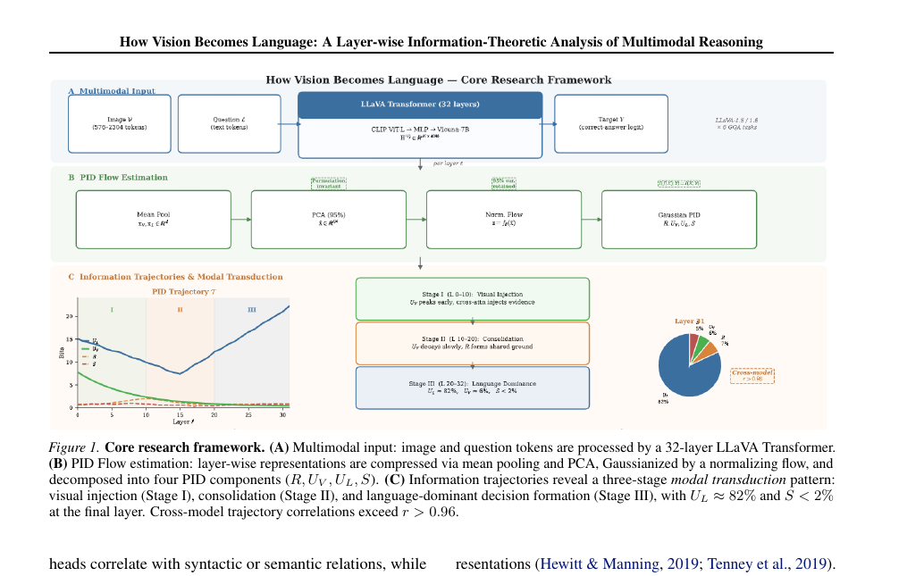

<p class="figure-caption"><strong>Figure 24.</strong> PID Flow 将高维隐藏表示降维、Gaussianize，再逐层估计视觉独有、语言独有、冗余和协同信息。来源：Wu et al., <a href="https://arxiv.org/abs/2602.15580">How Vision Becomes Language</a>, 2026。</p>

在其 LLaVA 与 GQA 设置中，视觉独有信息在早层达到峰值后下降，语言独有信息在晚层迅速上升，并占最终预测信息的大部分；估计的 cross-modal synergy 较低。

这与前面的路径研究形成呼应：视觉证据先写入语言侧 token，后续决策越来越由语言化表示承载。

但不能把“synergy 很低”当作所有模型和任务的普遍定律。[A Comprehensive Information-Decomposition Analysis of Large Vision-Language Models](https://openreview.net/forum?id=6WsBGk4Iag) 在更多模型和任务上区分了 synergy-driven 与 knowledge-driven 任务，也区分 fusion-centric 与 language-centric 模型家族。

PID 结果高度依赖：

- 任务是否需要真正跨模态关系，而不是任一模态都能回答；
- 表示选取和降维方式；
- PID 定义和密度估计；
- 对视觉、语言变量的构造方式。

所以信息论分解最适合回答“在这个实验设置里，最终预测信息由什么组成”，不应直接替代具体路径的因果分析。

## 12. 目前比较稳定的六条结论

### 12.1 多模态信息常先写入语言侧聚合 token

在 decoder-only MLLM 中，原始视觉或音频 token 很少始终直接控制输出。问题词、时间词、reference 和 option tokens 会逐渐变成多模态表示。

### 12.2 主要融合集中在有限层段，而不是全深度持续发生

图像通常表现为低层全局写入和中层目标写入；视频在此之前增加早中层跨帧建模；晚层更多负责汇聚和语言生成。

### 12.3 高注意力不等于高因果贡献

visual attention sink、head-level 分析和早期 attention faithfulness 研究都说明，热图最亮的位置可能只是数值吸引子。

### 12.4 原始模态 token 在完成转移后可能变得冗余

信息写入聚合器之后，继续保留全部 image/video/audio tokens 可能只增加计算量。有效的剪枝时机不是输入端，而是“信息已经交接完成”的层。

### 12.5 错误可能在早期感知阶段形成，再被正常路径传播

VideoLLM 的错误案例尤其清楚：错误跨帧表示先产生，后续 question-to-last 路由只是忠实传播错误证据。

### 12.6 路由高度依赖任务、架构和 prompt topology

“第几层融合”不是模型无关常数。BLIP、LLaVA、Qwen-Omni、VideoLLaMA 和 interleaved prompt 的接收 token 与有效层段都可能不同。

## 13. 仍然没有解决的争议

### 13.1 融合究竟发生在早层、中层还是深层

看似冲突的结论往往来自不同实验对象：

```text
架构：cross-attention vs token concatenation
任务：事实 VQA vs 时间推理 vs captioning
输出：单 token / 选项字母 vs 长文本生成
指标：probe vs state restoration vs edge knockout
污染：高斯噪声 vs 语义最小对 vs 模态冲突
```

因此更合理的写法不是“融合发生在第 12 层”，而是“在某架构、某任务和某干预定义下，主要功能阶段位于归一化深度的某个范围”。

### 13.2 视觉是被真正融合，还是仅被翻译成语言

现有证据同时支持两种情况：

- 有些任务需要真正的视觉—语言协同；
- 大量任务中，视觉先被压缩为语言侧表示，后续主要由语言骨干完成推理。

两者不是二选一，而是比例随模型和任务变化。

### 13.3 找到一条充分路径，等于理解了模型算法吗

不等于。

一组边足以维持性能，只能说明它们对当前任务具有功能充分性。它没有告诉我们每个 head/MLP 传递的是对象身份、空间位置、时间顺序、置信度还是语言先验。

下一步需要把路径定位与 Sparse Autoencoder、功能 probe、head/MLP 标注和 feature-level patching 结合起来。

### 13.4 Attention Knockout 会不会低估旁路和 self-repair

会。较窄窗口可能被残差和其他 token 绕过；模型也可能在消融后调用替代 head。因此需要同时报告：

- 多种窗口宽度；
- 从前向后和从后向前的累积屏蔽；
- 随机边与同数量边对照；
- 只保留有效路径的充分性实验；
- clean/corrupt 输入是否仍处于自然分布。

## 14. 接下来最值得做的研究

### 14.1 跨架构统一基准

应在同一数据、同一干预和同一归一化深度下比较：

- LLaVA 式 token concatenation；
- BLIP/Q-Former；
- 显式 cross-attention；
- early fusion；
- omni-modal MoE；
- streaming 和 memory-based VideoLLM。

只有这样才能区分 Transformer 通性与架构特例。

### 14.2 从答案首 token 扩展到开放式长生成

大部分工作只测量第一个答案 token 或选项字母。长生成会形成新的反馈回路：

```text
输入模态证据
  → 第一个生成 token
  → 已生成文本成为新上下文
  → 后续 token 是否继续读取模态？
  → 证据何时被遗忘、改写或语言先验覆盖？
```

[OmniTrace](https://arxiv.org/abs/2604.13073) 已开始把每个生成陈述追溯到图像、音频和视频 span，但生成级 circuit 仍远未解决。

### 14.3 Prompt topology 决定 information topology

interleaved 输入显示 token 排列会改变路由。可以系统改变：

- reference 的位置；
- option 在问题之前或之后；
- 多个问题 token 的顺序；
- role delimiter 和特殊 token；
- 模态块是否交错；
- 因果注意力与双向注意力。

这可能形成一个独立研究主题：**prompt 的拓扑结构如何决定内部信息拓扑。**

### 14.4 路径语义化

理想解释不只是“从 A 到 B”，而应回答：

```text
哪条路径
在什么层
由哪些 attention heads 和 MLP
传递什么语义特征
以什么方式改变输出
```

SAE feature、causal probe、activation patching 与 PID 可以在这里形成统一工具箱。

### 14.5 从解释走向训练和推理优化

当前结果已经给出多种可操作方向：

- 早期跨帧错误：加强时序对齐和反事实视频训练；
- 音频被视觉压制：增加冲突样本与模态平衡目标；
- 视觉语言化过晚：把后层视觉表示提前注入；
- 原始模态 token 已完成交接：动态删除 token；
- 大量边不必要：使用流量感知的结构化稀疏注意力；
- 错误知识位于早期因果 MLP：定向模型编辑。

## 15. 总结

这条研究脉络可以压缩为：

```text
注意力可视化
→ 跨层 Attention Flow
→ causal tracing / activation patching
→ Attention Knockout
→ 图像到语言的信息路线
→ 跨帧时空路线
→ 音视频任务相关路由
→ 多输入并行路线
→ head / circuit / sparse feature
→ PID 信息分解
→ 开放生成逐陈述归因
```

目前最有解释力的统一观点是：

> 多模态大模型并不是让视觉、音频和语言在所有层持续、均匀地混合。它们通常在有限层段内，把原始模态结构化并压缩到少数语言侧或靠后位置的聚合 token；随后模型主要沿稀疏的语言化路径完成决策。视频增加了早期跨帧建模，多输入交错则会产生多个并行聚合器。

但这不是一个已经完成的“普适定律”。融合位置和路由结构会受到架构、任务形式、答案长度、输入顺序、模态冲突和干预方法显著影响。

下一阶段真正重要的，不是再画一张平均注意力热图，而是建立可以跨模型、跨任务复现的四层统一框架：

```text
因果路径
+ 特征语义
+ 信息组成
+ 生成行为
```

只有当我们能够同时回答“信息在哪里、是否被使用、经过什么组件、最终如何改变生成”，多模态机制可解释性才会从路线图走向真正的模型算法理解。

## 参考资料

1. Jain, S. & Wallace, B. C. [Attention is not Explanation](https://aclanthology.org/N19-1357/). NAACL 2019.
2. Wiegreffe, S. & Pinter, Y. [Attention is not not Explanation](https://aclanthology.org/D19-1002/). EMNLP 2019.
3. Abnar, S. & Zuidema, W. [Quantifying Attention Flow in Transformers](https://aclanthology.org/2020.acl-main.385/). ACL 2020.
4. Chefer, H. et al. [Transformer Interpretability Beyond Attention Visualization](https://openaccess.thecvf.com/content/CVPR2021/html/Chefer_Transformer_Interpretability_Beyond_Attention_Visualization_CVPR_2021_paper.html). CVPR 2021.
5. Meng, K. et al. [Locating and Editing Factual Associations in GPT](https://proceedings.neurips.cc/paper_files/paper/2022/hash/6f1d43d5a82a37e89b0665b33bf3a182-Abstract-Conference.html). NeurIPS 2022.
6. Geva, M. et al. [Dissecting Recall of Factual Associations in Auto-Regressive Language Models](https://aclanthology.org/2023.emnlp-main.751/). EMNLP 2023.
7. Palit, V. et al. [Towards Vision-Language Mechanistic Interpretability: A Causal Tracing Tool for BLIP](https://openaccess.thecvf.com/content/ICCV2023W/CLVL/html/Palit_Towards_Vision-Language_Mechanistic_Interpretability_A_Causal_Tracing_Tool_for_BLIP_ICCVW_2023_paper.html). ICCV Workshop 2023.
8. Basu, S. et al. [Understanding Information Storage and Transfer in Multi-modal Large Language Models](https://proceedings.neurips.cc/paper_files/paper/2024/hash/0dfe31d6e703e138d46a7d2fced38b7c-Abstract-Conference.html). NeurIPS 2024.
9. Neo, C. et al. [Towards Interpreting Visual Information Processing in Vision-Language Models](https://arxiv.org/abs/2410.07149). 2024.
10. Golovanevsky, M. et al. [What Do VLMs NOTICE?](https://aclanthology.org/2025.naacl-long.571/). NAACL 2025.
11. Zhang, Z. et al. [Cross-modal Information Flow in Multimodal Large Language Models](https://openaccess.thecvf.com/content/CVPR2025/html/Zhang_Cross-modal_Information_Flow_in_Multimodal_Large_Language_Models_CVPR_2025_paper.html). CVPR 2025.
12. Kaduri, O. et al. [What's in the Image? A Deep-Dive into the Vision of Vision Language Models](https://openaccess.thecvf.com/content/CVPR2025/html/Kaduri_Whats_in_the_Image_A_Deep-Dive_into_the_Vision_of_CVPR_2025_paper.html). CVPR 2025.
13. Kang, S. et al. [See What You Are Told: Visual Attention Sink in Large Multimodal Models](https://arxiv.org/abs/2503.03321). ICLR 2025.
14. Nikankin, Y. et al. [Same Task, Different Circuits](https://arxiv.org/abs/2506.09047). 2025.
15. Lou, Y. et al. [SAE-V: Interpreting Multimodal Large Language Models with Sparse Autoencoders](https://openreview.net/forum?id=S4HPn5Bo6k). ICML 2025.
16. Kim, M. et al. [Map the Flow: Revealing Hidden Pathways of Information in VideoLLMs](https://arxiv.org/abs/2510.13251). ICLR 2026.
17. Suharitdamrong, W. et al. [From Senses to Decisions: The Information Flow of Auditory and Visual Perception in Multimodal LLMs](https://arxiv.org/abs/2606.10147). 2026 preprint.
18. Selvakumar, R. et al. [Do Audio-Visual Large Language Models Really See and Hear?](https://arxiv.org/abs/2604.02605). 2026.
19. Wu, H. et al. [How Vision Becomes Language: A Layer-wise Information-Theoretic Analysis of Multimodal Reasoning](https://arxiv.org/abs/2602.15580). 2026.
20. Xiu, L. et al. [A Comprehensive Information-Decomposition Analysis of Large Vision-Language Models](https://openreview.net/forum?id=6WsBGk4Iag). ICLR 2026.
21. Yan, Q. et al. [OmniTrace: A Unified Framework for Generation-Time Attribution in Omni-Modal LLMs](https://arxiv.org/abs/2604.13073). 2026.
