给多模态大模型一张图，再问它“百叶窗是向上还是向下”，模型可以回答正确。一个自然的解释是：模型看到了百叶窗，然后结合问题完成推理。

但这句话跳过了几乎所有真正困难的部分。

图像进入语言模型以后，物体和空间信息还停留在 image tokens 中吗？问题里的某个词会不会逐渐变成暂存视觉证据的工作区？模型是在每一层持续融合图像和文字，还是只在一小段层中完成跨模态传输？某个隐藏状态中**能够读出**答案，是否意味着模型真的**使用了**这部分信息？如果音频和画面冲突，模型究竟没有听见，还是听见以后仍然选择相信画面？

这些问题构成了近几年多模态机制可解释性的一条主线。研究对象正在从“模型看向哪里”逐渐推进到：

```text
信息是否存在
    ↓
信息是否进入模型实际使用的计算路径
    ↓
信息沿哪些 token、层、attention heads 与 features 传播
    ↓
不同模态在最终决策中分别提供了什么
    ↓
这条路径是否足以解释完整的自回归生成
```

本文不以某三篇论文为中心，也不按图像、视频、音频分别罗列工作，而是沿着真正的方法演进来组织材料：从 attention flow 与 causal tracing 出发，经过 token routing、head attribution、circuits、Sparse Autoencoder 与 Partial Information Decomposition，最后讨论视频时序、音视频竞争、prompt topology 和开放式生成。

可以先给出全文的核心判断：

> 在许多 decoder-only 多模态模型中，融合并不是所有模态在所有层里持续、均匀地混合。更常见的计算模式是：模态专用表示先完成对象、空间、时序或声音分析，再在有限的层窗口中把任务相关证据写入少数语言侧或靠后位置的聚合 token；后续决策主要沿更稀疏、也更语言化的路径完成。

这是一条正在积累证据的经验规律，不是架构无关的定律。Q-Former、显式 cross-attention、early fusion、Mixture-of-Experts、流式模型、长文本生成以及不同 prompt 排列，都可能产生不同的信息拓扑。

本文截图均裁自原论文完整 Figure 或完整 Table。每张图只用于支撑相邻论点，图例、坐标轴、子图与关键标签均保留；版权归原作者所有。

## 1. “信息流”究竟指什么？

多模态论文经常交替使用 representation、alignment、interaction、fusion 和 information flow，但它们并不回答同一个问题。

设第 $l$ 层的视觉、语言隐藏状态分别为 $h_l^V$ 和 $h_l^L$，最终输出为 $Y$。至少需要区分四种研究对象。

### 1.1 表示：信息能否被读出来？

最常见的方法是 linear probe、Logit Lens、词表投影或表示相似度：

$$
\hat z_l = g_l(h_l).
$$

如果一个简单分类器 $g_l$ 能从某层视觉 token 中预测物体类别、动作顺序或正确答案，说明这层表示**包含**相关信息。

但“存在”不等于“被使用”。Probe 可能拥有原模型后续网络没有使用的读取方向，也可能把分布在多个 token 中的弱信号重新组合成一个原模型从未显式计算的变量。一个隐藏状态可以同时编码颜色、位置、背景、对象身份与训练数据偏差，而最终决策只读取其中很小一部分。

因此，probe 更适合回答：

> 某种信息最早何时出现、何时消失、在哪些 token 中较容易解码？

它不适合单独回答：

> 这部分信息是否因果地改变了模型输出？

### 1.2 连接：哪些位置之间可能交换信息？

Attention matrix 描述目标 token 对源 token 分配的路由权重：

$$
A^{(l,h)}
=
\operatorname{softmax}
\left(
\frac{Q^{(l,h)}K^{(l,h)\top}}{\sqrt{d_k}}+M
\right).
$$

它可以告诉我们某层某个 head 中，目标位置允许从哪些源位置读取信息。但单层 attention map 有两个根本限制。

第一，深层 token 已经混合了前面多层的内容。第 20 层的 question token 即使不再直接关注 image tokens，也可能已经在第 10 层吸收了视觉证据。

第二，attention weight 只是路由系数。真正写入 residual stream 的消息还取决于 value 向量与 output projection。

Attention rollout 和 attention flow 是对第一个问题的早期修正。它们显式考虑残差连接和跨层路径，把“这一层看向哪里”改成“经过多层后，输入位置对当前表示仍有多大累计连接”。


<p class="figure-caption"><strong>Figure 1.</strong> 单层 raw attention 只展示局部连接；attention rollout 将各层注意矩阵与残差路径相乘；attention flow 则把网络视为有容量的有向图，估计输入到高层位置的最大流。来源：Abnar & Zuidema (2020), Figure 1。</p>

一个常见 rollout 写法是先把 identity residual 合并进注意矩阵：

$$
\widetilde A^{(l)}
=
\frac{A^{(l)}+I}{2},
$$

再递归计算：

$$
R^{(l)}
=
\widetilde A^{(l)}R^{(l-1)}.
$$

Rollout 比单层热图更符合 Transformer 的跨层结构，但它仍然由 attention 权重推导而来。它描述潜在通信，而不是输出对这条通信的因果依赖。

### 1.3 因果使用：拿走它以后，答案会不会改变？

Causal tracing 与 activation patching 通常先构造一个被破坏的运行，再把干净运行中的内部状态恢复到某个位置：

$$
\operatorname{IE}(l,i)
=
p\!\left(y\mid
\operatorname{patch}
(h_{l,i}^{\text{clean}}
\rightarrow h_{l,i}^{\text{corrupt}})
\right)
-
p(y\mid x_{\text{corrupt}}).
$$

如果恢复某个状态能够显著找回正确答案概率，说明这个状态在**给定污染方式**下处于一条能够修复输出的因果路径上。

Attention Knockout 则把问题进一步变成有方向的通信实验：在选定层窗口 $\mathcal L$ 中，将 source token 集合 $S$ 到 target token 集合 $T$ 的 attention logits 设为 $-\infty$，观察正确答案概率变化：

$$
\Delta p
=
p(y\mid x)
-
p\!\left(
 y\mid\operatorname{KO}(S\rightarrow T,\mathcal L)
\right).
$$

它回答的不是“哪个 token 很重要”，而是：

> 在这个层窗口中，模型是否需要通过 $S\rightarrow T$ 这组有向边传播信息？

Patching 与 knockout 都比相关性热图更接近机制证据，但也不能被简单理解为绝对真相。恢复一个状态表明它**足以在当前污染背景下修复输出**，不意味着它是干净运行中唯一或默认的路径；切断一条路径影响很小，也可能只是因为其他路径发生了 self-repair。

### 1.4 信息组成：视觉与语言分别提供了什么？

Partial Information Decomposition（PID）把视觉 $V$、语言 $L$ 对预测 $Y$ 的联合信息拆成四部分：

$$
I(Y;V,L)
=
R+U_V+U_L+S.
$$

其中：

- $R$：视觉和语言都包含的冗余信息；
- $U_V$：只有视觉表示提供的独有信息；
- $U_L$：只有语言表示提供的独有信息；
- $S$：必须联合观察两种模态才获得的协同信息。

PID 不直接告诉我们一条具体神经路径，却能回答 attention heatmap 无法回答的问题：模型最终主要依赖视觉独有证据、语言先验、两者重复表达的内容，还是只能通过联合计算产生的新信息？

这四类方法不是互相替代。更可信的证据链通常是：

```text
Probe：信息在哪里出现？
    +
Causal intervention：模型是否真的使用？
    +
Route / circuit analysis：通过什么组件传播？
    +
Information decomposition：不同来源如何组成预测？
```

| 方法 | 真正回答的问题 | 最常见的误读 |
|---|---|---|
| Probe / Logit Lens | 某层是否含有可解码信息 | 可解码等于被模型使用 |
| Attention / rollout | 哪些 token 之间存在潜在通道 | 高权重等于高贡献 |
| Patching / knockout | 某状态或路径是否具有因果作用 | 单点效应可以任意相加 |
| Circuit / head attribution | 哪些组件共同实现任务 | 一条平均 circuit 适用于所有输入 |
| SAE / feature analysis | 哪些稀疏方向具有可解释语义 | 稀疏特征天然单义且完整 |
| PID / mutual information | 预测信息由哪些模态成分组成 | 信息量直接等于一条神经通路 |

## 2. 为什么语言侧 token 容易成为多模态工作区？

在 LLaVA、Qwen-VL 的许多 decoder-only 变体中，图像、视频或音频被投影成一串 soft tokens，再与文本一起送入因果语言模型。简化后的序列可以写成：

```text
[system] [image / video / audio tokens] [question tokens] [answer prefix]
```

因果 mask 规定后方位置可以读取前方位置，而前方位置不能读取未来 token。因此，越靠后的 token 越有机会汇聚整个输入前缀。

假设图像 token 位于位置 $1\ldots m$，问题 token 位于 $m+1\ldots n$。那么问题 token 可以读取图像和更早的问题词，而 image token 无法读取后续问题。若任务需要“根据问题选择视觉证据”，模型自然会倾向于在问题侧建立一个条件化表示：

$$
h_{l,q}
\leftarrow
h_{l,q}
+
\sum_{v\in V}
A_{qv}^{(l)}V_v^{(l)}.
$$

这并不意味着问题 token 是唯一可能的工作区。System role、instruction、reference、option letter、separator 和最后输入位置都可能成为聚合点。哪个位置获得这个角色，取决于四件事：

1. 它在序列中的因果位置；
2. 它与任务目标的语义关系；
3. 训练数据是否反复让这个位置承担读取任务；
4. 模型是否存在显式 cross-attention 或其他旁路。

因此，“图像信息流向问题 token”最好理解为一种由架构和 prompt topology 共同诱导的策略，而不是所有多模态模型的固定法则。

这个结构约束也解释了一个之后会反复出现的现象：原始模态 token 并不需要一直保留到最后一层。只要信息已经被写入后方的工作区，后续网络就可能主要读取压缩后的语言侧表示。

## 3. 因果工具如何进入多模态模型

这条研究线的技术前史主要来自语言模型机制可解释性。

[Locating and Editing Factual Associations in GPT](https://arxiv.org/abs/2202.05262) 使用 causal tracing 定位事实回忆中的关键状态；[Dissecting Recall of Factual Associations in Auto-Regressive Language Models](https://aclanthology.org/2023.emnlp-main.751/) 则把事实回忆拆成主体表示丰富、关系信息传播和答案读取，并系统使用 Attention Knockout 追踪 token 间通信。

把这些工具搬到多模态模型并不只是增加一组 image tokens。文本中的错误事实通常可以替换成另一个词，而图像不存在唯一自然的“错误版本”。涂黑对象、换一张图片、交换 patch、加高斯噪声和替换语义属性分别定义了完全不同的反事实。

### 3.1 BLIP：建立“污染—恢复—测量”的模板

Palit 等人的 [Towards Vision-Language Mechanistic Interpretability](https://arxiv.org/abs/2308.14179) 将 causal tracing 迁移到 BLIP。实验先给图像表示注入噪声，使模型产生错误答案，再逐层、逐位置恢复干净状态，测量哪些恢复能够让答案概率回升。

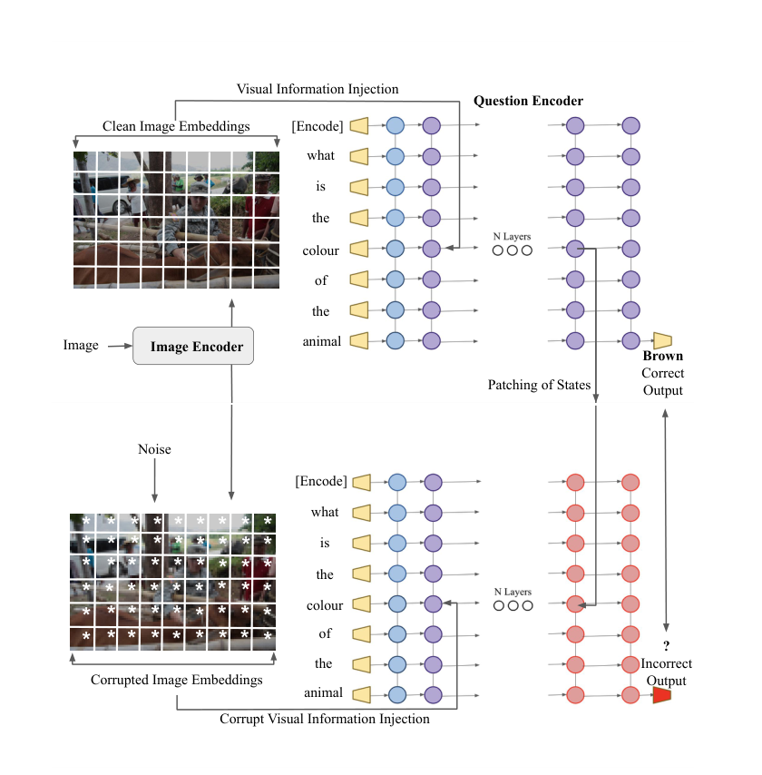

<p class="figure-caption"><strong>Figure 2.</strong> 干净图像产生正确输出；图像表示被污染后输出错误；将干净运行中的某个中间状态 patch 到污染运行，可以测量该状态对答案恢复的作用。来源：Palit et al. (2023), Figure 1。</p>

这项工作的价值主要在于建立实验模板：

```text
构造干净运行
    ↓
破坏目标信息并确认输出改变
    ↓
逐位置恢复内部状态
    ↓
测量正确输出被恢复的程度
```

它并没有给出一个可以直接推广到所有 VLM 的“融合层”。BLIP 使用视觉编码器、问题编码器与 cross-attention；LLaVA 则把视觉 token 直接送入语言骨干。不同模块边界会让同一个因果效应出现在不同深度。

### 3.2 MultiModalCausalTrace：同时追踪输入证据与参数知识

Basu 等人的 [Understanding Information Storage and Transfer in Multi-modal Large Language Models](https://arxiv.org/abs/2406.04236) 将问题改写为受约束的视觉问答。例如原问题是“这个地方在哪里？”，污染运行通过替换问题约束让模型朝错误地点预测，再逐层恢复干净表示。

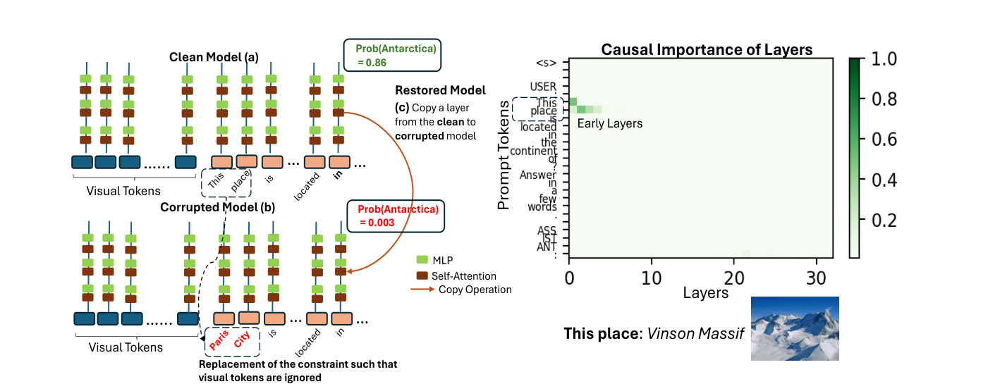

<p class="figure-caption"><strong>Figure 3.</strong> MultiModalCausalTrace 用错误约束构造污染运行，再将干净运行的层状态复制回去。右侧热图显示哪些层与 prompt 位置能够恢复正确地点。来源：Basu et al. (2024), Figure 2。</p>

这项工作区分了两类来源：

- 输入图像中刚刚提供的视觉证据；
- 模型参数中已经存储的事实与语言知识。

它观察到，对 LLaVA 一类模型，事实型视觉问答往往较早调用 MLP 与 self-attention 中的参数知识，中间 self-attention 再把视觉证据与问题表示送向最终问题位置。并非所有 image tokens 都同等重要，少数位置承担了较多信息转移。

论文进一步提出 MultEdit：既然某些早期 MLP 对多模态事实具有因果作用，就可以在这些位置进行定向编辑。这标志着机制分析开始从“解释结果”走向“利用定位结果改变模型”。

但这里仍有一个容易忽略的问题：patching heatmap 的形状既取决于模型，也取决于污染方式。如果污染同时破坏多个语义因素，恢复某个状态可能只是修复了整体分布，而不是精确恢复目标概念。

### 3.3 NOTICE：污染方式本身就是实验假设

[What Do VLMs NOTICE?](https://aclanthology.org/2025.naacl-long.477/) 指出，直接给视觉 embedding 添加高斯噪声可能让模型进入训练中从未见过的区域。此时 patching 找到的未必是正常推理路径，而可能是模型处理异常激活的修复路径。

NOTICE 改用 Semantic Input Pairs（SIP）和 Semantic Targeted Replacement（STR），在保留自然输入结构的同时改变目标属性。


<p class="figure-caption"><strong>Figure 4.</strong> NOTICE 在 SVO-Probes、MIT-States 与表情识别任务中构造语义最小对：干净与污染样本在对象、属性或表情上形成受控变化，而不是直接向 embedding 添加任意噪声。来源：Golovanevsky et al. (2025), Figure 1。</p>

这张图提醒我们，所谓“因果追踪”至少包含三层因果问题：

1. 改变输入中的什么语义变量？
2. 哪个内部状态能够恢复被改变的输出？
3. 恢复后模型是否回到自然的数据流形？

不同污染分别对应不同问题：

| 污染方式 | 更接近的问题 | 主要风险 |
|---|---|---|
| 高斯噪声 | 模型如何从非自然表示中恢复 | 严重 off-manifold |
| 遮挡 / 黑块 | 缺少局部像素时如何决策 | 同时引入遮挡纹理 |
| 替换整图 | 图像身份变化如何影响答案 | 改变因素过多 |
| 语义最小对 | 某个对象或属性改变时路径如何变化 | 数据构造成本高 |
| 文本约束替换 | 参数知识和输入约束如何竞争 | 可能改变问题难度 |

因此，阅读 patching 论文时，最先检查的不是热图，而是作者构造了什么反事实。

## 4. 从“信息存在哪里”到“信息怎样被路由”

Causal tracing 更擅长定位关键状态，但多模态模型还存在一个方向性问题：图像信息究竟写入了哪个文本位置？最终预测直接读取 image tokens，还是读取已经融合过的语言表示？

### 4.1 两阶段的视觉—语言转移

[Cross-modal Information Flow in Multimodal Large Language Models](https://openaccess.thecvf.com/content/CVPR2025/html/Zhang_Cross-modal_Information_Flow_in_Multimodal_Large_Language_Models_CVPR_2025_paper.html) 在多种 LLaVA 模型上系统切断 image、question 与 last token 之间的 attention 边。

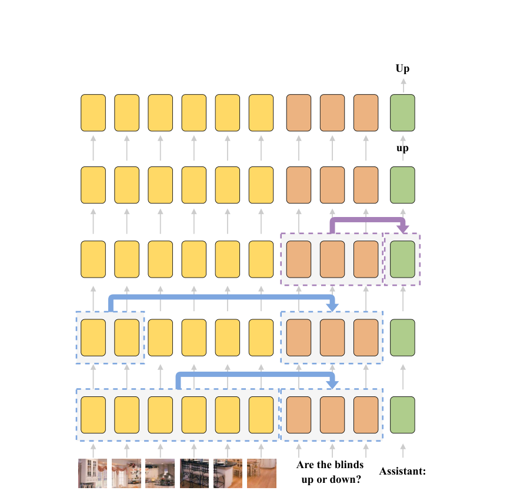

<p class="figure-caption"><strong>Figure 5.</strong> 论文总结的主路径：低层把全局图像信息写入问题表示，中层再次转移与问题相关的局部视觉信息，中高层把融合后的问题表示送到最后 token。来源：Zhang et al. (2025), Figure 1。</p>

实验给出一条具有代表性的三阶段路线：

```text
低层：整幅图像的全局语义 → question tokens
中层：与问题相关的对象证据 → 对应 question tokens
中高层：融合后的 question representation → last token
```

这里的“两阶段视觉写入”很重要。低层传递的不是最终答案，而更像场景级摘要；问题相关的局部对象信息到中层才被选择性写入。这与 Transformer 的功能分工相符：先形成可用的视觉上下文，再依据文本查询选择证据。

作者结合 Logit Lens 观察到，在部分模型和任务中，中层已经能够读出语义正确的答案，更高层主要完成词形、大小写和生成格式修整。于是可以把两件事分开：

- **semantic decision**：答案的概念内容何时形成；
- **surface realization**：答案如何被语言模型转换成最终 token。

这个区分对幻觉研究也很重要。模型可能在中层形成了正确概念，却在后续生成中被语言先验覆盖；也可能早期就选择了错误视觉证据，后续语言层只是忠实地表达错误判断。

### 4.2 问题 token 不是被动指令，而是多模态工作区

Kaduri 等人的 [What’s in the Image?](https://openaccess.thecvf.com/content/CVPR2025/html/Kaduri_Whats_in_the_Image_A_Deep-Dive_into_the_Vision_of_CVPR_2025_paper.html) 从另一个角度得到相似结论：即使阻断生成 token 直接读取 image tokens，模型仍能从 query 或 instruction tokens 中恢复相当完整的图像描述。

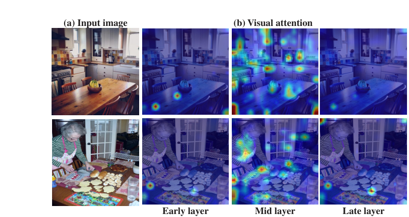

<p class="figure-caption"><strong>Figure 6.</strong> 早层和晚层视觉注意较集中，中层覆盖更多语义区域。结合干预实验，论文认为中间层段承担关键视觉细节的读取与压缩。来源：Kaduri et al. (2025), Figure 4。</p>

这类结果指向一个比“视觉 token 很重要”更具体的机制：

> 问题、指令或其他靠后 token 会逐渐变成多模态工作区。它们保留自己的语言角色，同时吸收与当前任务有关的图像证据，最终成为预测位置真正读取的对象。

“工作区”这个说法并不要求模型中存在一个显式模块。它只是描述一类功能：多个来源的信息汇聚到少数位置，随后由这些位置向输出广播。

判断一个 token 是否真正成为工作区，至少需要三种证据同时成立：

1. 它能够解码出跨模态内容；
2. 阻断模态到该 token 的边会损害任务；
3. 阻断该 token 到输出的边也会损害任务。

只满足第一条，可能只是信息被动经过；只满足第二条，信息也可能通过其他位置继续传播；三者结合才更接近一条完整路线。

## 5. Attention 是路径，不是消息本身

到这里很容易出现一个误解：既然许多路径实验都通过 attention 边完成，是不是终于可以把高 attention 直接当成高信息流？

答案仍然是否定的。

单个 attention head 对位置 $i$ 的输出为：

$$
o_i^{(h)}
=
\sum_j A_{ij}^{(h)}V_j^{(h)}W_O^{(h)}.
$$

至少需要区分四个量：

- 路由权重 $A_{ij}^{(h)}$；
- value message $V_j^{(h)}W_O^{(h)}$；
- 写入 residual stream 后的向量变化；
- 这次变化最终造成的 logit 或任务性能变化。

[See What You Are Told: Visual Attention Sink in Large Multimodal Models](https://arxiv.org/abs/2503.03321) 发现，一些视觉 token 会获得异常高的 attention weight，却几乎不向 residual stream 注入有效内容。作者将它们称为 visual attention sinks。

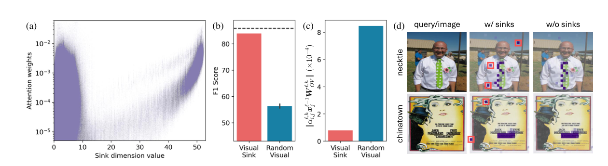

<p class="figure-caption"><strong>Figure 7.</strong> Sink tokens 获得很高 attention；但屏蔽它们对性能影响很小，其 attention-weighted value contribution 也远低于随机视觉 token。来源：Kang et al. (2025), Figure 3。</p>

这张图把三个常被混淆的对象放在一起：高权重、低消息贡献和低因果影响。一个 token 可以因为 key 方向或位置偏差吸收大量注意力，但它的 value 向量接近无效方向，因此不会明显改变输出。

多头结构又增加了两种复杂性。

第一，多个 heads 可能冗余地传递同一证据。单独屏蔽任意一个都没有明显影响，联合屏蔽才会暴露依赖。

第二，模型可能在干预以后动态 self-repair。后续 heads 或 MLP 检测到缺失信息，通过其他路径补偿输出。此时“小的单头效应”不代表该 head 在未干预模型中从不参与计算。

所以一篇可靠的 attention-based 论文通常需要回答：

- 干预的是权重、key/value、整个 head，还是整个 token？
- softmax 在屏蔽后是否重新归一化？
- 比较的是单头、头组还是整条路径？
- 是否使用等大小随机路径作为对照？
- 指标是首个答案 token、完整序列概率，还是任务准确率？
- 是否验证了只保留候选路径时仍能完成任务？

Attention Knockout 比 heatmap 更接近因果实验，但它仍然只是针对一组通信边的干预，不自动揭示这些边内部携带的语义。

## 6. 分析分辨率：从层到 head、circuit 与 feature

“中层负责融合”是一个有用概括，但仍然过粗。同一层包含几十个 attention heads、一个高维 MLP 和大量 residual features。不同输入也可能调用不同子图。

### 6.1 单头消融为什么经常找不到关键 head？

[Interpreting Attention Heads for Image-to-Text Information Flow](https://arxiv.org/abs/2509.17588) 比较单头 ablation 与 head attribution。它先随机保留或屏蔽不同 head 组合，再用线性模型拟合“哪些 heads 存在”与最终 logit 之间的关系。

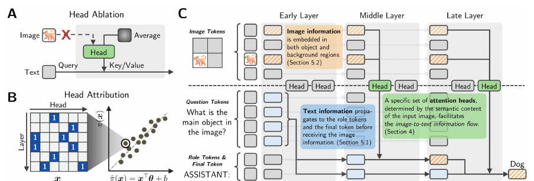

<p class="figure-caption"><strong>Figure 8.</strong> A：单头消融容易漏掉分布式、冗余的信息流；B：head attribution 对多组 head mask 与输出 logit 做回归，估计每个 head 的条件贡献；C：随后在重要 heads 中继续追踪 image-to-text token 路由。来源：Kim et al. (2025), Figure 1。</p>

简化地说，head attribution 拟合：

$$
\hat z
=
\beta_0+
\sum_h \beta_h m_h,
$$

其中 $m_h\in\{0,1\}$ 表示第 $h$ 个 head 是否保留，$z$ 是目标答案 logit。系数 $\beta_h$ 不是完整的高阶因果效应，但比逐个消融更能揭示分布在多个 heads 中的通信。

论文的观察包括：

- image-to-text flow 由一个特定但冗余的 head 子集承担；
- 哪些 heads 被调用更多取决于图像的语义内容，而不只是低层外观；
- 文本信息可能先流向 role-related 与 final tokens，再接收图像信息；
- 对象信息不仅存在于对象 patch，也可能分布在背景 token 中。

最后一点提醒我们，不应把“对象位置”简单等同于目标框内的视觉 token。ViT 与语言层中的全局混合会让背景位置携带对象上下文，基于 bounding box 的硬切分可能漏掉重要证据。

### 6.2 同一任务，不同模态可以使用不同 circuits

[Same Task, Different Circuits](https://arxiv.org/abs/2506.09047) 比较语义相同的视觉任务和文本任务。例如，一边数图像中的香蕉，一边数文本序列中的单词 banana。


<p class="figure-caption"><strong>Figure 9.</strong> 对应的视觉与语言任务使用大体不重叠的 circuits；query 与 generation 子图较可互换，而处理模态数据的子图具有明显专属性。将后层视觉表示 patch 回早层，可以改善视觉任务表现。来源：Nikankin et al. (2025), Figure 1。</p>

论文发现：

- 同一任务的 vision circuit 与 language circuit 在结构上大体分离；
- 与问题理解、答案生成相关的组件更接近模态无关；
- 处理原始图像或文本数据的组件则明显模态专用；
- 视觉表示往往到较晚层才接近高性能文本表示，留给后续推理的层数不足；
- 将后层视觉表示 back-patch 到早层，可以缩小一部分模态性能差距。

这修正了一个过于简单的“共享语义空间”叙事。模型未必先把图像和文字映射到完全相同的表示，再运行同一套算法。它也可能让两套模态专用前端分别计算，直到更靠后位置才进入相似的 query 和 generation 子图。

Circuit 研究的难点在于输入依赖性。一个平均 circuit 可能混合计数、OCR、空间关系与常识问答的不同算法。即使两条 circuit 的节点重叠，也不意味着它们在不同输入上执行相同功能。

### 6.3 SAE：把高维状态拆成可解释稀疏特征

层、token 和 head 都是架构单元，不一定对应语义单元。Sparse Autoencoder（SAE）尝试把隐藏状态 $x$ 重构为少量稀疏特征：

$$
z
=
\operatorname{ReLU}(W_{\text{enc}}x+b_{\text{enc}}),
$$

$$
\hat x
=
W_{\text{dec}}z+b_{\text{dec}},
$$

并优化重构损失与稀疏正则：

$$
\mathcal L
=
\lVert x-\hat x\rVert_2^2
+
\lambda\lVert z\rVert_1.
$$

[SAE-V](https://proceedings.mlr.press/v267/lou25a.html) 将这一范式扩展到多模态模型，分析视觉 token、文本 token 与跨模态激活中的稀疏特征，并将特征权重进一步用于数据筛选。

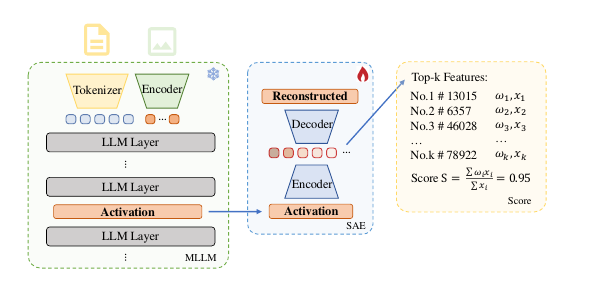

<p class="figure-caption"><strong>Figure 10.</strong> SAE-V 从 MLLM 某层 activation 中编码稀疏特征，再通过 decoder 重构原状态；样本得分由激活的 top-k 特征及其跨模态权重聚合得到。来源：Lou et al. (2025), Figure 2。</p>

SAE 为多模态信息流增加了一种新的分析单位：不再只问“视觉 token 是否流向问题 token”，而是问“哪些对象、属性、空间或跨模态特征通过这条路径被激活”。

不过，SAE 也有自己的解释风险：

- 稀疏不自动等于单义；
- 一个语义可能分散在多个 features 中；
- 强制重构会保留对输入有用但对决策无关的细节；
- 不同稀疏度、字典宽度和训练层会产生不同特征基底；
- feature label 往往仍依赖人工观察或外部模型总结。

因此，最有力的 SAE 证据仍然需要 feature ablation、feature steering 或 patching 来验证。

这一阶段的研究粒度可以概括为：

```text
layer localization
    ↓
token-to-token route
    ↓
attention head / MLP
    ↓
task circuit
    ↓
sparse semantic feature
```

真正完整的机制解释最终需要把这些尺度连在一起：某个语义 feature 由哪些视觉位置产生，经哪些 heads 写入哪个工作区，又如何通过后续 circuit 改变输出。

## 7. 信息存在，不代表它会被输出

多模态模型的一个核心失败模式不是“没有形成正确表示”，而是正确表示没有控制最终生成。

### 7.1 语言模型内部保留了比答案更多的视觉结构

[Visual Representations inside the Language Model](https://arxiv.org/abs/2510.04819) 不从最终文本答案出发，而是研究语言模型 KV cache 中的 visual value tokens。作者发现，中间视觉表示仍能零样本支持前景分割、语义对应、时间对应与 referring expression detection 等感知任务。

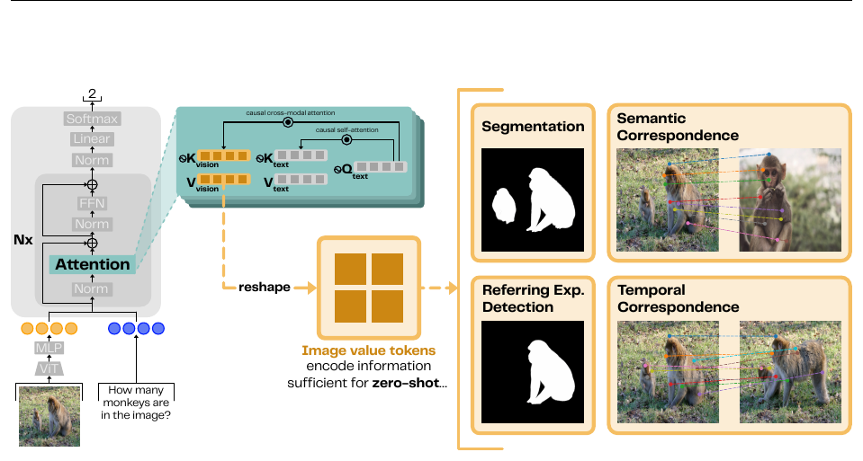

<p class="figure-caption"><strong>Figure 11.</strong> 论文从多模态语言模型不同层的 image value tokens 中读取表示，并将其用于分割、语义对应、时间对应与指代表达检测，以测量语言模型内部保留的视觉结构。来源：Liu et al. (2025), Figure 1。</p>

这类结果说明，语言模型并没有在 projector 后立即把图像压缩成几个离散词。中间 value tokens 仍保留空间和对应关系，甚至能够支持模型最终答案未表现出来的感知能力。

论文进一步报告，在部分 BLINK Art Style 问题中，内部表示包含足以改善回答的感知信息，但生成端没有利用它。于是“感知能力”至少可以拆成三层：

```text
encoder / value states 是否编码视觉结构
    ↓
语言侧工作区是否读取这些结构
    ↓
输出 circuit 是否让它支配最终文本
```

只提升第一层，不一定改善最终回答。模型可能已经“看见”，问题出在读取和生成。

### 7.2 音视频冲突让“存在但未表达”更加清楚

[Do Audio-Visual Large Language Models Really See and Hear?](https://arxiv.org/abs/2604.02605) 使用音频和画面语义冲突的反事实样本。研究发现，中间音频表示中可以解码出正确声音语义，但在更深的跨模态转移和文本生成阶段，视觉表示经常压制音频证据。

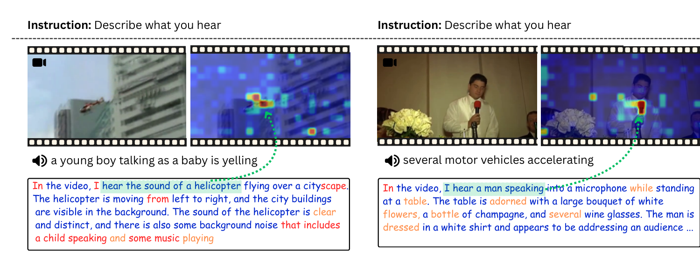

<p class="figure-caption"><strong>Figure 12.</strong> 左例中模型能从音频识别儿童声音，却根据画面生成“直升机”；右例即使被要求描述声音，回答仍大量复述画面。来源：Selvakumar et al. (2026), Figure 7。</p>

这是一种典型的 perception–generation gap：

```text
audio representation 中存在正确语义
               ↓
跨模态竞争阶段未获得足够控制权
               ↓
生成端主要复述视觉先验
```

这里至少有三种可能机制：

1. 音频表示未被写入最终工作区；
2. 音频和视觉都进入工作区，但视觉方向在 residual stream 中占优；
3. 中间决策已经正确，语言生成阶段又被训练数据中的视觉—文本共现覆盖。

区分这三种机制，需要同时测量表示可解码性、模态到工作区的路径、工作区到输出的路径，以及生成 token 随时间的变化。

这个例子也说明，幻觉不应只被理解为“视觉 encoder 看错”。错误可能发生在感知、路由、模态竞争、决策读取或表面生成的任意阶段。

## 8. 融合不是一个标量：用 PID 拆解预测信息

很多工作用一个 cross-modal score 表示“融合强度”，但视觉与语言之间可能同时存在冗余、竞争、独有信息和真正协同。

### 8.1 PID Flow：从高维隐藏状态估计信息组成

[How Vision Becomes Language](https://arxiv.org/abs/2602.15580) 提出 PID Flow，将高维视觉与语言表示经过降维、normalizing-flow Gaussianization 和 Gaussian PID 估计，得到每一层的 $(R,U_V,U_L,S)$。

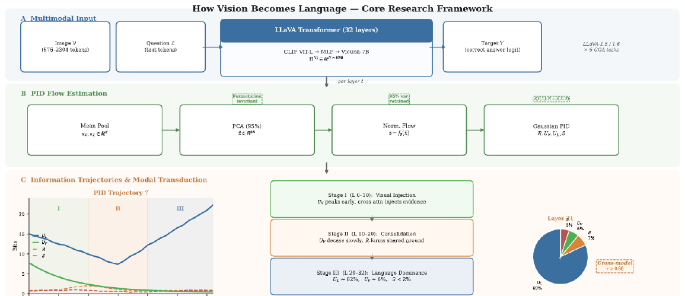

<p class="figure-caption"><strong>Figure 13.</strong> 视觉与语言表示按层提取，经降维和可处理的概率估计后做 Partial Information Decomposition，并结合 Image→Question attention knockout 检验信息轨迹变化。来源：Wu et al. (2026), Figure 1。</p>

这项研究在 LLaVA-1.5/1.6 与若干 GQA 任务中观察到一种 modal transduction 轨迹：

- 视觉独有信息在早层较高，随后下降；
- 语言独有信息在晚层快速上升，并主导最终预测；
- 在其设置中，最终 synergy 较低；
- 切断 Image→Question 路径会让视觉信息“滞留”，同时提高补偿性 synergy 与总信息成本。

这个结果支持一种常见算法：视觉证据被逐步转写进语言侧表示，再由语言骨干完成后续推理。需要注意的是，这里的“language-unique”指相对于当前定义的视觉与语言表示来源独有，不等于模型只依赖自然语言或完全忽略图像。视觉内容一旦被写进语言 token，就可能在 PID 中表现为语言侧信息。

### 8.2 更大范围的研究显示模型并非只有一种轨迹

ICLR 2026 的 [A Comprehensive Information-Decomposition Analysis of Large Vision-Language Models](https://arxiv.org/abs/2603.29676) 将 PID 扩展到更多模型家族、任务和深度。

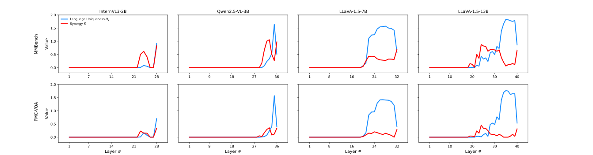

<p class="figure-caption"><strong>Figure 14.</strong> 红线表示视觉—语言 synergy，蓝线表示语言独有信息。不同模型和任务呈现阶段性变化，但两类信息的相对强度与峰值位置明显不同。来源：Xiu et al. (2026), Figure 4。</p>

这类分析揭示了三个无法由单一“融合分数”表达的差异。

**任务可以是 synergy-driven，也可以是 knowledge-driven。** 有些问题必须联合图像与文本才能解决；另一些任务主要依赖语言先验或参数知识，视觉只负责少量消歧。

**模型家族可以是 fusion-centric，也可以是 language-centric。** 两个准确率接近的模型，内部策略可能不同：一个在中后层形成较强跨模态协同，另一个先把视觉压缩到语言侧，再主要放大语言独有信息。

**信息轨迹通常不是单调增加。** 冗余、独有信息和 synergy 可能在不同层段转换。最后几层还受到输出头、格式化和答案标签的影响，不能简单解释为“更深就融合得更好”。

将两项 PID 研究放在一起，更合理的结论是：

> “视觉被翻译成语言以后再推理”是一种常见机制，但不是多模态模型唯一可能的算法。协同程度取决于架构、任务、训练数据以及 PID 估计方式。

### 8.3 PID 的数字为什么需要谨慎解释？

高维神经表示的互信息无法直接精确计算。实际流程通常包含 mean pooling、PCA、随机投影、密度估计或 Gaussian 假设。不同处理会改变绝对 bit 数和四项分配。

因此，PID 论文最可靠的部分通常是：

- 同一估计器下的层间趋势；
- 模型或任务之间的相对比较；
- 干预前后的轨迹变化；
- 与任务性能和路径实验一致的变化。

不宜把一个具体的“synergy 占 2%”直接当成模型内部客观、无估计误差的物理量。Synergy 也不等于 attention interaction：前者是预测信息的统计分解，后者是网络中的计算连接。

## 9. 视频：跨模态传输之前还有时序计算

静态图像 VLM 给出了最基本的 modality → language → prediction 路线。视频没有推翻这条路线，而是在它之前增加了跨帧计算。

[Map the Flow](https://arxiv.org/abs/2510.13251) 将 Attention Knockout 扩展到不同视频帧之间的边，并结合 Logit Lens 追踪时间概念。

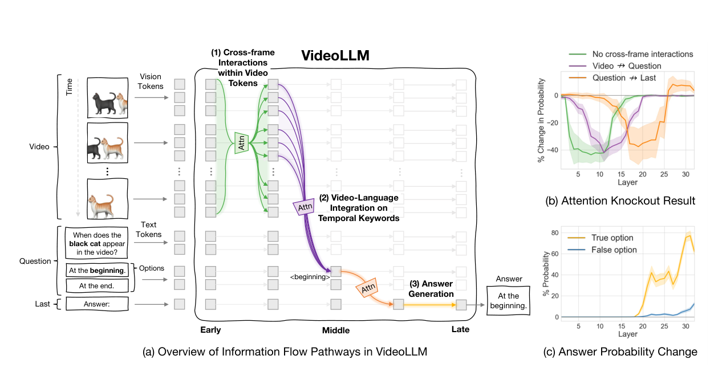

<p class="figure-caption"><strong>Figure 15.</strong> VideoLLM 先在早中层进行跨帧交互，再将时间信息写入问题关键词，中后层把融合表示送入最后 token；右侧曲线是切断相应路径后的概率变化。来源：Kim et al. (2026), Figure 1。</p>

论文得到一条比静态图像多一个阶段的路线：

```text
早中层：跨帧交互，形成时空表示
    ↓
中层：视频证据写入时间词、问题词或答案选项
    ↓
中高层：融合表示汇聚到最后 token
    ↓
输出答案
```

切断早中层跨帧边会显著损害动作顺序、方向和时间关系，而切断较晚的跨帧边影响较小。这说明模型不是在所有层持续比较每一帧；它更像先构造一个时序摘要，再把摘要传给语言侧决策路径。

错误分析进一步显示，一些失败样本在早期跨帧阶段就形成了错误顺序表示。后面的跨模态传输并没有“坏掉”，反而正常地把错误证据传向答案。这种分层诊断比笼统地说“模型时序能力不足”更有用，因为它指出应改进的是早期视频建模，而不是后期语言生成。

### 9.1 必要路径之外，还要验证功能充分性

只证明切断某条路径会损害性能，仍可能把很多无关边保留下来。Map the Flow 进一步只开放其识别出的 effective pathways，屏蔽其余 attention edges，并与等规模随机屏蔽比较。

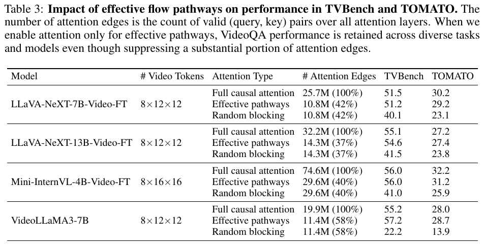

<p class="figure-caption"><strong>Figure 16.</strong> 仅保留识别出的有效路径时，四个 VideoLLM 在 TVBench 与 TOMATO 上大体维持原性能；屏蔽相同数量的随机边则显著下降。表中 attention edges 为所有层有效 query–key 对的总数。来源：Kim et al. (2026), Table 3。</p>

这张表给出比单纯 knockout 更强的证据：候选路径不仅是必要通道的一部分，也在这些任务上接近功能充分。它同时提示一种效率机会——大量 attention edges 在完成当前 VideoQA 任务时可以暂时关闭。

但“有效路径足以答题”仍不等于已经理解内部算法。路径内部可能仍包含多个冗余 heads，保留下来的表示也可能依赖模型在训练中学到的捷径。更严格的验证还需要：

- 在语义反事实上保持稳定；
- 跨不同视频长度与帧率复现；
- 对空间、计数、OCR 等非时序任务给出不同预测；
- 证明不是只保留了一个更大的通用骨架。

## 10. 音视频与 prompt topology：路由可以串行，也可以并行

音频带来模态竞争，多输入交错提示则改变 token 的因果顺序。两者都说明信息流并不只由“这是图像还是声音”决定。

### 10.1 普通音视频问答：任务决定模态流量

2026 年预印本 [From Senses to Decisions](https://arxiv.org/abs/2606.10147) 在音视频模型上切断 Video→Question、Audio→Question 和 Question→Last 等路径。

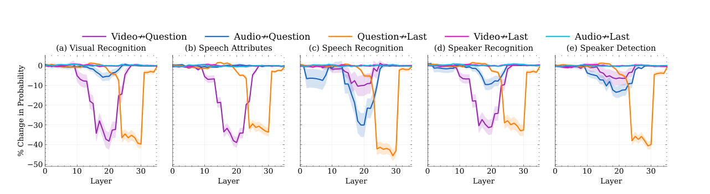

<p class="figure-caption"><strong>Figure 17.</strong> 不同任务中，Video→Question、Audio→Question 与 Question→Last 的 knockout 曲线。模态贡献随任务变化，但共同主路线是 Modalities → Question → Last。来源：Suharitdamrong et al. (2026), Figure 4。</p>

视觉识别类问题主要依赖 video flow；语音内容、说话人和声音事件问题才显著依赖 audio flow。模型并不是固定地以同一比例混合音频和视频，而是依据问题建立任务条件化的流量分配。

这意味着“音频 attention 较低”本身不能证明模型不会听。应当在音频相关任务中进行路径干预，并检查 audio information 是否先被写入问题 token，再影响最后位置。

### 10.2 多输入交错提示：一条路线可以分裂成两条

当输入包含多个候选音频、图像、reference、question 和 option letters，序列中的角色比模态类别更加重要。论文观察到候选内容可以通过 reference token 到达预测，也可以经 option letters 形成独立竞争路径。

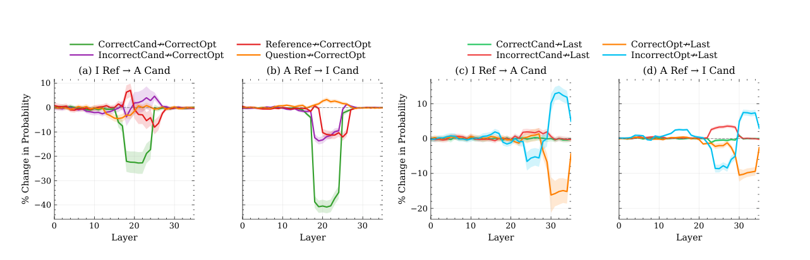

<p class="figure-caption"><strong>Figure 18.</strong> 候选项与 reference 在中层写入正确 option；后期正确与错误 option letters 分别流向 last token，并通过竞争决定预测。来源：Suharitdamrong et al. (2026), Figure 6。</p>

可以将它抽象为：

```text
路径 A：Candidates + Question → Reference → Last
路径 B：Candidates → Option tokens → Last
```

问题文本主要通过 reference 路线进入预测；候选模态还可以通过 option tokens 建立另一条路线。输入中的标签位置不再只是表面格式，而成为内部 circuit 的锚点。

这就是 prompt topology：

- 哪个 token 位于所有证据之后；
- 哪个 token 能读取问题与候选项；
- 哪个位置与正确标签在训练中稳定对应；
- 哪些边被因果 mask 允许；
- 相同内容以何种顺序排列。

因此，对信息流论文而言，prompt template 不是无关紧要的实现细节。改变候选项顺序、把问题提前、删除 role token 或更换标签格式，都可能重新配置聚合器和路径。

### 10.3 Token 有生命周期：传完以后可以丢弃

如果原始模态 token 已经把内容写入后方工作区，那么它们在后续层可能变得冗余。From Senses to Decisions 进一步在不同层删除视频、音频和非选项问题 token。

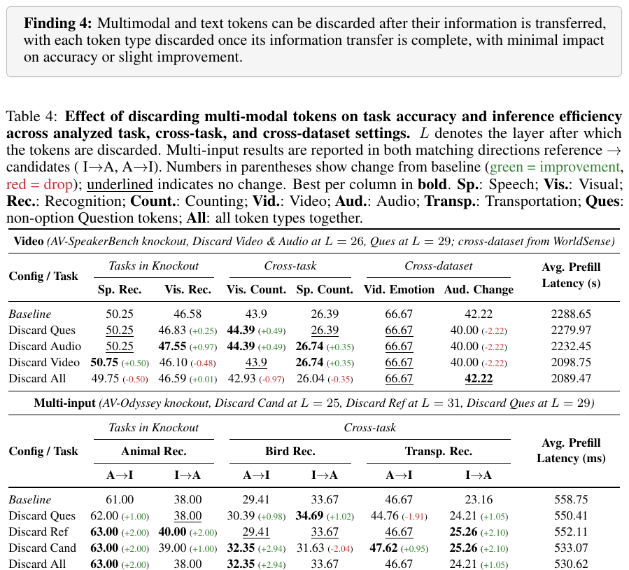

<p class="figure-caption"><strong>Figure 19.</strong> 在识别出的转移完成层之后删除 video、audio 或 question tokens，多个数据集的准确率通常变化很小，部分设置还略有提升，同时降低推理开销。来源：Suharitdamrong et al. (2026), Finding 4 与 Table 4。</p>

这个结果引出一个有用概念：**token lifecycle**。

```text
原始模态 token 被创建
    ↓
参与对象、空间、声音或时序计算
    ↓
把任务相关内容写入工作区 token
    ↓
后续不再承担必要通信
    ↓
可以被压缩、缓存或删除
```

与固定比例 token pruning 相比，生命周期视角更机制化：不是因为某个 token 的平均 attention 低就删除，而是在它完成特定信息传输后再停止计算。

但删除后性能略升也不一定意味着这些 token 原本“有害”。删除可能减少 attention sink、噪声或过拟合路径，也可能改变 softmax 归一化。需要与等量随机删除、不同删除层和开放式生成任务对照。

## 11. 固定答案实验还解释不了开放式生成

目前许多信息流研究只选择模型本来就回答正确的样本，再测正确选项、答案首 token 或一个短词的概率。这种设置便于因果比较，却把真实生成大幅简化。

开放式回答的计算图随着每个生成 token 改变：

$$
p(y_{1:T}\mid x)
=
\prod_{t=1}^{T}
p(y_t\mid x,y_{<t}).
$$

第一个句子可能依赖图像，第二个句子依赖已经生成的文本，第三个句子又可能重新读取视频。某个输入片段对不同 output spans 的作用也不同。

2026 年预印本 [OmniTrace](https://arxiv.org/abs/2604.13073) 尝试把任意 token-level attribution 信号整理成 generation-time、span-level 的跨模态来源说明。

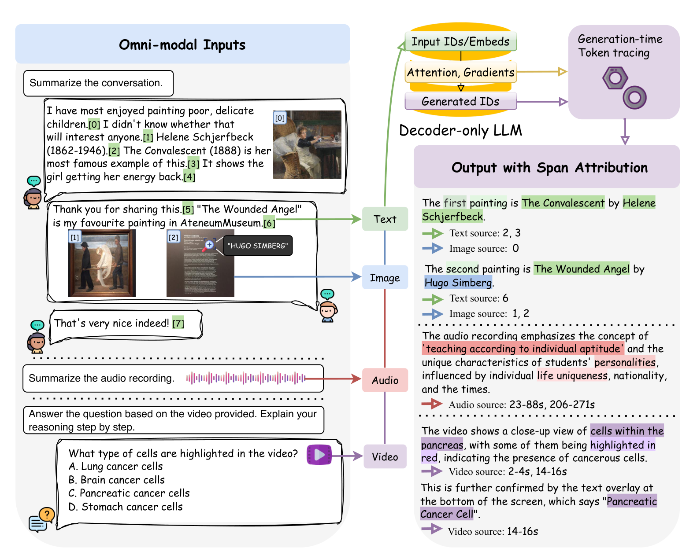

<p class="figure-caption"><strong>Figure 20.</strong> OmniTrace 在每个解码步骤追踪候选源 token，再将碎片化信号聚合为文本、图像、音频和视频的语义 span attribution。来源：Yan et al. (2026), Figure 1。</p>

它解决三个工程问题：

- **generation-aware**：归因对象是每个解码步骤，而不是固定分类输出；
- **omni-modal**：所有模态共享一条 token 时间线；
- **span-level**：把不稳定的 token 信号聚合成可读的语义片段。

但需要明确：OmniTrace 是归因聚合框架，不会自动把底层 attention、gradient 或 perturbation signal 变成忠实的因果 circuit。它的可信度仍取决于接入的基础 attribution 方法。

开放生成还引入了分类任务中不存在的问题：

1. **evidence decay**：输入模态证据是否随着生成变长而衰减？
2. **self-conditioning**：已生成文本是否逐渐取代原始证据？
3. **claim-specific routing**：回答中不同事实是否调用不同图像区域或时间片？
4. **late hallucination**：模型最初是否有正确证据，却在后续续写中被语言先验带偏？
5. **re-reading**：模型是否会在关键 token 前重新访问原始模态？

因此，从多项选择字母推断完整对话中的信息流，仍然存在很大距离。

## 12. 如何判断一篇信息流论文是否可信？

这个领域的方法名称越来越多，但可以用一套相对稳定的问题检查实验设计。

### 12.1 研究单位是什么？

作者干预的是 layer、token、attention edge、head、MLP、feature，还是整段模态输入？不同单位回答的问题不同，不能把 layer heatmap 解释成具体 circuit。

### 12.2 反事实是否自然且单一？

污染是否只改变目标语义？是否同时改变背景、长度、难度或输出格式？Embedding noise 是否把模型推到分布外？

### 12.3 输出指标是否覆盖真正任务？

只看正确答案首 token 的概率，可能忽略后续生成。多项选择任务中的 option logit 也可能受到标签偏置。最好同时报告完整答案准确率、sequence likelihood 和任务指标。

### 12.4 是否区分必要性与充分性？

- 切断路径后下降：支持必要性；
- 只保留路径仍能完成任务：支持充分性；
- 恢复状态能够救回答案：支持条件充分性；
- 三者并不等价。

### 12.5 是否有等规模随机基线？

屏蔽大量 attention edges 几乎总会损害模型。只有与相同数量、相同层分布的随机边比较，才能证明候选路径具有特殊性。

### 12.6 是否考虑冗余与 self-repair？

单头或单路径效应可能很小，因为多个组件承担同一功能。应进行组合干预、路径交互分析或 head attribution，而不是把零效应直接解释成“不参与”。

### 12.7 层窗口是否经过敏感性分析？

Attention Knockout 常在连续 $k$ 层中切断边。窗口太短，信息可在相邻层绕过；窗口太长，又会把多个阶段混在一起。结论应在多个窗口大小下保持基本稳定。

### 12.8 样本是否只包含模型答对的题？

分析正确样本可以定位成功算法，却不能自动解释错误。错误样本需要区分：感知错误、路径失败、模态竞争、语言覆盖和输出格式问题。

### 12.9 结论是否跨架构、任务和 prompt 复现？

LLaVA 的 question workspace 不一定出现在 BLIP 的 cross-attention；单词答案的路径也不一定适用于长描述。至少应明确结论的架构、数据与 prompt 边界。

可以把一篇较完整的信息流研究概括为以下实验矩阵：

| 证据 | 问题 | 最好包含的对照 |
|---|---|---|
| Probe | 信息何时出现？ | 随机标签、不同 probe 容量 |
| Patching | 哪个状态能恢复输出？ | 多种自然污染、位置对照 |
| Knockout | 哪条边具有方向性作用？ | 随机边、窗口敏感性 |
| Sufficiency test | 候选路径是否足够？ | 等规模随机保留 |
| Circuit / feature ablation | 哪些组件实现功能？ | 联合干预、self-repair |
| PID | 信息由何种模态组成？ | 多估计器、干预前后比较 |
| Error analysis | 失败发生在哪一阶段？ | 正确与错误样本配对 |

## 13. 目前相对稳定的图景

把不同架构、任务和方法放在一起，下面几条结论获得了相对多的支持。

### 13.1 信息存在、被使用和被表达是三件事

Probe 可以在中间表示中读出正确对象、空间或声音，但最终输出可能忽略它。Visual KV 与音视频冲突研究都展示了这种分离。

### 13.2 跨模态传输常集中在有限层窗口

图像模型常在早中层完成全局到局部的视觉写入；视频模型还需要更早完成跨帧交互。后层往往更多负责汇聚、输出读取和语言形式化，而不是持续访问所有原始模态。

### 13.3 少数靠后 token 经常成为工作区

Question、instruction、reference、option 和 last token 会因为任务语义与因果位置成为聚合点。原始 image、video 或 audio tokens 在完成传输后可能部分冗余。

### 13.4 高 attention 不等于高因果贡献

Visual sink、value contribution、head attribution 和 knockout 共同说明：路由权重、实际消息、residual 变化与最终输出效应必须分开测量。

### 13.5 多模态模型没有唯一的融合算法

同一任务的视觉和文本输入可以调用不同 circuits；有些模型更 fusion-centric，有些更 language-centric；prompt 顺序还能将串行路线改造成并行路线。

### 13.6 错误可能在很早的模态专用阶段形成

VideoLLM 可以在跨帧阶段先构造错误时序表示，后续路径再正常传播错误。音视频模型也可能正确编码声音，却在后期竞争中让视觉占优。“最终答错”不能被统一归因于最后几层。

可以把当前常见的 decoder-only 路线压缩成下面这张文字图：

```text
原始模态 tokens
    ↓
模态专用计算
（对象、空间、跨帧、声音）
    ↓
有限的跨模态转移窗口
    ↓
语言侧工作区 / 靠后锚点 tokens
    ↓
稀疏 heads、circuits 与模态竞争
    ↓
预测 token
    ↓
自回归生成中的证据保留或覆盖
```

它比“图像与文字在 Transformer 中融合”具体得多，但仍只是一个等待跨架构验证的中层理论。

## 14. 仍然没有解决的核心问题

### 14.1 跨架构统一实验

当前很多规律来自 token-concatenation 的 decoder-only 模型。需要在相同数据、prompt 与干预下比较 Q-Former、显式 cross-attention、early fusion、MoE、state-space 与 streaming architectures，才能区分哪些现象来自因果 Transformer 拓扑，哪些只来自具体接口设计。

### 14.2 从平均路径走向 input-conditioned circuits

平均 knockout 曲线可能把多种算法混在一起。空间关系、计数、OCR、知识问答、拒答和长视频检索很可能调用不同子图。未来需要针对单输入发现 circuit，再验证它在语义最小对上的稳定性。

### 14.3 同时建模必要性、充分性与交互作用

神经网络中的路径不是独立部件。两个单独无效的 heads 联合起来可能关键；切断一条路径后另一条路径可能接管。未来需要更系统的组合干预、Shapley-style attribution、causal mediation 与路径交互模型。

### 14.4 把路径与语义特征连接起来

Attention Knockout 只能说明 A 向 B 传了某种有用内容。SAE、causal probe、feature patching 与 neuron/head 功能标注需要进一步说明：传递的是对象身份、空间关系、时间顺序、说话人信息、答案置信度，还是纯粹的位置与格式信号。

### 14.5 解释完整生成，而不只是答案字母

真正有用的解释应能对长回答中的每个 claim 指出支持它的图像区域、视频时间段、音频片段或上下文文本，并区分“模型读取过证据”与“证据因果地改变了生成”。

### 14.6 将解释转化为训练与推理改进

已有结果已经提示几类可操作方向：

- 在视觉表示过晚对齐时进行 back-patching 或早期辅助训练；
- 对音视频冲突加入模态平衡目标；
- 依据 token lifecycle 做动态缓存和删除；
- 只为当前任务开放有效 attention 路径；
- 在错误最早出现的模态专用阶段进行定向微调；
- 用 feature-level steering 恢复未被输出读取的感知信息。

真正有价值的机制理论，最终应能预测哪一种干预会改善哪一类错误，而不仅是在事后为一张热图命名。

## 结语

多模态机制可解释性最重要的进展，不是发现某个神奇层，也不是得到一张更漂亮的 attention map，而是逐渐建立了一套更严格的问题顺序：

```text
先问信息在哪里，
再问模型是否使用，
再追踪它经过什么路径，
再识别传递信息的组件与特征，
最后分析不同模态如何共同决定完整生成。
```

沿着这条主线，研究对象已经从 attention visualization 走向 causal tracing、token routing、head attribution、modality-specific circuits、sparse features、information decomposition 和 generation-time attribution。

当前最有解释力的图景是：多模态模型常把感知证据压缩到少数语言侧工作区，再由语言骨干完成后续决策；但压缩发生在哪里、哪些模态能够进入工作区、谁在冲突中占据主导，以及这些证据能否在长生成中持续存在，并没有统一答案。

真正的目标也不应只是“看见模型内部”，而是形成可以被反事实验证、能够定位错误来源，并最终指导训练、编辑和高效推理的机制模型。

## 参考资料

1. Jain & Wallace. [Attention is not Explanation](https://aclanthology.org/N19-1357/). NAACL 2019.
2. Wiegreffe & Pinter. [Attention is not not Explanation](https://aclanthology.org/D19-1002/). EMNLP-IJCNLP 2019.
3. Abnar & Zuidema. [Quantifying Attention Flow in Transformers](https://aclanthology.org/2020.acl-main.385/). ACL 2020.
4. Chefer et al. [Transformer Interpretability Beyond Attention Visualization](https://openaccess.thecvf.com/content/CVPR2021/html/Chefer_Transformer_Interpretability_Beyond_Attention_Visualization_CVPR_2021_paper.html). CVPR 2021.
5. Meng et al. [Locating and Editing Factual Associations in GPT](https://arxiv.org/abs/2202.05262). NeurIPS 2022.
6. Geva et al. [Dissecting Recall of Factual Associations in Auto-Regressive Language Models](https://aclanthology.org/2023.emnlp-main.751/). EMNLP 2023.
7. Palit et al. [Towards Vision-Language Mechanistic Interpretability: A Causal Tracing Tool for BLIP](https://arxiv.org/abs/2308.14179). ICCV Workshop 2023.
8. Basu et al. [Understanding Information Storage and Transfer in Multi-modal Large Language Models](https://arxiv.org/abs/2406.04236). NeurIPS 2024.
9. Golovanevsky et al. [What Do VLMs NOTICE? A Mechanistic Interpretability Pipeline for Gaussian-Noise-Free Text-Image Corruption and Evaluation](https://aclanthology.org/2025.naacl-long.477/). NAACL 2025.
10. Zhang et al. [Cross-modal Information Flow in Multimodal Large Language Models](https://openaccess.thecvf.com/content/CVPR2025/html/Zhang_Cross-modal_Information_Flow_in_Multimodal_Large_Language_Models_CVPR_2025_paper.html). CVPR 2025.
11. Kaduri et al. [What’s in the Image? A Deep-Dive into the Vision of Vision Language Models](https://openaccess.thecvf.com/content/CVPR2025/html/Kaduri_Whats_in_the_Image_A_Deep-Dive_into_the_Vision_of_CVPR_2025_paper.html). CVPR 2025.
12. Kang et al. [See What You Are Told: Visual Attention Sink in Large Multimodal Models](https://arxiv.org/abs/2503.03321). arXiv 2025.
13. Nikankin et al. [Same Task, Different Circuits: Disentangling Modality-Specific Mechanisms in VLMs](https://arxiv.org/abs/2506.09047). NeurIPS 2025.
14. Lou et al. [SAE-V: Interpreting Multimodal Large Language Models via Sparse Autoencoders](https://proceedings.mlr.press/v267/lou25a.html). ICML 2025.
15. Kim et al. [Interpreting Attention Heads for Image-to-Text Information Flow in Large Vision–Language Models](https://arxiv.org/abs/2509.17588). arXiv 2025.
16. Liu et al. [Visual Representations inside the Language Model](https://arxiv.org/abs/2510.04819). COLM 2025.
17. Xiu et al. [A Comprehensive Information-Decomposition Analysis of Large Vision-Language Models](https://arxiv.org/abs/2603.29676). ICLR 2026.
18. Wu et al. [How Vision Becomes Language: A Layer-wise Information-Theoretic Analysis of Multimodal Reasoning](https://arxiv.org/abs/2602.15580). arXiv 2026.
19. Kim et al. [Map the Flow: Revealing Hidden Pathways of Information in VideoLLMs](https://arxiv.org/abs/2510.13251). ICLR 2026.
20. Selvakumar et al. [Do Audio-Visual Large Language Models Really See and Hear?](https://arxiv.org/abs/2604.02605). CVPR Findings 2026.
21. Suharitdamrong et al. [From Senses to Decisions: The Information Flow of Auditory and Visual Perception in Multimodal LLMs](https://arxiv.org/abs/2606.10147). arXiv 2026.
22. Yan et al. [OmniTrace: A Unified Framework for Generation-Time Attribution in Omni-Modal LLMs](https://arxiv.org/abs/2604.13073). arXiv 2026.
23. Jiang et al. [Interpreting and Editing Vision-Language Representations to Mitigate Hallucinations](https://arxiv.org/abs/2410.02762). arXiv 2024.
24. Neo et al. [Towards Interpreting Visual Information Processing in Vision-Language Models](https://arxiv.org/abs/2410.07149). arXiv 2024.
25. Qi et al. [A Survey on Mechanistic Interpretability for Multi-Modal Foundation Models](https://arxiv.org/abs/2502.17516). arXiv 2025.
