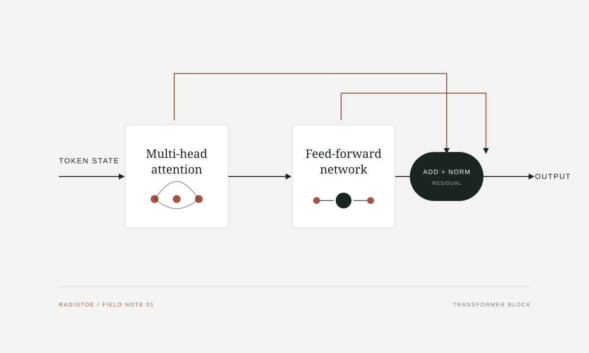

Transformer 常被压缩成 Query、Key、Value、多头注意力和残差连接。只记住这些名称，仍然回答不了最关键的问题：**一句话中的每个位置，怎样按当前需要读取其他位置的信息？**

记序列长度为 $T$，隐藏维度为 $d$，输入表示为 $X\in\mathbb R^{T\times d}$。以下讨论忽略 batch 维度。

## 1. 序列建模的核心困难

语言按顺序出现，但决定一个词含义的信息不一定在相邻位置。循环网络把历史压入逐步更新的状态，远距离信息必须穿过整条链，时间步之间也难以完全并行。

Transformer 允许任意两个位置通过一层注意力直接建立数据依赖。注意力并非让所有位置同等重要，而是为当前位置计算一组依赖输入内容的读取权重。

## 2. Query、Key 与 Value

每个 token 表示同时承担三种角色：Query 描述当前位置寻找什么，Key 描述一个位置如何被匹配，Value 描述它被选中后提供什么。三者来自同一个 $X$：

$$
Q=XW_Q,\qquad K=XW_K,\qquad V=XW_V.
$$

若 $Q,K\in\mathbb R^{T\times d_k}$，则 $QK^\top$ 的第 $(i,j)$ 项表示位置 $i$ 应当多大程度读取位置 $j$。

## 3. 缩放点积注意力

$$
\operatorname{Attention}(Q,K,V)
=\operatorname{softmax}\!\left(\frac{QK^\top}{\sqrt{d_k}}+M\right)V.
$$

$QK^\top$ 产生 $T\times T$ 的匹配矩阵。除以 $\sqrt{d_k}$ 控制点积方差，避免 softmax 过早饱和。自回归模型的因果掩码为

$$
M_{ij}=\begin{cases}0,&j\le i,\\-\infty,&j>i.\end{cases}
$$

softmax 使每行权重非负且和为 $1$，最后乘以 $V$ 完成加权聚合。注意力就是一次由当前内容发起、在整段序列上执行的软检索。

## 4. 多头与残差路径

多头注意力让模型并行使用多组投影：

$$
\operatorname{MHA}(X)=
\operatorname{Concat}(\operatorname{head}_1,\ldots,\operatorname{head}_H)W_O.
$$

不同头提供多个关系子空间，让同一位置可以按不同标准选择信息。

<strong>Figure 1.</strong> 注意力负责位置间通信，前馈网络负责逐位置的非线性变换；两者都位于残差路径中。

在常见 pre-norm block 中：

$$
X'=X+\operatorname{MHA}(\operatorname{LN}(X)),
$$

$$
Y=X'+\operatorname{MLP}(\operatorname{LN}(X')).
$$

残差连接让子层学习增量，同时保留信息与梯度的直接路径。多层堆叠后，模型反复执行通信、局部变换与状态更新。

## 5. 位置与顺序

没有位置信息时，注意力无法区分“猫追狗”和“狗追猫”。输入通常写成

$$
X^{(0)}=E_{\mathrm{token}}+E_{\mathrm{position}}.
$$

位置可以通过学习向量、固定正余弦编码或旋转位置编码注入。形式不同，目的相同：让匹配分数依赖顺序。

## 6. 从隐藏状态到下一个 token

自回归语言模型将序列概率分解为

$$
p_\theta(x_{1:T})=\prod_{t=1}^{T}p_\theta(x_t\mid x_{<t}),
$$

并最小化

$$
\mathcal L(\theta)=-\sum_{t=1}^{T}\log p_\theta(x_t\mid x_{<t}).
$$

模型并未直接获得语法、事实或推理步骤标签。为了持续降低预测误差，它必须从数据中形成可复用的表示和计算模式。Transformer 提供的，是一种能把这种学习扩展到大规模序列与并行训练的结构。

把整条路径压缩起来：token 与位置先成为向量；注意力决定信息从哪里流向哪里，Value 传递实际内容；前馈网络逐位置变换；残差路径反复更新表示；最后的隐藏状态再被投影为下一个 token 的概率分布。
