给模型一张 Robin Williams 的照片，要求它说出照片中的人是谁，它可能回答正确；直接问“Robin Williams 的配偶是谁”，它也可能调用参数知识回答正确。但把两个问题合在一起——“照片中人物的配偶是谁？”——模型却可能失败。

这个现象很容易被笼统地归入“视觉推理不足”或“多模态幻觉”。然而，从模型内部来看，它至少包含两种不同能力：

```text
图像 → 识别实体
实体 → 调用关于该实体的事实知识
```

前一步属于视觉实体解析，后一步属于语言模型已经学到的事实回忆。一个 VLM 可以分别完成两步，却无法把它们及时接起来。

近三年的一组机制可解释性工作正围绕这个问题形成一条非常清晰的研究主线：先理解语言模型如何从参数中取出事实，再把 causal tracing、activation patching、Attention Knockout 和 Logit Lens 等方法迁移到视觉语言模型，最后定位一个反复出现的瓶颈——**视觉实体表示虽然最终形成了，但它可能形成得太晚，错过了语言骨干中负责事实回忆的早期计算回路。**

本文关注的不是一般意义上的“VLM 如何融合信息”，而是一个更窄也更可检验的问题：

> 当问题中的主体由图像而不是文字给出时，视觉实体表示怎样进入语言模型的参数知识回路？失败究竟发生在看见、识别、连接，还是回忆？

这条脉络连接了以下几类工作：

- 语言模型中的事实存储与事实提取；
- BLIP、LLaVA 等架构中的视觉 causal tracing；
- 图像实体与文本实体之间的知识检索差距；
- multimodal two-hop problem；
- 通过模型编辑、状态注入和选择性预测修复失败。

文章截图均裁自原论文的完整 Figure 或完整子图。图例、坐标轴、token 标签和关键箭头均保留；版权归原作者所有。

## 1. 问题不只是“模型是否知道”，而是“图像能否唤起知识”

先考虑一个事实三元组：

$$
(s,r,o)
=
(\text{Robin Williams},\text{spouse},\text{Marsha Garces}).
$$

文本查询直接把主体 $s$ 放进 token 序列：

```text
Who is the spouse of Robin Williams?
```

视觉查询则只给出一张图像 $I$：

```text
Who is the spouse of the subject in this image?
```

从计算结构上看，两种输入并不等价。文本路线可以简化为：

$$
h_s^{(0)}
\longrightarrow
h_s^{(l)}
\longrightarrow
\operatorname{Recall}(s,r)
\longrightarrow o,
$$

而视觉路线至少要多做一次实体解析：

$$
I
\longrightarrow
V(I)
\longrightarrow
z_s^{(l)}
\longrightarrow
\operatorname{Recall}(z_s^{(l)},r)
\longrightarrow o.
$$

其中 $z_s^{(l)}$ 是模型在第 $l$ 层形成的、足以表示图像实体身份的内部状态。关键问题不是它最终是否存在，而是它在**什么时候**形成、以什么形式形成，以及后续网络是否仍有机会调用原有事实回忆机制。

### 1.1 四类失败不能混在一起

一个视觉事实问题回答错误，至少有四种可能原因。

**感知失败。** 模型没有提取足够的形状、面孔、文字或地标特征，连主体是谁都不知道。

**实体解析失败。** 视觉特征存在，但没有形成稳定的实体级表示。例如模型知道画面中是“一座冰川”，却没有解析为 “Perito Moreno Glacier”。

**跨模态连接失败。** 模型已经能识别实体，但视觉表示没有进入语言骨干实际使用的事实回忆路径。Ashok 等人把这一类称为 **linking failure**。

**事实回忆失败。** 主体已经以合适形式进入语言模型，但模型参数中没有相应事实，或事实被错误、过时或竞争性记忆覆盖。

普通 VQA accuracy 把四种原因压成一个数字，因此很难支持机制判断。这个细分领域最重要的方法进步之一，就是构造配对实验，把它们拆开：

```text
实体识别问题：这是谁 / 这是什么？
文本事实问题：明确写出实体名称，再询问事实
视觉事实问题：只用图像指代实体，再询问同一个事实
```

当模型能通过前两项，却在第三项失败时，证据才真正指向视觉实体与参数知识之间的连接。

### 1.2 “存在哪里”“怎样传递”“怎样取出”是三个问题

相关论文经常共同使用 information storage、information transfer、factual recall 和 information flow，但它们并不是同一个研究对象。

- **Storage** 问的是：事实关联主要由哪些参数或子层承载？
- **Transfer** 问的是：输入中的主体与关系信息如何传播到输出位置？
- **Extraction** 问的是：预测位置怎样从主体表示中选出正确属性？

例如，一个事实可以存储在 MLP 参数中，但真正把它写入当前 residual stream 的计算依赖主体 token；随后还需要 attention 把信息传到最后位置。定位到“某个 MLP 很重要”，并不等于完整解释了事实回忆。

这也是为什么该领域需要组合多种工具：

| 工具 | 它真正回答的问题 | 主要局限 |
|---|---|---|
| Causal tracing | 恢复哪个内部状态可以修复被污染的输出？ | 结果依赖污染方式与恢复窗口 |
| Activation patching | 把一个运行的状态移入另一个运行，能否转移行为？ | patch 可能构造非自然中间状态 |
| Attention Knockout | 切断某组有向 attention 边，输出是否下降？ | 可能存在旁路与 self-repair |
| Logit Lens / probe | 某层是否已经含有可解码的实体或答案信息？ | 可解码不等于被原模型使用 |
| Model editing | 修改定位出的参数后，目标知识是否可控改变？ | 编辑成功不必然证明日常推理只用该位置 |

### 1.3 Causal tracing 如何定位事实回忆

Meng 等人的 ROME 工作把事实定位写成三次运行。

1. **Clean run：** 用原始输入记录正确答案概率和内部状态。
2. **Corrupted run：** 污染主体表示，使模型无法正常回忆事实。
3. **Patched run：** 在污染运行中恢复某个 token、某层或某个子层的 clean activation。

若恢复状态 $h_{i}^{(l)}$ 后，正确答案概率明显上升，可以定义一个间接效应：

$$
\operatorname{IE}(l,i)
=
p\!\left(o\mid
\operatorname{patch}\left(h_{i,\mathrm{clean}}^{(l)}
\rightarrow h_{i,\mathrm{corrupt}}^{(l)}\right)
\right)
-
p(o\mid x_{\mathrm{corrupt}}).
$$

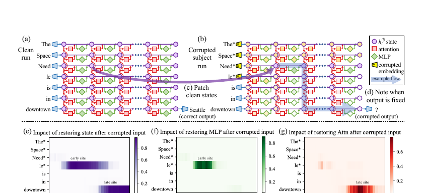

<p class="figure-caption"><strong>Figure 1.</strong> ROME 的 causal tracing：分别运行 clean、corrupted 和 patched forward pass，再测量恢复隐藏状态、MLP 或 attention 输出后正确答案概率的变化。来源：Meng et al. (2022), Figure 1。</p>

ROME 的核心发现通常被概括为：在 GPT 类模型中，主体最后一个 token 附近的中层 MLP 是事实关联的重要 causal site。更准确地说，这项工作回答了“恢复哪里可以找回答案”和“编辑哪里能够改变事实”，但没有完整说明事实在一次正常 forward pass 中怎样被逐步取出。

后续真正把事实回忆拆成计算步骤的，是 Geva 等人的 *Dissecting Recall of Factual Associations in Auto-Regressive Language Models*。

## 2. 语言模型怎样把一个事实从参数中取出来？

理解 VLM 的困难之前，需要先明确它继承了怎样的语言回忆回路。

给定一个 subject–relation query：

```text
Beats Music is owned by ___
```

模型需要将主体 “Beats Music”、关系 “owned by” 和属性 “Apple” 组织起来。Geva 等人通过表示分析、子层消融和 Attention Knockout 提出了一个三阶段机制。

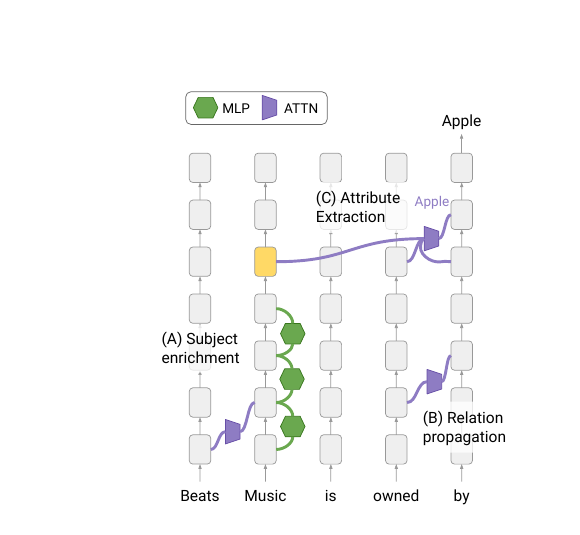

<p class="figure-caption"><strong>Figure 2.</strong> 语言模型事实回忆的三阶段机制：主体富集、关系传播与属性提取。来源：Geva et al. (2023), Figure 1。</p>

### 2.1 第一步：主体表示先被“富集”

输入刚进入模型时，主体 token 主要表示其字面语义。经过前部 MLP 后，主体最后位置逐渐包含多个与主体相关的候选属性：公司、创始人、所在地、产品、所有者等。

可以把这个过程抽象为：

$$
h_s^{(l+1)}
=
h_s^{(l)}
+
\operatorname{MLP}^{(l)}(h_s^{(l)}),
$$

其中 MLP 写入的不一定是当前问题唯一需要的答案，而更像一组主体相关属性。Geva 等人把它称为 **subject enrichment**。

这一步非常重要，因为它改变了对“事实存储”的直觉：模型不是等到最后一层才从某个数据库式位置读取一个答案；主体表示在较早阶段已经被参数知识丰富，后面的任务是根据关系从中选择正确属性。

### 2.2 第二步：关系信息到达预测位置

关系词 “owned by” 位于主体之后，并且预测位置可以读取整个前缀。模型需要把关系约束传到最后 token，使预测位置知道它应该询问“所有者”，而不是成立时间、地点或行业。

在因果 mask 下，信息流向大致是：

```text
relation tokens ─────→ final prediction position
subject tokens  ─────→ final prediction position
```

但两条路径的关键层段不同。关系信息较早到达预测位置，随后预测位置才从富集后的主体表示中抽取对应属性。

### 2.3 第三步：attention 从主体表示中选择属性

最终的属性提取主要由后部 attention heads 完成。预测位置的 query 与主体位置的 key/value 相互作用，将与关系匹配的属性消息写入 residual stream：

$$
m_{s\rightarrow p}^{(l,h)}
=
A_{p,s}^{(l,h)}
W_O^{(l,h)}W_V^{(l,h)}h_s^{(l)}.
$$

这里需要特别注意：attention weight 只决定路由强度，真正传递的内容还取决于 value 和 output projection。因此，“某个 head 很关注主体”并不足以证明它提取了事实；需要切断有向边或直接干预消息。

Geva 等人使用 Attention Knockout，在连续层窗口内把指定 source token 到 target token 的 attention logits 设为 $-\infty$：

$$
A_{T,S}^{(l,h)}=0,
\qquad l\in\mathcal L.
$$

再测量正确答案概率变化。

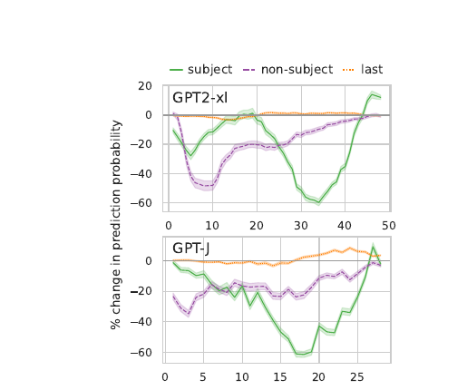

<p class="figure-caption"><strong>Figure 3.</strong> 对不同 token 集合到最后位置的 attention 边进行 knockout。绿色主体路径在中后层最关键，关系路径和最后位置自身则表现出不同的层间作用。来源：Geva et al. (2023), Figure 2。</p>

这组结果建立了此后视觉事实检索研究的基准模型：

```text
早期 MLP：把主体变成携带多种属性的表示
关系路径：把当前查询需求传到预测位置
后部 attention：从主体表示中抽取与关系匹配的属性
```

### 2.4 为什么这个回路对 VLM 是一个苛刻约束？

文本输入从第 0 层开始就有明确主体 token。视觉输入却只有一组连续 soft tokens，它们最初表达纹理、局部区域和视觉特征，未必与语言骨干的 “Robin Williams” 或 “Perito Moreno Glacier” 表示对齐。

如果事实回忆需要早期或中前部 MLP 读取主体，而可用的视觉实体表示到中后层才形成，那么 VLM 面临一个时间顺序问题：

$$
l_{\mathrm{entity}}
>
l_{\mathrm{recall}}.
$$

即使第 $l_{\mathrm{entity}}$ 层已经能用 probe 读出实体名称，负责把主体属性写入 residual stream 的 $l_{\mathrm{recall}}$ 层也已经过去了。后面的层不一定会自动重演同一套回忆算法。

这就是后来所谓 **Too Late to Recall** 的核心直觉。但在形成这一结论之前，研究首先需要回答更基础的问题：视觉信息到底存在哪里，又怎样进入语言模型？

## 3. 从 BLIP 到 LLaVA：视觉表示如何进入语言回路？

这一阶段的论文并没有一开始就聚焦“视觉事实回忆失败”。它们先尝试建立 VLM 版的 causal tracing，并描绘对象信息在 token 和层之间的演化。

### 3.1 BLIP：第一次把 causal tracing 迁移到视觉问答

Palit 等人的 *Towards Vision-Language Mechanistic Interpretability* 分析 BLIP。BLIP 与 LLaVA 式 token concatenation 不同：图像先由 image encoder 编码，再通过 cross-attention 条件化 question encoder，最后由 answer decoder 生成答案。

他们给图像 embedding 加噪声，使模型从正确答案转为错误答案；随后把 clean run 的中间状态逐层恢复到 corrupted run，观察答案概率是否恢复。

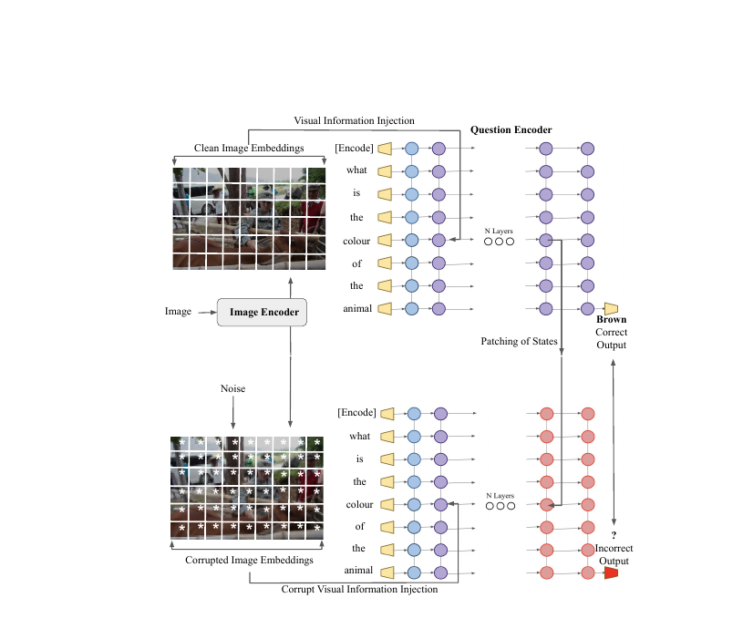

<p class="figure-caption"><strong>Figure 4.</strong> BLIP causal tracing：干净图像得到正确颜色，污染图像得到错误输出，再把干净状态 patch 到 question encoder 或 answer decoder。来源：Palit et al. (2023), Figure 1。</p>

在其 COCO-QA 颜色识别设置中，主要 causal relevance 集中在 question encoder 和 answer decoder 的最后层，特别是最后位置。

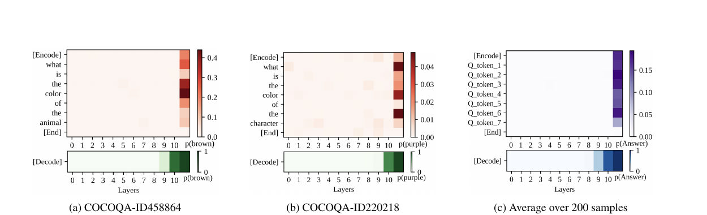

<p class="figure-caption"><strong>Figure 5.</strong> 两个样本和 200 个样本平均后的 causal tracing 热图。在该 BLIP 设置中，恢复靠后的层和最后位置最能找回正确答案。来源：Palit et al. (2023), Figure 4。</p>

这项工作的重要性主要在方法层面：它证明语言模型的 causal tracing 可以跨越视觉编码器、cross-attention question encoder 和 decoder 的架构边界。

但“最后层最重要”不能直接推广为所有 VLM 的通则。至少有三项限制：

第一，实验集中于颜色识别，答案通常是单 token；第二，BLIP 的 cross-attention 结构与 LLaVA 的视觉 token 拼接明显不同；第三，高斯噪声可能把图像 embedding 推到训练分布之外。后来的 NOTICE 因此改用语义相近图像和对称文本替换，强调自然 corruption 对 causal tracing 结论的重要性。

### 3.2 MultiModalCausalTrace：把“存储”与“传递”分开

Basu 等人的 NeurIPS 2024 工作把问题进一步拆成 information storage 与 information transfer，并设计了 VQA-Constraints：每个问题包含答案必须满足的视觉或文本约束。

例如：

```text
What movie directed by [the director in this image]
has won a [Golden Globe]?
```

这里既有视觉约束，也有文本约束。研究者可以分别污染某个约束，再恢复特定内部状态，从而比较模型在处理不同来源的事实条件时使用哪些层。

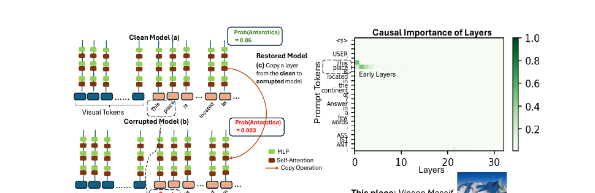

<p class="figure-caption"><strong>Figure 6.</strong> MultiModalCausalTrace：替换问题中的约束构造 corrupted run，再恢复 clean run 的 MLP 或 self-attention 状态，测量正确答案概率恢复。来源：Basu et al. (2024), Figure 2。</p>

该工作得到一个看似反直觉的结果：在 LLaVA 和 multimodal Phi-2 中，视觉事实问题的重要 causal MLP/self-attention 往往比对应纯语言模型更早。

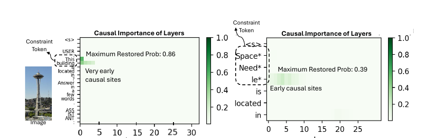

<p class="figure-caption"><strong>Figure 7.</strong> LLaVA-7B 的高 causal effect 出现在非常早的层，而对应 Vicuna-7B 的 causal site 更靠后。来源：Basu et al. (2024), Figure 1。</p>

这并不意味着模型在第 1 层已经完成实体级事实回忆。它说明：在作者的 constraint corruption 设置中，恢复早期层的状态足以找回输出；这些层可能负责把视觉约束接入后续计算，也可能承载适配器投影后的关键表示。

更直接的信息传递分析显示：

- 视觉编码器输出中，只有一个稳定的小子集对答案传输贡献最大；在 LLaVA 的实验中常表现为末尾约 36 个视觉 token；
- 中层 self-attention 主要负责把约束信息送到最后 token；
- MLP 与 self-attention 的角色不同：前者更接近参数知识读写，后者更接近跨位置运输。

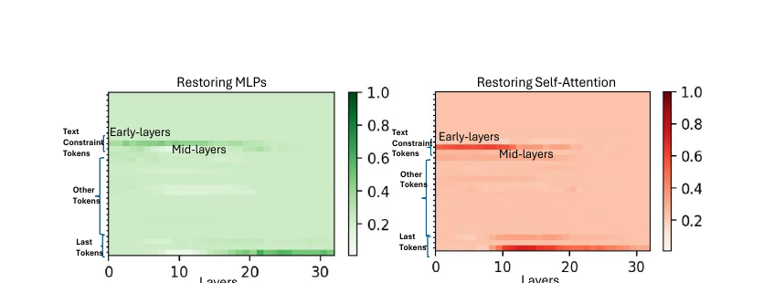

<p class="figure-caption"><strong>Figure 8.</strong> 恢复 MLP 与恢复 self-attention 的层—token热图。信息在较早层被取出，并由中层 self-attention 向最后位置传递。来源：Basu et al. (2024), Figure 4。</p>

这项区分非常关键。一个状态在早层有 causal effect，不代表实体身份已经以语言 token 形式显式出现；它也可能只是后续实体解析所需的视觉条件。

### 3.3 对象信息先局部存在，再逐渐“语言化”

Neo 等人的 ICLR 2025 工作从三个互补角度研究 LLaVA 视觉 token：

1. 消融与对象区域对应的 visual tokens；
2. 用 Logit Lens 把中间视觉表示投影到词表空间；
3. 用 Attention Knockout 检查对象 token 到最后位置的传输。

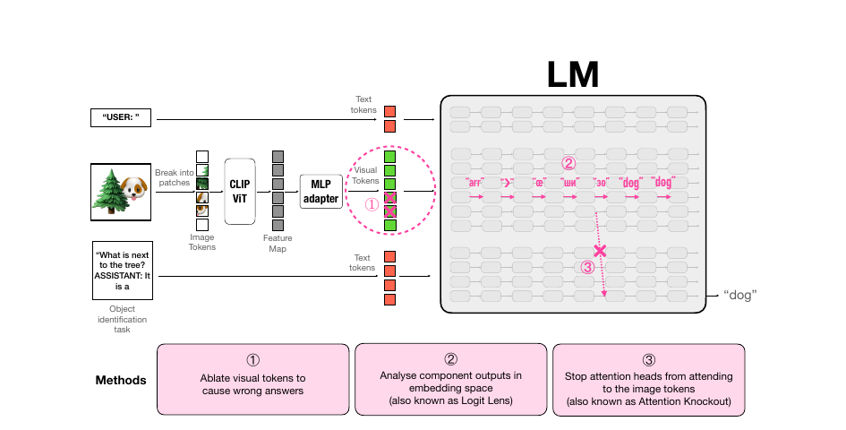

<p class="figure-caption"><strong>Figure 9.</strong> 对象 token 消融、Logit Lens 和 Attention Knockout 共同分析视觉对象表示。来源：Neo et al. (2025), Figure 1。</p>

对象特定 token 被移除后，原本回答正确的对象识别问题准确率下降超过 70%，说明对象信息并不是完全均匀地分散在所有视觉 token 中。与此同时，视觉 token 在浅层很难映射为有意义词汇，但在中后层越来越容易被 vocabulary projection 解释为对象、部件、材质或背景词。

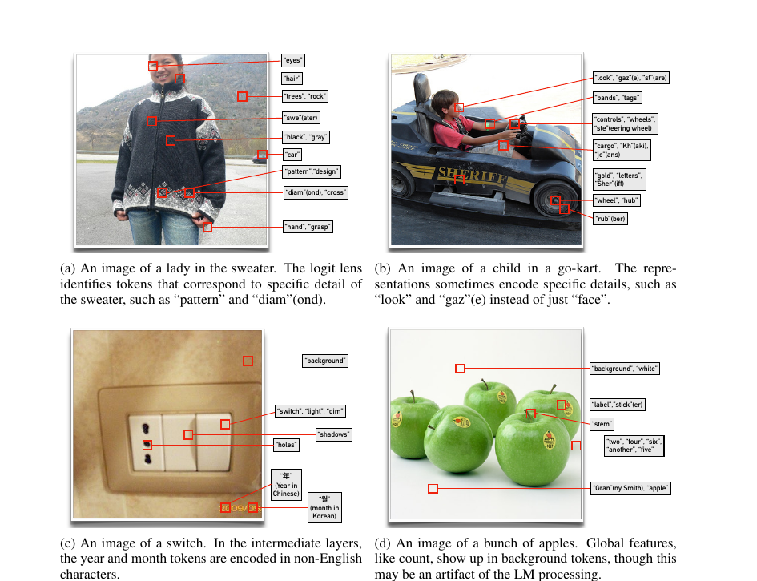

<p class="figure-caption"><strong>Figure 10.</strong> Logit Lens 在视觉 token 上读出的对象、部件和属性词。随着层数增加，部分视觉位置逐渐与语言词表对齐。来源：Neo et al. (2025), Figure 3。</p>

Attention Knockout 又表明，阻断对象相关视觉 token 到最后 token 的连接，在中后层造成最明显性能下降；早层更偏向整幅图像的上下文处理。

把这些结果组合起来，可以得到一个更细的过程：

```text
视觉编码器：形成空间局部的对象特征
    ↓
语言骨干早层：保留大量连续、非语言化视觉信息
    ↓
中层：对象表示逐渐与文本语义对齐
    ↓
中后层：最后位置从对象 token 中抽取任务相关信息
```

Yu 与 Ananiadou 对 LLaVA 颜色问答的预印本也得到相近观察：视觉 embeddings 可以表现出可解释的颜色与对象特征，深层 attention heads 根据 query–key 相似性读取这些特征，视觉 instruction tuning 主要增强了 Vicuna 原有能力。这篇工作提供了有用的补充，但截至本文写作时仍应作为预印本看待。

### 3.4 “早层重要”与“中后层才可读”并不矛盾

这组论文乍看给出不同答案：

- BLIP causal tracing 指向最后层；
- Basu 等人发现非常早的 causal sites；
- Neo 等人发现对象信息在中后层最可解释、也最直接传到最后位置。

它们测量的其实是不同事件。

| 研究结论 | 更准确的含义 |
|---|---|
| 早层状态可修复输出 | 早层是后续正确计算所需的因果前提 |
| 中后层可读出实体词 | 视觉表示此时已与词表中的实体语义对齐 |
| 最后层 patch 最有效 | 在该架构与污染设置中，最后汇聚状态最能恢复答案 |
| 中层 attention 很重要 | 跨 token 的信息运输主要在该层段发生 |

因此不能只问“融合发生在哪一层”。更好的问题是：

> 哪一层完成视觉特征提取，哪一层形成实体身份，哪一层调用参数知识，哪一层把结果送到输出？

这种分阶段视角为 2025 年的实体知识检索研究铺平了道路。

## 4. 模型能认出实体，却未必能调用关于它的知识

Cohen 等人的 ACL 2025 工作首次把这个失败模式变成清晰的评测对象。他们构建 PopVQA，把实体识别与知识提取分开。

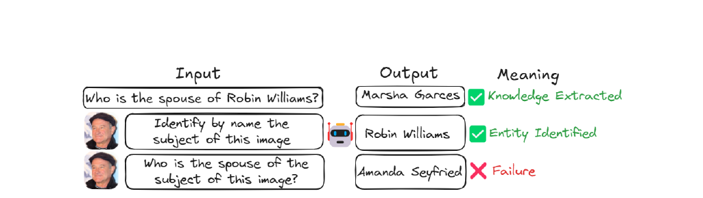

<p class="figure-caption"><strong>Figure 11.</strong> 模型能从图片识别 Robin Williams，也能在文本条件下回答其配偶，却无法把视觉实体与参数知识结合。来源：Cohen et al. (2025), Figure 1。</p>

研究设计包含三类对照：

```text
文本知识问题：Who is the spouse of Robin Williams?
视觉识别问题：Who is the subject in this image?
视觉知识问题：Who is the spouse of the subject in this image?
```

只有当模型通过前两项时，第三项失败才能被解释为连接或提取问题。论文在若干模型上观察到视觉条件相对文本条件最高约 18 个百分点的准确率下降。

### 4.1 深层才出现的实体信息，给第二跳留下的计算太少

研究者把文本实体或其他视觉模型产生的实体表示 patch 到 LLaVA 的不同层，并测量原实体与注入实体的生成概率。

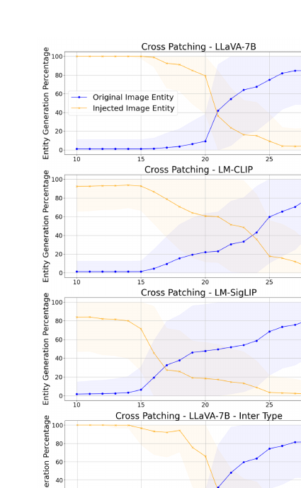

<p class="figure-caption"><strong>Figure 12.</strong> 将不同来源的实体表示注入 LLaVA。蓝线表示原图实体仍被生成的比例，橙线表示注入实体被生成的比例；视觉路线通常需要经过更多层才能稳定完成身份解析。来源：Cohen et al. (2025), Figure 4。</p>

结果表明，实体识别不是在视觉编码器结束时就完全完成。对 LLaVA 而言，图像隐藏状态还要在语言模型内部经过相当多层，才产生稳定、可传递的实体身份。相比之下，CLIP 或 SigLIP 的实体表示在某些 patching 设置中更早可用。

这给出一个“层预算”解释：

$$
L
=
L_{\mathrm{recognition}}
+
L_{\mathrm{linking}}
+
L_{\mathrm{recall}}
+
L_{\mathrm{generation}}.
$$

当视觉实体识别占用太多层时，模型只剩少量深层来完成参数知识检索和答案形成。文本路线则从输入开始就有明确主体，几乎不消耗实体解析层预算。

但 PopVQA 中约 18 个百分点的差距仍然可能受数据、实体难度和模型是否真的知道事实影响。Ashok 等人的 Findings EMNLP 2025 工作进一步构造了更严格的控制实验。

### 4.2 用完全配对的文本与视觉 reference 隔离 linking failure

Ashok 等人为同一个实体事实构造两种 reference：

- **Textual reference：** 问题中直接写实体名称；
- **Visual reference：** 问题只说“图像中的对象”，实体名称完全不出现。

同时加入 trivial image、entity image、trivial QA 和 entity QA 等条件，过滤掉模型本来就不知道答案、图像无法识别或问题可被语言先验猜出的样本。

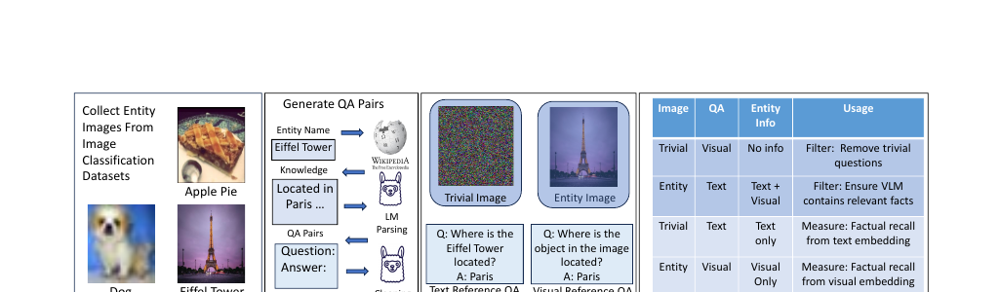

<p class="figure-caption"><strong>Figure 13.</strong> 数据构造与四种条件：文本/视觉 reference、实体/无信息图像，用于隔离模型能否把视觉实体连接到内部事实知识。来源：Ashok et al. (2025), Figure 2。</p>

在七个 VLM、四类数据集上的结果更加尖锐：Text Only 条件平均正确率约 84.70%，Visual 条件约 42.05%；相对性能下降平均为 58.95%。论文报告每个被测试 VLM 在依赖视觉 reference 时都出现超过 50% 的下降。

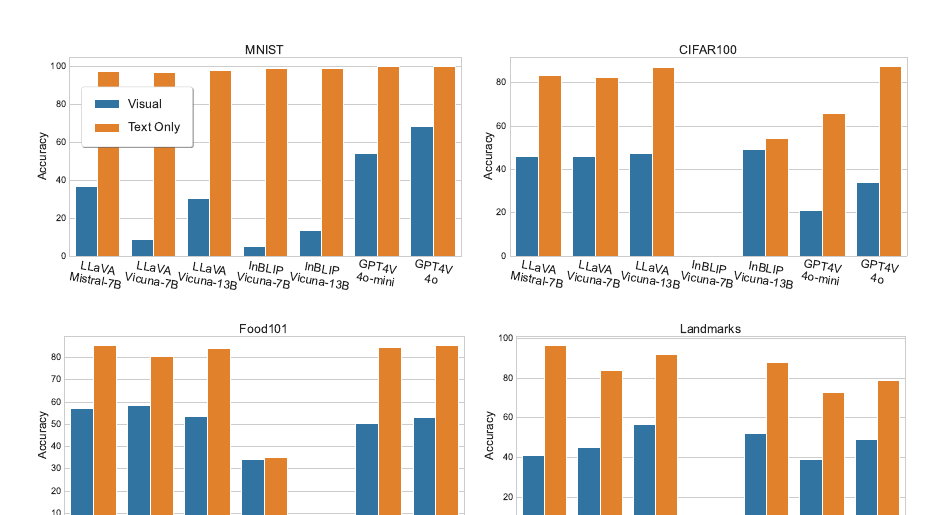

<p class="figure-caption"><strong>Figure 14.</strong> MNIST、CIFAR100、Food101 和 Landmarks 上的视觉与文本 reference 对比。视觉条件在不同架构、规模和预训练范式下均显著更差。来源：Ashok et al. (2025), Figure 3。</p>

这个结果不能简单解释为“模型看不见”。数据过滤已经尽可能保证：

- 图像包含单一、清晰实体；
- 模型能识别该实体；
- 文本条件下模型能回答相同事实；
- 答案不能仅靠问题模板猜出。

因此剩下的差距更接近真正的 symbol grounding / entity linking 问题：模型的视觉表示没有可靠地触发语言模型中已经存在的事实关联。

### 4.3 Linking failure 在隐藏状态中留下可检测轨迹

有趣的是，失败并不是内部完全没有信号。作者将最后输入 token 的隐藏状态投影到词表空间，比较 success 与 failure 样本。

成功样本通常更早建立对正确答案的置信度，并在后续层保持稳定；失败样本往往在更晚层才快速提高某个错误答案概率，同时表示与早期状态的相似度下降更剧烈。

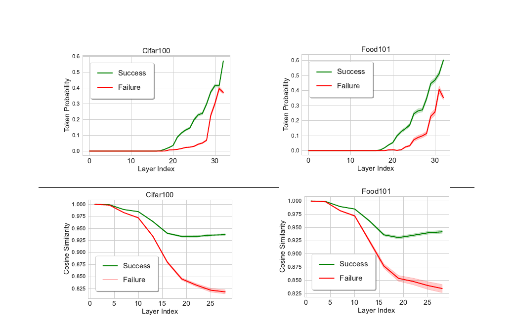

<p class="figure-caption"><strong>Figure 15.</strong> 成功与失败样本在 token probability 和 hidden-state cosine similarity 上形成不同轨迹。来源：Ashok et al. (2025), Figure 4。</p>

基于这些隐藏状态训练的线性 probes，在标记 linking failure 时准确率超过 92%，并能迁移到域外数据。在 selective prediction 中，模型只在 probe 判断较可靠时回答，覆盖率相对基线绝对提高 7.87%，错误风险同时下降 0.9%。

这类结果有两层意义。

第一，linking failure 并非完全随机噪声，而是一类具有内部结构的系统性失败；第二，在彻底修复机制之前，可以先构建 abstention 或 routing 系统，避免模型在明显未完成视觉—知识连接时自信作答。

但 probe 仍然只是检测器。它能够识别失败，不代表它说明了为什么实体接入事实回路过晚。这个问题由 *Too Late to Recall* 给出了更直接的因果解释。

## 5. Two-Hop Problem：为什么视觉实体总是“太晚”进入回忆回路？

Venhoff 等人的 NeurIPS 2025 工作将语言模型事实回忆和视觉实体形成放进同一条时间轴，提出 **two-hop problem**。

对于文本语言模型：

```text
subject token 已存在
    ↓
早层 MLP 产生主体相关事实
    ↓
后续 attention 选择答案
```

对于 VLM：

```text
分布式视觉 token
    ↓
先推断实体身份
    ↓
再调用事实回忆
```

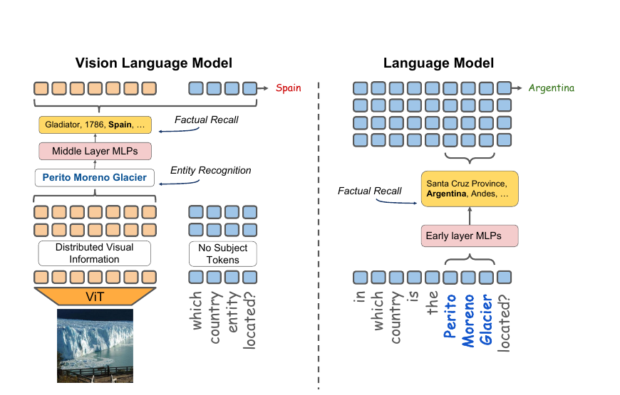

<p class="figure-caption"><strong>Figure 16.</strong> 文本模型从输入开始就拥有 “Perito Moreno Glacier” 主体 token，可以调用早层事实 MLP；退化的 VLM 到中层才解析出实体，因而错过原有回忆回路。来源：Venhoff et al. (2025), Figure 1。</p>

论文在 14 个 VLM 上比较视觉事实回忆与其语言骨干，覆盖 adapter、native 和 cross-attention 架构，以及 7B 至 124B 规模。14 个模型中有 11 个相对语言模型出现事实回忆退化；但 Qwen2.5-VL-72B、Gemma-3 等模型表现出较小差距或基本持平，说明 two-hop 不是无法克服的架构宿命。

### 5.1 退化模型没有复用语言骨干原有的子层

作者先对语言骨干进行 attribution patching。与 ROME、Geva 等工作的结果一致，语言模型的 factual recall 主要依赖：

- 实体 token 附近的较早 MLP；
- 最后 token 附近的后部 attention；
- 两者之间的 residual stream 传递。

随后在 VLM 中进行同样分析。高性能 VLM 倾向于复用语言骨干相似的组件；退化明显的 LLaVA 系模型则依赖不同的中后层子层。

这意味着问题不只是“视觉输入更难”。如果多模态训练真正把视觉实体对齐到语言骨干可用的内部接口，模型可以继续使用原有事实 circuit；如果对齐只在深层发生，骨干的早层回忆模块就看不到主体。

### 5.2 Probe 能读出实体的时间，决定模型是否赶得上回忆

作者在每层 residual stream 上训练 ImageNet 实体 probes。退化的 LLaVA-1.5 与 LLaVA-MORE 在浅层 probe accuracy 很低，到中后层才迅速上升；Gemma-3 与大规模多模态训练的 Qwen2.5-VL 则更早形成可读实体表示。

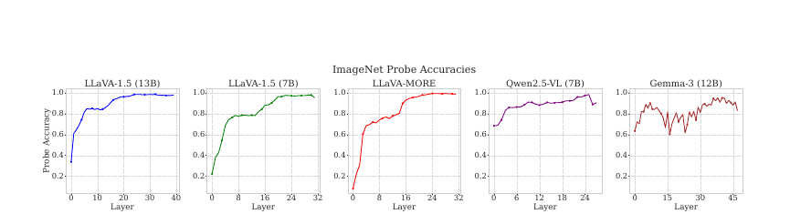

<p class="figure-caption"><strong>Figure 17.</strong> 各层实体 probe accuracy。退化的 LLaVA 系模型在中后层才形成稳定实体表示，而表现较好的模型从较早层就可读出实体。来源：Venhoff et al. (2025), Figure 5。</p>

Probe 证据本身不能证明这些表示被事实回路使用，但它与组件 attribution、模型间性能差距和后续 patching 结果共同构成一条一致证据链：

$$
\text{early entity resolution}
\Rightarrow
\text{reuse LLM factual circuit}
\Rightarrow
\text{smaller visual–text gap}.
$$

### 5.3 把语言骨干的早层 MLP 输出补回去，可以恢复多少？

最关键的因果实验是把语言模型在明确实体名称条件下产生的早层 MLP outputs，patch 到 VLM 的视觉运行中。

因为视觉序列里没有天然对应的主体 token，作者使用 attribution heuristic 选择最适合接收状态的 token 区间，并与随机 patch 和 back-patching 比较。

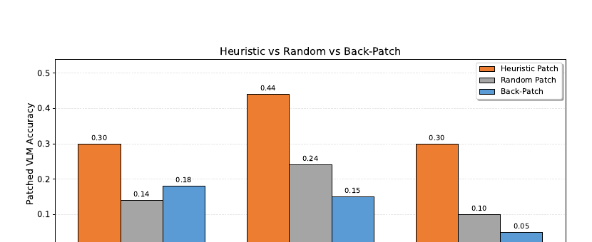

<p class="figure-caption"><strong>Figure 18.</strong> 将语言骨干实体 token 的早层 MLP 输出 patch 到退化 VLM。Heuristic patch 在三个 LLaVA 系模型上均明显优于随机位置和简单 back-patch。来源：Venhoff et al. (2025), Figure 4。</p>

在只统计“语言模型答对、VLM 答错”的样本上，heuristic patch 平均恢复约 35% 的性能差距；随机 patch 约 16%，back-patching 约 13%。这不是完整修复，却提供了重要的因果证据：退化 VLM 缺少的确实包含语言骨干早层事实回忆表示，而不仅是最终答案 token 的浅层相关性。

论文还测试 Chain-of-Thought prompting。显式要求模型先识别图像实体，再回答事实，可以在部分大模型上改善结果。这与 two-hop 解释一致：CoT 把隐式的两步计算变成两个自回归阶段，使实体名称作为文本 token 出现在上下文中，下一步事实回忆就能走熟悉的文本路线。

但 CoT 不是普适修复。它可能识别错实体，也会增加延迟，并把内部对齐问题转化为外部生成依赖。更理想的模型应该在不暴露中间文本的情况下，也能尽早产生与语言主体兼容的内部表示。

### 5.4 如何统一此前看似冲突的论文？

现在可以把不同结论放到一条流程中：

```text
图像特征形成
    ↓
对象相关 token 局部化
    ↓
视觉表示逐渐语言化
    ↓
实体身份稳定形成
    ↓
主体相关参数知识被激活
    ↓
关系约束选择属性
    ↓
答案传到最后位置
```

- Basu 等人的“早层 causal sites”更多描述视觉约束进入后续计算的必要前提；
- Neo 等人的“中后层对象 token”描述实体语义变得可解释、可直接抽取的阶段；
- Cohen、Ashok 和 Venhoff 研究的则是实体身份是否及时到达语言事实 circuit；
- Geva 描述主体已经是语言 token 时，事实回忆如何在骨干内部完成。

所以真正的矛盾不是“到底早层还是晚层重要”，而是：**不同层负责不同变量，视觉实体身份与语言事实 circuit 的时间顺序是否匹配。**

## 6. 从定位到修复：需要改知识、改连接，还是改输出？

机制分析最终应该帮助我们选择正确干预目标。这个细分领域已经出现三条不同路线。

### 6.1 修改参数知识：MultiEdit

如果模型在文本与视觉条件下都稳定回答错误，问题更可能位于 parametric memory，而不是跨模态连接。Basu 等人根据 causal tracing 定位早期 MLP，并提出 MultiEdit，用闭式更新修改投影矩阵。

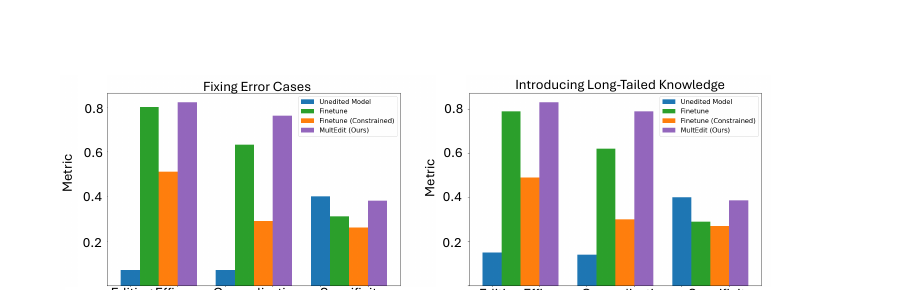

<p class="figure-caption"><strong>Figure 19.</strong> MultiEdit 在修复错误事实和写入长尾知识时，提高 Editing Efficacy 与 Generalization，同时尽量保持 Specificity。来源：Basu et al. (2024), Figure 6。</p>

这类编辑适合回答：模型本身记错了什么？但如果文本条件能答对、视觉条件答错，继续编辑事实参数可能破坏原本正确的知识。此时应修的是 linking 或 routing。

### 6.2 强化内部连接：FCCT 与 Intermediate Representation Injection

Li 等人的 AAAI 2026 工作提出 Fine-grained Cross-modal Causal Tracing（FCCT）。相比只按“视觉 token / 文本 token”划分，它进一步区分：

- early visual tokens；
- visual object tokens；
- late visual tokens；
- early textual tokens；
- textual object tokens；
- late textual tokens；
- last token。

同时分别 patch MHSA、FFN 和 hidden state，从而把“某层重要”细化为“哪个 token 角色的哪个组件重要”。

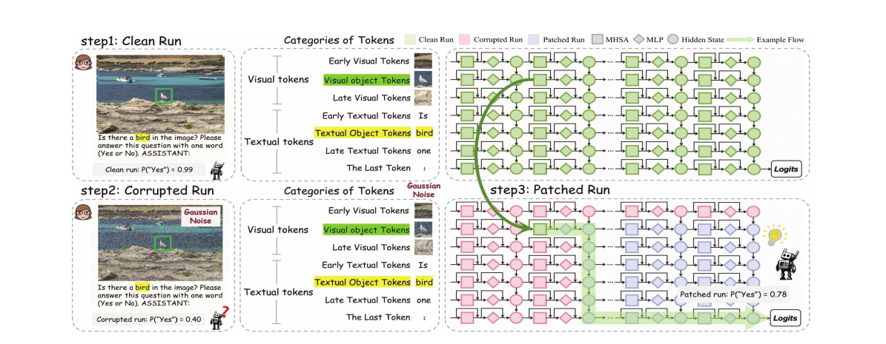

<p class="figure-caption"><strong>Figure 20.</strong> FCCT 在 clean、corrupted 和 patched runs 之间，逐 token 类型、逐组件、逐层恢复状态。来源：Li et al. (2026), Figure 2。</p>

论文总结出三个功能阶段：

1. 中层 last-token MHSA 聚合前面视觉与文本信息；
2. FFN 呈现从 visual-centric、visual–textual 到 generation-oriented 的三阶段演化；
3. hidden states 从浅层视觉语义逐渐转为深层任务与输出语义。

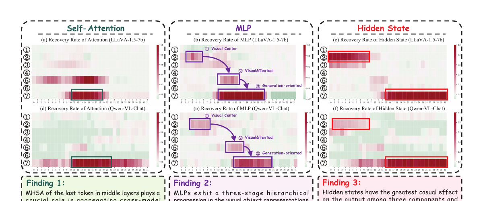

<p class="figure-caption"><strong>Figure 21.</strong> Attention、MLP 和 hidden state 的 recovery rate 热图。中层最后 token 的 MHSA、分阶段 FFN 和深层 hidden state 承担不同角色。来源：Li et al. (2026), Figure 3。</p>

基于这些 causal components，作者提出 Intermediate Representation Injection（IRI）：记录具有高 recovery rate 的中层 MHSA/MLP 输出，并以受控权重注入后续层。它不改参数，也不重新训练，而是在推理时强化已经存在、但可能在深层衰减的对象证据。论文在五类 hallucination benchmarks 和多个 LVLM 上报告了改进，同时尽量保持原有能力和推理速度。

IRI 与 Too Late 的 patching 方向略有不同：前者强调防止关键对象表示在后续层被弱化，后者强调把实体与事实表示提前接入骨干。但两者共享一个设计原则：

> 不要笼统增强所有视觉 attention，而应根据因果分析，在正确层段强化正确表示。

### 6.3 检测失败：probe 与 selective prediction

当模型内部连接暂时无法可靠修复时，Ashok 等人的 probes 提供了更保守的工程路线：在生成前判断当前隐藏状态是否呈现 linking failure 轨迹。

这种方法不会提高每个样本的事实回忆能力，却可以降低高风险场景中的错误暴露。它特别适合医疗影像知识、地标信息、产品识别和人物知识等“图像负责给出实体，语言模型负责给出事实”的任务。

但 probe 必须被当作分布相关的风险估计器，而不是机制真理。训练集上的 success/failure 边界可能随模型升级、prompt 模板、生成策略和图像分布变化。

### 6.4 修复前应先判断故障属于哪一层

可以用一个简单诊断矩阵区分干预对象：

| 实体识别 | 文本事实回忆 | 视觉事实回忆 | 更可能的问题 | 合适干预 |
|---|---|---|---|---|
| 错 | 对/错 | 错 | 视觉感知或实体解析 | 视觉编码、分辨率、区域选择 |
| 对 | 错 | 错 | 参数知识缺失或错误 | 检索增强、知识编辑 |
| 对 | 对 | 错 | linking / timing / routing | 对齐训练、状态 patch、内部注入 |
| 对 | 对 | 对但长文本幻觉 | 证据在生成中衰减或被先验覆盖 | generation-time attribution、持续注入、解码约束 |

这张表也解释了为什么“减少幻觉”不是单一技术问题。把错误事实写对、让模型看清对象、让实体及时进入事实 circuit、让视觉证据在长生成中持续存在，是四个不同目标。

### 6.5 这一领域还缺什么？

现有证据已经相当一致，但结论仍有明显边界。

**第一，需要自然 corruption。** 高斯噪声可能产生训练分布外状态。NOTICE 提出的语义图像对和对称文本替换，是更可靠的方向；未来 factual recall 研究也需要确保 visual corruption 只改变实体，而不引入低级视觉伪影。

**第二，需要把 probe 与因果使用分开。** “第 15 层能读出实体名称”不等于第 15 层后的网络真的使用它。理想实验应同时报告 layer-wise probe、path knockout 和 state patching。

**第三，需要验证路径的充分性。** 切断某个组件导致性能下降只说明必要性。还应尝试只保留候选路径、重建最小 circuit，或在新样本和新关系上验证同一机制。

**第四，需要从单 token VQA 扩展到长生成。** 当前工作大多用实体名、地点、颜色或多项选择答案。长文本中，图像实体表示可能在首 token 时可用，却在后续自回归过程中逐渐被语言先验覆盖。

**第五，需要跨架构比较。** BLIP 的显式 cross-attention、LLaVA 的 token concatenation、Qwen2.5-VL 的大规模多模态训练、Gemma-3 的 native multimodal design，可能形成不同的内部接口。不能把一个模型的绝对层号当成普遍规律。

**第六，需要把事实正确性与时间性纳入评测。** 某些人物关系、职位和地点属性会变化。模型答错可能是跨模态连接失败，也可能是参数知识过时；数据构造必须保存事实来源与时间戳。

## 结语

这组论文将一个模糊问题——“为什么 VLM 明明认识图片，却答不出相关知识？”——逐步拆成了可以干预的计算过程。

语言模型中的事实回忆并不是一次性查表。主体先被 MLP 富集为携带多种属性的表示，关系信息传到预测位置，后部 attention 再选出正确属性。视觉语言模型想复用这套回路，必须先把分布式视觉特征变成语言骨干能识别的实体状态。

目前最有解释力的统一模型是：

```text
图像
  ↓
局部视觉特征与对象 token
  ↓
实体级表示逐渐形成并语言化
  ↓
尽早接入语言骨干的主体位置或等价内部接口
  ↓
MLP 激活主体相关参数知识
  ↓
关系约束选择属性
  ↓
attention 将答案传到预测位置
```

失败可以发生在任意一段，但这个细分领域最重要的新认识是：

> 视觉实体表示最终“存在”，并不保证事实回忆成功。它必须在正确的层、正确的 token 角色和正确的计算时机进入语言模型已有的功能回路。

这也是 “Too Late to Recall” 比“视觉表示没有对齐”更具体的地方。真正有用的多模态对齐，不只是让图像和文字在 embedding space 中相似，而是让视觉输入能够及时调用语言骨干已经学会的算法。

## 参考文献

1. Meng, K. et al. [Locating and Editing Factual Associations in GPT](https://proceedings.neurips.cc/paper_files/paper/2022/hash/6f1d43d5a82a37e89b0665b33bf3a182-Abstract-Conference.html). NeurIPS 2022.
2. Geva, M. et al. [Dissecting Recall of Factual Associations in Auto-Regressive Language Models](https://aclanthology.org/2023.emnlp-main.751/). EMNLP 2023.
3. Palit, V. et al. [Towards Vision-Language Mechanistic Interpretability: A Causal Tracing Tool for BLIP](https://openaccess.thecvf.com/content/ICCV2023W/CLVL/html/Palit_Towards_Vision-Language_Mechanistic_Interpretability_A_Causal_Tracing_Tool_for_BLIP_ICCVW_2023_paper.html). ICCV Workshop 2023.
4. Basu, S. et al. [Understanding Information Storage and Transfer in Multi-Modal Large Language Models](https://proceedings.neurips.cc/paper_files/paper/2024/hash/0dfe31d6e703e138d46a7d2fced38b7c-Abstract-Conference.html). NeurIPS 2024.
5. Neo, C. et al. [Towards Interpreting Visual Information Processing in Vision-Language Models](https://openreview.net/forum?id=chanJGoa7f). ICLR 2025.
6. Yu, Z. & Ananiadou, S. [Understanding Multimodal LLMs: the Mechanistic Interpretability of LLaVA in Visual Question Answering](https://arxiv.org/abs/2411.10950). arXiv preprint, 2024.
7. Cohen, I. et al. [Performance Gap in Entity Knowledge Extraction Across Modalities in Vision Language Models](https://aclanthology.org/2025.acl-long.1411/). ACL 2025.
8. Ashok, D. et al. [Can VLMs Recall Factual Associations From Visual References?](https://aclanthology.org/2025.findings-emnlp.850/). Findings of EMNLP 2025.
9. Venhoff, C. et al. [Too Late to Recall: Explaining the Two-Hop Problem in Multimodal Knowledge Retrieval](https://openreview.net/forum?id=qeL8fi8GS7). NeurIPS 2025.
10. Li, Q. et al. [Causal Tracing of Object Representations in Large Vision Language Models: Mechanistic Interpretability and Hallucination Mitigation](https://ojs.aaai.org/index.php/AAAI/article/view/40431). AAAI 2026.
11. Golovanevsky, M. et al. [What Do VLMs NOTICE? A Mechanistic Interpretability Pipeline for Gaussian-Noise-free Text-Image Corruption and Evaluation](https://aclanthology.org/2025.naacl-long.571/). NAACL 2025.
